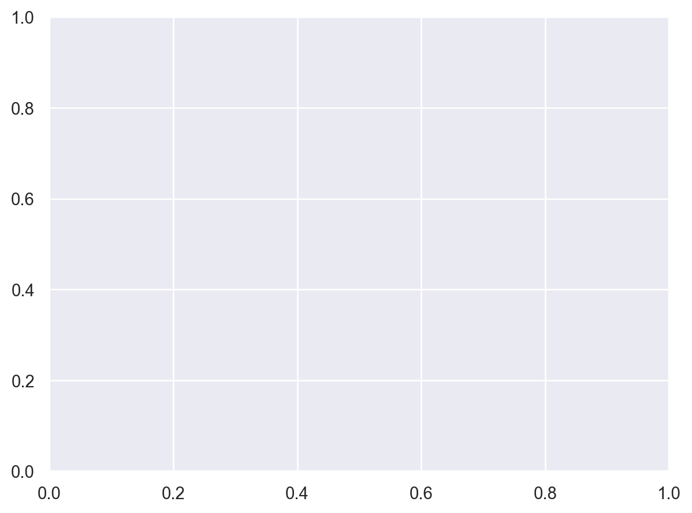
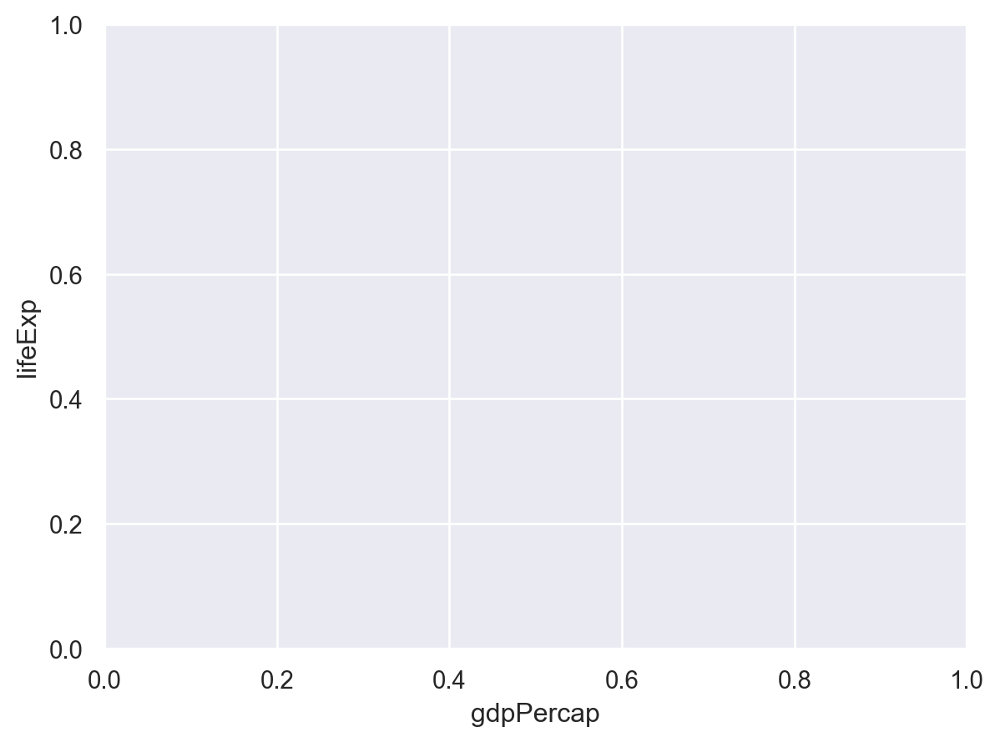
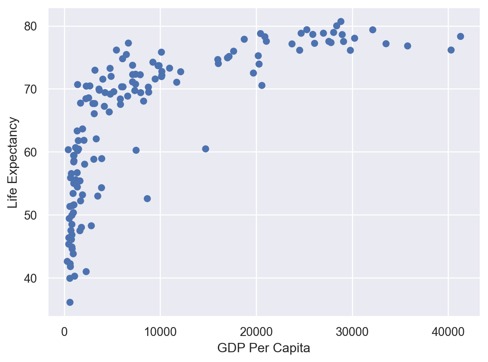
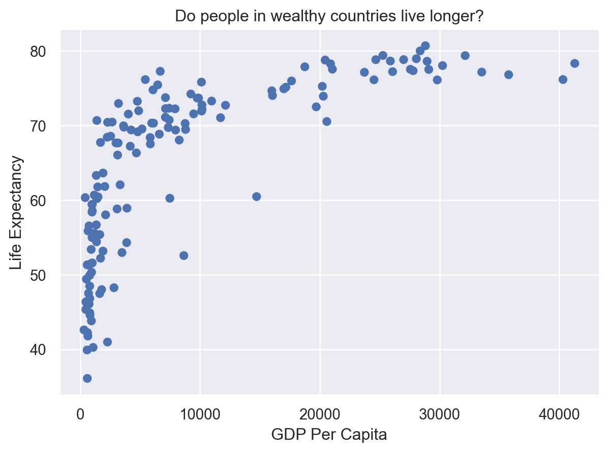
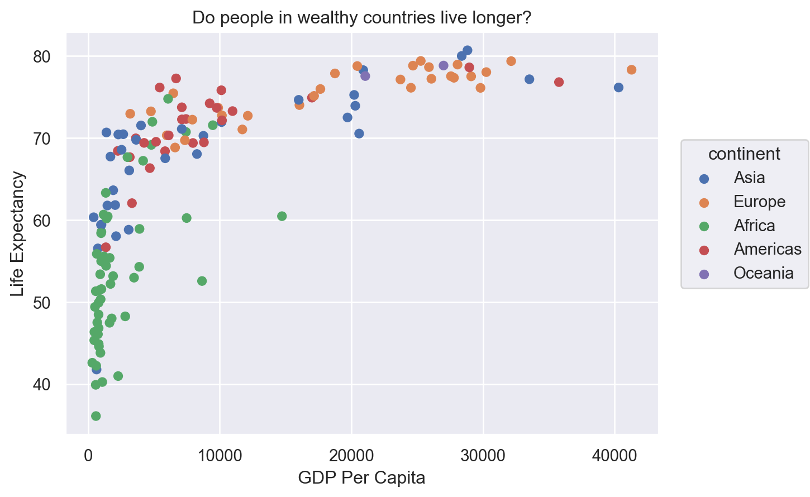

### Contents

1. [Introduction to Python and JupyterLab](#introduction-to-python-and-jupyterlab)
1. [Loading and reviewing data](#loading-and-reviewing-data)
1. [Understanding commands](#understanding-commands)
1. [Creating our first plot](#creating-our-first-plot)
1. [Plotting for data exploration](#plotting-for-data-exploration)
    + [Importing datasets](#importing-datasets)
    + [Discrete plots](#discrete-plots)
    + [Layers](#layers)
    + [Color vs. Fill](#color-vs-fill)
    + [Univariate plots](#univariate-plots)
    + [Plot themes](#plot-themes)
    + [Facets](#facets)
    + [Saving plots](#saving-plots)
1. [Bonus](#bonus)
    + [Creating complex plots](#creating-complex-plots)
      + [Animated plots](#animated-plots)
      + [Map plots](#map-plots)
1. [Glossary of terms](#glossary-of-terms)

> ## Bonus: why learn to program?
> Share why you're interested in learning how to code.
> > ## Solution:
> > There are lots of different reasons, including to perform data analysis and generate figures. I'm sure you have morespecific reasons for why you'd like to learn!
> {: .solution}
{: .challenge}

# Introduction to Python and JupyterLab
_[Back to top](#contents)_

In this session we will be testing the hypothesis that a country's life expectancy is related to the total value of its finished goods and services, also known as the Gross Domestic Product (GDP).
To test this hypothesis, we'll need two things: data and a platform to analyze the data.

You already [downloaded the data]({{ page.root }}/setup.html). But what platform will we use to analyze the data? We have many options!

We could try to use a spreadsheet program like Microsoft Excel or Google sheets that have limited access, less flexibility, and don't easily allow for things that are critical to ["reproducible" research](https://journals.plos.org/ploscompbiol/article?id=10.1371/journal.pcbi.1003285), like easily sharing the steps used to explore and make changes to the original data.

Instead, we'll use a programming language to test our hypothesis. Today we will use Python, but we could have also used R for the same reasons we chose Python (and we teach workshops for both languages). Both Python and R are freely available, the instructions you use to do the analysis are easily shared, and by using reproducible practices, it's straightforward to add more data or to change settings like colors or the size of a plotting symbol.

> ## But why Python and not R?
<!-- > [There's no great reason](http://www.academichermit.com/2020/03/23/Why-R.html). -->
> There's no great reason.
> Although there are subtle differences between the languages, it's ultimately a matter of personal preference. Both are powerful and popular languages that have very well developed and welcoming communities of scientists that use them. As you learn more about Python, you may find things that are annoying in Python that aren't so annoying in R; the same could be said of learning R. If the community you work in uses Python, then you're in the right place.
>
{: .solution}

<!-- To run Python, all you really need is the Python program, which is available for computers running the Windows, Mac OS X, or Linux operating systems. You downloaded Python while getting [set up]({{ page.root }}/setup.html) for this workshop. -->

<!-- To make your life in Python easier, there is a great (and free!) program called JupyterLab that you also downloaded and used during [set up]({{ page.root }}/setup.html). As we work today, we'll use features that are available in JupyterLab for writing and running code, managing projects, installing packages, getting help, and much more. It is important to remember that Python and JupyterLab are different, but complementary programs. You need Python to use JupyterLab. -->

To run Python, all you really need is the Python program, which is available for computers running the Windows, Mac OS X, or Linux operating systems. 
In this workshop, we will use Anaconda, a popular Python distribution bundled with other popular tools (e.g., common Python libraries).
We will use JupyterLab (which come with Anaconda) as the integrated development environment (IDE) for writing and running code, managing projects, getting help, and much more. 
<!-- It is important to remember that Python and JupyterLab are different, but complementary programs. -->

<!-- To run Python, we will use JupyterLab as the integrated development environment (IDE). -->

> Bonus Exercise: Can you think of a reason you might not want to use JupyterLab?
>
> > ## Solution:
> > On some high-performance computer systems (e.g. Amazon Web Services) you typically can't get a display like JupyterLab to open. If you're at the University of Michigan and have access to Great Lakes, then you might want to learn more about [resources](https://arc.umich.edu/open-ondemand/#document-4) to run JupyterLab on Great Lakes.
> {: .solution}
{: .challenge}

<!-- > ## The tidyverse vs Base Python
> If you've used Python before, you may have learned commands that are different than the ones we will be using during this workshop. We will be focusing on functions from the [tidyverse](https://www.tidyverse.org/). The "tidyverse" is a collection of Python packages that have been designed to work well together and offer many convenient features that do not come with a fresh install of Python (aka "base Python"). These packages are very popular and have a lot of developer support including many staff members from JupyterLab. These functions generally help you to write code that is easier to read and maintain. We believe learning these tools will help you become more productive more quickly.
{: .callout} -->


To get started, we'll spend a little time getting familiar with the JupyterLab environment and setting it up to suit your tastes. When you start JupyterLab, you'll have three panels.


On the left you'll have a panel with three tabs - Console, Terminal, and Jobs. The Console tab is what running Python from the command line looks like. This is where you can enter Python code. Try typing in `2+2` at the prompt (>). In the upper right panel are tabs indicating the Environment, History, and a few other things. If you click on the History tab, you'll see the command you ran at the Python prompt.


In the lower right panel are tabs for Files, Plots, Packages, Help, and Viewer. You used the Packages tab to install tidyverse.

We'll spend more time in each of these tabs as we go through the workshop, so we won't spend a lot of time discussing them now.

You might want to alter the appearance of your JupyterLab window. The default appearance has a white background with black text. If you go to the Tools menu at the top of your screen, you'll see a "Global options" menu at the bottom of the drop down; select that.


From there you will see the ability to alter numerous things about JupyterLab. Under the Appearances tab you can select the theme you like most. As you can see there's a lot in Global options that you can set to improve your experience in JupyterLab. Most of these settings are a matter of personal preference.

However, you can update settings to help you to insure the reproducibility of your code. In the General tab, none of the selectors in the Python Sessions, Workspace, and History should be selected. In addition, the toggle next to "Save workspace to .PythonData on exit" should be set to never. These setting will help ensure that things you worked on previously don't carry over between sessions.


Let's get going on our analysis!

One of the helpful features in JupyterLab is the ability to create a project. A project is a special directory that contains all of the code and data that you will need to run an analysis.

At the top of your screen you'll see the "File" menu. Select that menu and then the menu for "New Project...".


When the smaller window opens, select "Existing Directory" and then the "Browse" button in the next window.


Navigate to the directory that contains your code and data from the setup instructions and click the "Open" button.


Then click the "Create Project" button.


Did you notice anything change?

In the lower right corner of your JupyterLab session, you should notice that your
Files tab is now your project directory. You'll also see a file called
un-report.Rproj in that directory.

From now on, you should start JupyterLab by double clicking on that file. This will
make sure you are in the correct directory when you run your analysis.


We'd like to create a file where we can keep track of our Python code.

Back in the "File" menu, you'll see the first option is "New File". Selecting "New File" opens another menu to the right and the first option is "Python Script". Select "Python Script".

Now we have a fourth panel in the upper left corner of JupyterLab that includes an **Editor** tab with an untitled Python Script. Let's save this file as `gdp_population.R` in our project directory.

We will be entering Python code into the **Editor** tab to run in our **Console** panel.

On line 1 of `gdp_population.R`, type `2+2`.

With your cursor on the line with the `2+2`, click the button that says <kbd>Run</kbd>. You should be able to see that `2+2` was run in the Console.

As you write more code, you can highlight multiple lines and then click <kbd>Run</kbd> to run all of the lines you have selected.

Let's delete the line with 2+2 and replace it with `library(tidyverse)`.

Go ahead and run that line in the **Console** by clicking the <kbd>Run</kbd> button on the top right of the **Editor** tab and choosing <kbd>Run Selected Lines</kbd>. This loads a set of useful functions and sample data that makes it easier for us to do complex analyses and create professional visualizations in R.


<!-- ~~~
library(tidyverse)
~~~
{: .language-r} -->

```python
import numpy as np
import pandas as pd
```


<!-- 
~~~
── Attaching packages ──────────────────────────────────────────────────────────────── tidyverse 1.3.1 ──
~~~
{: .output}


~~~
✔ ggplot2 3.3.5     ✔ purrr   0.3.4
✔ tibble  3.1.6     ✔ dplyr   1.0.7
✔ tidyr   1.1.4     ✔ stringr 1.4.0
✔ readr   2.1.1     ✔ forcats 0.5.1
~~~
{: .output}


~~~
── Conflicts ─────────────────────────────────────────────────────────────────── tidyverse_conflicts() ──
✖ dplyr::filter() masks stats::filter()
✖ dplyr::lag()    masks stats::lag()
~~~
{: .output} -->

> ## What's with all those messages???
>
> When you loaded the `tidyverse` package, you probably got a message like the
> one we got above. Don't panic! These messages are just giving you more
> information about what happened when you loaded `tidyverse`. The `tidyverse` is
> actually a collection of several different packages, so the first section of the
> message tells us what packages were installed when we loaded `tidyverse` (these
> include `ggplot2`, which we'll be using a lot in this lesson, and `dyplr`, which
> you'll be introduced to tomorrow in the 
> [R for Data Analysis lesson]({{ page.root }}/05-python-markdown)).
>
> The second section of messages gives a list of "conflicts." Sometimes, the
> same function name will be used in two different packages, and R has to decide
> which function to use. For example, our message says that:
>
> ~~~
> dplyr::filter() masks stats::filter()
> ~~~
> {: .output}
>
> This means that two different packages (`dyplr` from `tidyverse` and `stats`
> from base R) have a function named `filter()`. By default, R uses the function
> that was most recently loaded, so if we try using the `filter()` function after
> loading `tidyverse`, we will be using the `filter()` function > from `dplyr()`.
>
{: .callout}


> ## Pro-tip
>
> Those of us that use **pandas** on a daily basis use cheat sheets to help us remember how to use various **pandas** functions. If you haven't already, print out the PDF versions of the cheat sheets that were in the setup instructions.
>
> You can also find them in JupyterLab by going to the "Help" menu and selecting "Cheat Sheets". The two that will be most helpful in this workshop are "Data Visualization with ggplot2", "Data Transformation with dplyr", "R Markdown Cheat Sheet", and "R Markdown Reference Guide".
>
> For things that aren't on the cheat sheets, [Google is your best friend]({{ page.root }}/06-conclusion/). Even expert coders use Google when they're stuck or trying something new!
>
{: .testimonial}

---

# Loading and reviewing data
_[Back to top](#contents)_

We will import a subsetted file from the gapminder dataset called `gapminder_1997.csv`. There are many ways to import data into R but for your first plot we will use JupyterLab's file menu to import and display this data. As we move through this process, JupyterLab will translate these *point and click* commands into code for us.

In JupyterLab select "File" > "Import Dataset" > "From Text (readr)".


The file is located in the main directory, click the "Browse" button and select the file named `gapminder_1997.csv`. A preview of the data will appear in the window. You can see there are a lot of Import Options listed, but R has chosen the correct defaults for this particular file.


We can see in that box that our data will be imported with the Name: "gapminder_1997". Also note that this screen will show you all the code that will be run when you import your data in the lower right "Code Preview". Since everything looks good, click the "Import" button to bring your data into R.

After you've imported your data, a table will open in a new tab in the top left corner of JupyterLab. This is a quick way to browse your data to make sure everything looks like it has been imported correctly. To review the data, click on the new tab.

We see that our data has 5 columns (variables).

Each row contains life expectancy ("lifeExp"), the total population ("pop"), and the per capita gross domestic product ("gdpPercap") for a given country ("country").

There is also a column that says which continent each country is in ("continent"). Note that both North America and South America are combined into one category called "Americas".

After we've reviewed the data, you'll want to make sure to click the tab in the upper left to return to your `gdp_population.R` file so we can start writing some code.

Now look in the **Environment** tab in the upper right corner of JupyterLab. Here you will see a list of all the objects you've created or imported during your R session. You will now see `gapminder_1997` listed here as well.

Finally, take a look at the **Console** at the bottom left part of the JupyterLab screen. Here you will see the commands that were run for you to import your data in addition to associated metadata and warnings.

> ## Data objects
> There are many different ways to store data in R. Most objects have a table-like structure with rows and columns. We will refer to these objects generally as "data objects". If you've used R before, you many be used to calling them "data.frames". Functions from the "tidyverse" such as `read_csv` work with objects called "tibbles", which are a specialized kind of "data.frame." Another common way to store data is a "data.table". All of these types of data objects (tibbles, data.frames, and data.tables) can be used with the commands we will learn in this lesson to make plots. We may sometimes use these terms interchangeably.
{: .callout}

# Understanding commands

Let's start by looking at the code JupyterLab ran for us by copying and pasting the first line from the console into our `gdp_population.ipynb` file that is open in the **Editor** window.

~~~
import numpy as np
import pandas as pd

gapminder_1997 = pd.read_csv("gapminder_1997.csv")

print(gapminder_1997)
~~~
{: .language-python}

~~~
                country       pop continent  lifeExp     gdpPercap
0           Afghanistan  22227415      Asia   41.763    635.341351
1               Albania   3428038    Europe   72.950   3193.054604
2               Algeria  29072015    Africa   69.152   4797.295051
3                Angola   9875024    Africa   40.963   2277.140884
4             Argentina  36203463  Americas   73.275  10967.281950
..                  ...       ...       ...      ...           ...
137             Vietnam  76048996      Asia   70.672   1385.896769
138  West Bank and Gaza   2826046      Asia   71.096   7110.667619
139          Yemen Rep.  15826497      Asia   58.020   2117.484526
140              Zambia   9417789    Africa   40.238   1071.353818
141            Zimbabwe  11404948    Africa   46.809    792.449960

[142 rows x 5 columns]
~~~
{: .output}
You should now have a line of text in your code file that started with `gapminder` and ends with a `)` symbol.

What if we want to run this command from our code file?

In order to run code that you've typed in the editor, you have a few options. We can click <kbd>Run</kbd> again from the right side of the **Editor** tab but the quickest way to run the code is by pressing <kbd>Ctrl</kbd>+<kbd>Enter</kbd> on your keyboard (<kbd>Ctrl</kbd>+<kbd>Enter</kbd> on Mac).

This will run the line of code that currently contains your cursor and will move your cursor to the next line. Note that when Rstudio runs your code, it basically just copies your code from the **Editor** window to the **Console** window, just like what happened when we selected <kbd>Run Selected Line(s)</kbd>.

Let's take a closer look at the parts of this command.

Starting from the left, the first thing we see is `gapminder_1997`. We viewed the contents of this file after it was imported so we know that `gapminder_1997` acts as a placeholder for our data.

If we highlight just `gapminder_1997` within our code file and press <kbd>Ctrl</kbd>+<kbd>Enter</kbd> on our keyboard, what do we see?

We should see a data table outputted, similar to what we saw in the Viewer tab.

In pandas terms, `gapminder_1997` is a named [**DataFrame**](https://pandas.pydata.org/docs/reference/api/pandas.DataFrame.html) that references or stores something. In this case, `gapminder_1997` stores a specific table of data.

Looking back at the command in our code file, the second thing we see is a `=` symbol, which is the **assignment operator**. It assigns values generated or typed on the right to objects on the left. 
<!-- An alternative symbol that you might see used as an **assignment operator** is the `=` but it is clearer to only use `<-` for assignment. We use this symbol so often that JupyterLab has a keyboard short cut for it: <kbd>Alt</kbd>+<kbd>-</kbd> on Windows, and <kbd>Option</kbd>+<kbd>-</kbd> on Mac. -->

> ## Assigning values to objects
> Try to assign values to some objects and observe each object after you have assigned a new value. What do you notice?
{: .challenge}

~~~
name = "Ben"
print(name)
age = 26
print(age)
name = "Harry Potter"
print(name)
~~~
{: .language-python}

~~~
Ben
26
Harry Potter
~~~
{: .output}
> ## Solution
> When we assign a value to an object, the object stores that value so we can access it later. However, if we store a new value in an object we have already created (like when we stored "Harry Potter" in the `name` object), it replaces the old value. The `age` object does not change, because we never assign it a new value.
{: .solution}

> ## Guidelines on naming objects
> - You want your object names to be explicit and not too long.
> - They cannot start with a number (2x is not valid, but x2 is).
> - Python is case sensitive, so for example, weight_kg is different from Weight_kg.
> - You cannot use spaces in the name.
> - There are some names that cannot be used because they are the names of fundamental functions in Python (e.g., if, else, for; run `help("keywords")` for a complete list). 
If in doubt, check the help to see if the name is already in use (`?function_name`).
> - It's best to avoid dots (.) within names. Dots have a special meaning (methods) in Python and other programming languages.
> - It is recommended to use nouns for object names and verbs for function names.
> - Be consistent in the styling of your code, such as where you put spaces, how you name objects, etc. Using a consistent coding style makes your code clearer to read for your future self and your collaborators. The official style guide for Python code can be found [here](https://peps.python.org/pep-0008/).
{: .checklist}

> ## Bonus Exercise: Bad names for objects
> Try to assign values to some new objects. What do you notice? After running all four lines of code bellow, what value do you think the object `Flower` holds?
{: .challenge}

~~~
1number = 3
Flower = "marigold"
flower = "rose"
favorite number = 12
~~~
{: .language-python}

~~~


      Input In [3]
        1number = 3
         ^
    SyntaxError: invalid syntax


~~~
{: .language-python}


> ## Solution
> Notice that we get an error when we try to assign values to `1number` and `favorite number`. This is because we cannot start an object name with a numeral and we cannot have spaces in object names. The object `Flower` still holds "marigold." This is because Python is case-sensitive, so running `flower = "rose"` does NOT change the `Flower` object. This can get confusing, and is why we generally avoid having objects with the same name and different capitalization.
{: .solution}

The next part of the command is `pd.read_csv("gapminder_1997.csv")`. This has a few different key parts. The first part is `pd`, which is the shorthand name for pandas that we imported earlier. 
The next part is the `read_csv` function from the pandas library. In Python you call a function from a library by typing the  name followed by opening then closing parenthesis. Each function has a purpose, which is often hinted at by the name of the function. Let's try to run the function without anything inside the parenthesis.

~~~
pd.read_csv()
~~~
{: .language-python}

~~~


    ---------------------------------------------------------------------------

    TypeError                                 Traceback (most recent call last)

    Input In [4], in <cell line: 1>()
    ----> 1 pd.read_csv()


    TypeError: read_csv() missing 1 required positional argument: 'filepath_or_buffer'


~~~
{: .language-python}


We get an error message. Don't panic! Error messages pop up all the time, and can be super helpful in debugging code.

In this case, the message tells us "read_csv() missing 1 required positional argument: 'filepath_or_buffer'" Many functions, including `read_csv`, require additional pieces of information to do their job. We call these additional values "arguments" or "parameters." You pass **arguments** to a function by placing values in between the parenthesis. A function takes in these arguments and does a bunch of "magic" behind the scenes to output something we're interested in.

For example, when we loaded in our data, the command contained `"gapminder_1997.csv"` inside the `read_csv()` function. This is the value we assigned to the file argument. But we didn't say that that was the file. How does that work?

> ## Pro-tip
>
> Each function has a help page that documents what arguments the function
> expects and what value it will return. You can bring up the help page a few
> different ways. If you have typed the function name in the **Editor** windows,
> you can put your cursor on the function name and press <kbd>F1</kbd> to open
> help page in the **Help** viewer in the lower right corner of JupyterLab. You can
> also type `?` followed by the function name in the console.
>
> For example, try running `?pd.read_csv`. A help page should pop up with
> information about what the function is used for and how to use it, as well as
> useful examples of the function in action. As you can see, the first
> **argument** of `read_csv` is the file path.
>
{: .callout}

The `read_csv()` function took the file path we provided, did who-knows-what behind the scenes, and then outputted a table with the data stored in that csv file. All that, with one short line of code!

Do all functions need arguments? Let's test some other functions:

~~~
from datetime import date
date.today()
~~~
{: .language-python}


~~~
datetime.date(2023, 4, 27)
~~~
{: .output}


~~~
import os
os.getcwd()
~~~
{: .language-python}


~~~
'/Users/fredfeng/Desktop/teaching/workshops/um-carpentries/intro-curriculum-python/_episodes_ipynb'
~~~
{: .output}


While some functions, like those above, don't need any arguments, in other
functions we may want to use multiple arguments. When we're using multiple
arguments, we separate the arguments with commas. For example, we can use the
`sum()` function to add numbers together:


~~~
sum([5, 6])
~~~
{: .language-python}


~~~
11
~~~
{: .output}


> ## Learning more about functions
> Look up the function `round`. What does it do? What will you get as output for the following lines of code?
{: .challenge}

~~~
round(3.1415)
round(3.1415, 3)
~~~
{: .language-python}


~~~
3.142
~~~
{: .output}


> ## Solution
> `round` rounds a number. By default, it rounds it to zero digits (in our example above, to 3). If you give it a second number, it rounds it to that number of digits (in our example above, to 3.142)
{: .solution}

Notice how in this example, we didn't include any argument names. But you can
use argument names if you want:

~~~
print(pd.read_csv(filepath_or_buffer="gapminder_1997.csv"))
~~~
{: .language-python}

~~~
                country       pop continent  lifeExp     gdpPercap
0           Afghanistan  22227415      Asia   41.763    635.341351
1               Albania   3428038    Europe   72.950   3193.054604
2               Algeria  29072015    Africa   69.152   4797.295051
3                Angola   9875024    Africa   40.963   2277.140884
4             Argentina  36203463  Americas   73.275  10967.281950
..                  ...       ...       ...      ...           ...
137             Vietnam  76048996      Asia   70.672   1385.896769
138  West Bank and Gaza   2826046      Asia   71.096   7110.667619
139          Yemen Rep.  15826497      Asia   58.020   2117.484526
140              Zambia   9417789    Africa   40.238   1071.353818
141            Zimbabwe  11404948    Africa   46.809    792.449960

[142 rows x 5 columns]
~~~
{: .output}
> ## Position of the arguments in functions
> Which of the following lines of code will give you an output of 3.14? For the one(s) that don't give you 3.14, what do they give you?
{: .challenge}

~~~
round(number=3.1415)
round(number=3.1415, ndigits=2)
round(ndigits=2, number=3.1415)
round(2, 3.1415)
~~~
{: .language-python}

~~~


    ---------------------------------------------------------------------------

    TypeError                                 Traceback (most recent call last)

    Input In [10], in <cell line: 4>()
          2 round(number=3.1415, ndigits=2)
          3 round(ndigits=2, number=3.1415)
    ----> 4 round(2, 3.1415)


    TypeError: 'float' object cannot be interpreted as an integer


~~~
{: .language-python}


> ## Solution
> The 2nd and 3rd lines will give you the right answer because the arguments are named, and when you use names the order doesn't matter. The 1st line will give you 3 because the default number of digits is 0. Then 4th line will give you an error because, since you didn't name the arguments, `number=2` and `ndigits=3.1415` which should be an integer. 
{: .solution}

Sometimes it is helpful - or even necessary - to include the argument name, but often we can skip the argument name, if the argument values are passed in a certain order. If all this function stuff sounds confusing, don't worry! We'll see a bunch of examples as we go that will make things clearer.

> ## Reading in an excel file
> Say you have an excel file and not a csv - how would you read that in? Hint: Use the Internet to help you figure it out!
>
> {: .source}
>
> > ## Solution
> > Pandas comes with the `read_excel` function which provides the same output as the output of `read_csv`.
> {: .solution}
{: .challenge}

> ## Comments
> Sometimes you may want to write comments in your code to help you remember
> what your code is doing, but you don't want R to think these comments are a part
> of the code you want to evaluate. That's where **comments** come in! Anything
> after a `#` symbol in your code will be ignored by R. For example, let's say we
> wanted to make a note of what each of the functions we just used do:
{: .callout}

~~~
date.today()   # outputs today's date
~~~
{: .language-python}


~~~
datetime.date(2023, 4, 27)
~~~
{: .output}


~~~
os.getcwd()    # outputs our current working directory (folder)
~~~
{: .language-python}


~~~
'/Users/fredfeng/Desktop/teaching/workshops/um-carpentries/intro-curriculum-python/_episodes_ipynb'
~~~
{: .output}


~~~
sum([5, 6])   # adds numbers
~~~
{: .language-python}


~~~
11
~~~
{: .output}


~~~
print(pd.read_csv(filepath_or_buffer="gapminder_1997.csv"))   # reads in csv file
~~~
{: .language-python}

~~~
                country       pop continent  lifeExp     gdpPercap
0           Afghanistan  22227415      Asia   41.763    635.341351
1               Albania   3428038    Europe   72.950   3193.054604
2               Algeria  29072015    Africa   69.152   4797.295051
3                Angola   9875024    Africa   40.963   2277.140884
4             Argentina  36203463  Americas   73.275  10967.281950
..                  ...       ...       ...      ...           ...
137             Vietnam  76048996      Asia   70.672   1385.896769
138  West Bank and Gaza   2826046      Asia   71.096   7110.667619
139          Yemen Rep.  15826497      Asia   58.020   2117.484526
140              Zambia   9417789    Africa   40.238   1071.353818
141            Zimbabwe  11404948    Africa   46.809    792.449960

[142 rows x 5 columns]
~~~
{: .output}
# Creating our first plot
_[Back to top](#contents)_

We will be using the seaborn package today to make our plots. 
This is a very popular statistical data visualization library in Python. 
We will use the [seaborn objects interface](https://seaborn.pydata.org/tutorial/objects_interface.html). 
All plots start by calling the `Plot()` function.

~~~
import seaborn.objects as so

so.Plot(data=gapminder_1997)
~~~
{: .language-python}


    

    


Note that we've added this new function call to a second line just to make it
easier to read. To do this we make sure that the `+` is at the end of the first
line otherwise R will assume your command ends when it starts the next row. The
`+` sign indicates not only that we are adding information, but to continue on
to the next line of code.

Observe that our **Plot** window is no longer a grey square. We now see that
we've mapped the `gdpPercap` column to the x axis of our plot. Note that that
column name isn't very pretty as an x-axis label, so let's add the `labs()`
function to make a nicer label for the x axis


~~~
so.Plot(gapminder_1997, x="gdpPercap", y="lifeExp")
~~~
{: .language-python}


    

    


OK. That looks better. 

> ## Quotes vs No Quotes
> Notice that when we added the label value we did so by placing the values
> inside quotes. This is because we are not using a value from inside our data
> object - we are providing the name directly. When you need to include actual
> text values in R, they will be placed inside quotes to tell them apart from
> other object or variable names.
> 
> The general rule is that if you want to use values from the columns of your
> data object, then you supply the name of the column without quotes, but if you
> want to specify a value that does not come from your data, then use quotes.
{: .callout}

> ## Mapping life expectancy to the y axis
> Map our `lifeExp` values to the y axis and give them a nice label.
{: .challenge}

~~~
(
    so.Plot(gapminder_1997, x="gdpPercap", y="lifeExp")
    .add(so.Dot())
    .label(x="GDP Per Capita", y="Life Expectancy")
)
~~~
{: .language-python}


    

    


Now we're really getting somewhere. It finally looks like a proper plot!  We can
now see a trend in the data. It looks like countries with a larger GDP tend to
have a higher life expectancy. Let's add a title to our plot to make that
clearer. Again, we will use the `labs()` function, but this time we will use the
`title =` argument.

~~~
so.Plot(gapminder_1997, x="gdpPercap", y="lifeExp"
 ).add(so.Dot()
 ).label(x="GDP Per Capita", 
         y="Life Expectancy", 
         title = "Do people in wealthy countries live longer?")
~~~
{: .language-python}


    

    


No one can deny we've made a very handsome plot! But now looking at the data, we
might be curious about learning more about the points that are the extremes of
the data. We know that we have two more pieces of data in the `gapminder_1997`
object that we haven't used yet. Maybe we are curious if the different
continents show different patterns in GDP and life expectancy. One thing we
could do is use a different color for each of the continents. To map the
continent of each point to a color, we will again use the `aes()` function:

~~~
(
    so.Plot(gapminder_1997, x="gdpPercap", y="lifeExp", color="continent")
    .add(so.Dot())
    .label(x="GDP Per Capita", 
           y="Life Expectancy", 
           title="Do people in wealthy countries live longer?")
)
~~~
{: .language-python}


    

    


~~~

~~~
{: .language-python}

