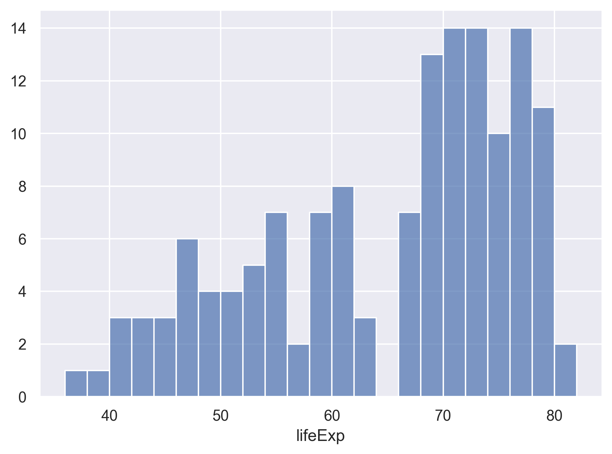
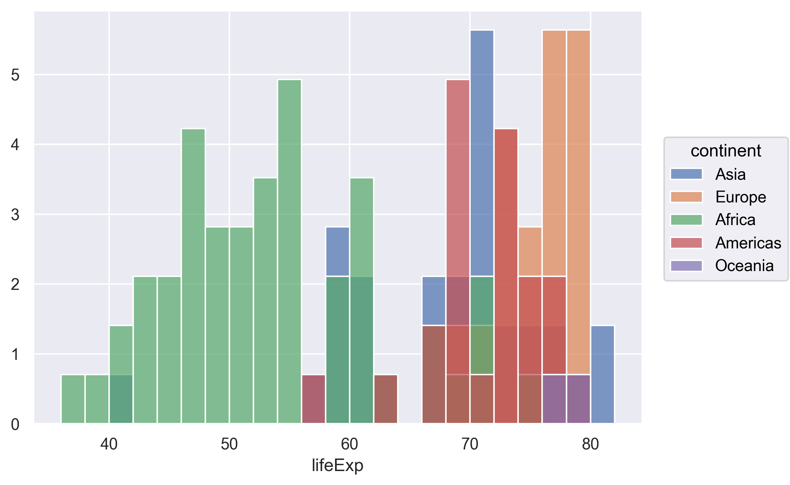
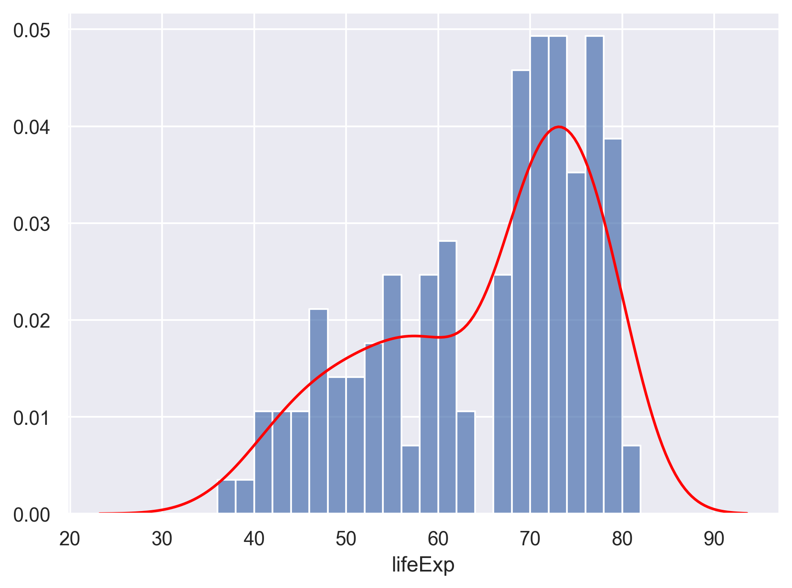

### Contents

1. [Introduction to Python and JupyterLab](#introduction-to-python-and-jupyterlab)
1. [Python basics](#python-basics)
1. [Loading and reviewing data](#loading-and-reviewing-data)
1. [Understanding commands](#understanding-commands)
1. [Creating our first plot](#creating-our-first-plot)
1. [Plotting for data exploration](#plotting-for-data-exploration)
    + [Importing datasets](#importing-datasets)
    + [Categorical plots](#categorical-plots)
    + [Layers](#layers)
    + [Color vs. Fill](#color-vs-fill)
    + [Univariate plots](#univariate-plots)
    + [Plot themes](#plot-themes)
    + [Facets](#facets)
    + [Saving plots](#saving-plots)
1. [Bonus](#bonus)
    + [Creating complex plots](#creating-complex-plots)
      + [Animated plots](#animated-plots)
      + [Map plots](#map-plots)
1. [Glossary of terms](#glossary-of-terms)

> ## Bonus: why learn to program?
> Share why you're interested in learning how to code.
> > ## Solution:
> > There are lots of different reasons, including to perform data analysis and generate figures. I'm sure you have more specific reasons for why you'd like to learn!
> {: .solution}
{: .challenge}

# Introduction to Python and JupyterLab
_[Back to top](#contents)_

In this session we will be testing the hypothesis that a country's life expectancy is related to the total value of its finished goods and services, also known as the Gross Domestic Product (GDP).
To test this hypothesis, we'll need two things: data and a platform to analyze the data.

You already [downloaded the data]({{ page.root }}/setup.html). 
But what platform will we use to analyze the data? We have many options!

We could try to use a spreadsheet program like Microsoft Excel or Google sheets that have limited access, less flexibility, and don't easily allow for things that are critical to ["reproducible" research](https://journals.plos.org/ploscompbiol/article?id=10.1371/journal.pcbi.1003285), like easily sharing the steps used to explore and make changes to the original data.

Instead, we'll use a programming language to test our hypothesis. 
Today we will use Python, but we could have also used R for the same reasons we chose Python (and we teach workshops for both languages). 
Both Python and R are freely available, the instructions you use to do the analysis are easily shared, and by using reproducible practices, it's straightforward to add more data or to change settings like colors or the size of a plotting symbol.

> ## But why Python and not R?
> There's no great reason.
> Although there are subtle differences between the languages, it's ultimately a matter of personal preference. 
> Both are powerful and popular languages that have very well developed and welcoming communities of scientists that use them. 
> As you learn more about Python, you may find things that are annoying in Python that aren't so annoying in R; the same could be said of learning R. 
> If the community you work in uses Python, then you're in the right place.
{: .solution}

To run Python, all you really need is the [Python program](https://www.python.org/downloads/), which is available for computers running the Windows, Mac OS X, or Linux operating systems. 
In this workshop, we will use Anaconda, a popular Python distribution bundled with other popular tools (e.g., many Python data science libraries).
We will use JupyterLab (which comes with Anaconda) as the integrated development environment (IDE) for writing and running code, managing projects, getting help, and much more. 

> Bonus Exercise: Can you think of a reason you might not want to use JupyterLab?
>
> > ## Solution:
> > On some high-performance computer systems (e.g. Amazon Web Services) you typically can't get a display like JupyterLab to open. If you're at the University of Michigan and have access to Great Lakes, then you might want to learn more about [resources](https://arc.umich.edu/open-ondemand/#document-4) to run JupyterLab on Great Lakes.
> {: .solution}
{: .challenge}

To get started, we'll spend a little time getting familiar with the [JupyterLab interface](https://jupyterlab.readthedocs.io/en/latest/user/interface.html). 
When we start JupyterLab, on the left side there's a collapsible sidebar that contains a [file browser](https://jupyterlab.readthedocs.io/en/latest/user/files.html#working-with-files) where we can see all the files and directories on our system.


On the right side is the [main work area](https://jupyterlab.readthedocs.io/en/latest/user/interface.html#main-area) where we can write code, see the outputs, and do other things.
Now let's create a new Jupyter notebook by clicking the "Python 3" button (under the "Notebook" category) on the "Launcher" tab .


Now we have created a new Jupyter notebook called `Untitled.ipynb`. 
The file name extension `ipynb` indicates it's a notebook file. 
In case you are interested, it stands for "IPython Notebook", which is the former name for Jupyter Notebook. 

Let's give it a more meaningful file name called `gdp_population.ipynb`
To rename a file we can right click it from the file browser, and then click "Rename". 


A notebook is composed of "cells". You can add more cells by clicking the plus "+" button from the toolbar at the top of the notebook.


<!--  -->


<!-- On the left you'll have a panel with three tabs - Console, Terminal, and Jobs. The Console tab is what running Python from the command line looks like. This is where you can enter Python code. Try typing in `2+2` at the prompt (>). In the upper right panel are tabs indicating the Environment, History, and a few other things. If you click on the History tab, you'll see the command you ran at the Python prompt.


In the lower right panel are tabs for Files, Plots, Packages, Help, and Viewer. You used the Packages tab to install tidyverse.

We'll spend more time in each of these tabs as we go through the workshop, so we won't spend a lot of time discussing them now.

You might want to alter the appearance of your JupyterLab window. The default appearance has a white background with black text. If you go to the Tools menu at the top of your screen, you'll see a "Global options" menu at the bottom of the drop down; select that.


From there you will see the ability to alter numerous things about JupyterLab. Under the Appearances tab you can select the theme you like most. As you can see there's a lot in Global options that you can set to improve your experience in JupyterLab. Most of these settings are a matter of personal preference.

However, you can update settings to help you to insure the reproducibility of your code. In the General tab, none of the selectors in the Python Sessions, Workspace, and History should be selected. In addition, the toggle next to "Save workspace to .PythonData on exit" should be set to never. These setting will help ensure that things you worked on previously don't carry over between sessions.


Let's get going on our analysis!

One of the helpful features in JupyterLab is the ability to create a project. A project is a special directory that contains all of the code and data that you will need to run an analysis.

At the top of your screen you'll see the "File" menu. Select that menu and then the menu for "New Project...".


When the smaller window opens, select "Existing Directory" and then the "Browse" button in the next window.


Navigate to the directory that contains your code and data from the setup instructions and click the "Open" button.


Then click the "Create Project" button.


Did you notice anything change?

In the lower right corner of your JupyterLab session, you should notice that your
Files tab is now your project directory. You'll also see a file called
un-report.Rproj in that directory.

From now on, you should start JupyterLab by double clicking on that file. This will
make sure you are in the correct directory when you run your analysis.


We'd like to create a file where we can keep track of our Python code.

Back in the "File" menu, you'll see the first option is "New File". Selecting "New File" opens another menu to the right and the first option is "Python Script". Select "Python Script".

Now we have a fourth panel in the upper left corner of JupyterLab that includes an **Editor** tab with an untitled Python Script. Let's save this file as `gdp_population.R` in our project directory.

We will be entering Python code into the **Editor** tab to run in our **Console** panel.

On line 1 of `gdp_population.R`, type `2+2`.

With your cursor on the line with the `2+2`, click the button that says <kbd>Run</kbd>. You should be able to see that `2+2` was run in the Console.

As you write more code, you can highlight multiple lines and then click <kbd>Run</kbd> to run all of the lines you have selected.

Let's delete the line with 2+2 and replace it with `library(tidyverse)`.

Go ahead and run that line in the **Console** by clicking the <kbd>Run</kbd> button on the top right of the **Editor** tab and choosing <kbd>Run Selected Lines</kbd>. This loads a set of useful functions and sample data that makes it easier for us to do complex analyses and create professional visualizations in R. -->


<!-- > ## What's with all those messages???
>
> When you loaded the `tidyverse` package, you probably got a message like the
> one we got above. Don't panic! These messages are just giving you more
> information about what happened when you loaded `tidyverse`. The `tidyverse` is
> actually a collection of several different packages, so the first section of the
> message tells us what packages were installed when we loaded `tidyverse` (these
> include `ggplot2`, which we'll be using a lot in this lesson, and `dyplr`, which
> you'll be introduced to tomorrow in the 
> [R for Data Analysis lesson]({{ page.root }}/05-r-markdown)).
>
> The second section of messages gives a list of "conflicts." Sometimes, the
> same function name will be used in two different packages, and R has to decide
> which function to use. For example, our message says that:
>
> ~~~
> dplyr::filter() masks stats::filter()
> ~~~
> {: .output}
>
> This means that two different packages (`dyplr` from `tidyverse` and `stats`
> from base R) have a function named `filter()`. By default, R uses the function
> that was most recently loaded, so if we try using the `filter()` function after
> loading `tidyverse`, we will be using the `filter()` function > from `dplyr()`.
>
{: .callout} -->


<!-- > ## Pro-tip
>
> Those of us that use **pandas** on a daily basis use cheat sheets to help us remember how to use various **pandas** functions. 
> If you haven't already, print out the PDF versions of the cheat sheets that were in the setup instructions.
>
> For things that aren't on the cheat sheets, [Google is your best friend]({{ page.root }}/06-conclusion/). Even expert coders use Google when they're stuck or trying something new!
>
{: .testimonial} -->

---
# Python basics
_[Back to top](#contents)_

### Arithmetic operators

At a minimum, we can use Python as a calculator.

If we type the following into a cell, and click the run button (the triangle-shaped button that looks like a play button), we will see the output under the cell.

Another quicker way to run the code in the selected cell is by pressing on your keyboard <kbd>Ctrl</kbd>+<kbd>Enter</kbd> (for Windows) or <kbd>Command</kbd>+<kbd>Return</kbd> (for MacOS). 


#### Addition

~~~
2 + 3
~~~
{: .language-python}

~~~
5
~~~
{: .output}

#### Subtraction
~~~
2 - 3
~~~
{: .language-python}

~~~
-1
~~~
{: .output}

#### Multiplication
~~~
2 * 3
~~~
{: .language-python}

~~~
6
~~~
{: .output}

#### Division
~~~
2 / 3
~~~
{: .language-python}

~~~
0.6666666666666666
~~~
{: .output}

#### Exponentiation

One thing that you might need to be a little careful about is the exponentiation. 
If you have used Microsoft Excel, MATLAB, R, or some other programming languages,
the operator for exponentiation is the caret `^` symbol. 
Let's take a look at if that works in Python. 

~~~
2 ^ 3
~~~
{: .language-python}

~~~
1
~~~
{: .output}

Hmm. That's not what we expected. 
It turns out in Python (and a few other languages), the caret symbol is used for another operation called bitwise [exclusive OR](https://en.wikipedia.org/wiki/Exclusive_or).

In Python we use double asterisks `**` for exponentiation. 

~~~
2 ** 3
~~~
{: .language-python}

~~~
8
~~~
{: .output}

#### Order of operations
We can also use parentheses to specify what operations should be resolved first.
For example, to convert 60 degrees Fahrenheit to Celsius, we can do:
~~~
5 / 9 * (60 - 32)
~~~
{: .language-python}

~~~
15.555555555555555
~~~
{: .output}

#### Assignment operator
In Python we can use a `=` symbol, which is called the **assignment operator**, to assign values on the right to objects on the left.

Let's assign a number to a variable called "age".

When we run the cell, it seems nothing happened. 
But that's only because we didn't ask Python to display anything in the output after the assignment operation. 
We can call the Python built-in function `print()` to display information in the output. 

We can also use another Python built-in function `type()` to check the type of an object, in this case, the variable called "age".
And we can see the type is "int", standing for integers.

~~~
age = 26
print(age)
print(type(age))
~~~
{: .language-python}

~~~
26
<class 'int'>
~~~
{: .output}

Let's create another variable called "pi", and assign it with a value of 3.1415.
We can see that this time the variable has a type of "float" for floating-point number, or a number with a decimal point.

~~~
pi = 3.1415
print(pi)
print(type(pi))
~~~
{: .language-python}

~~~
3.1415
<class 'float'>
~~~
{: .output}

We can also assign string or text values to a variable. 
Let's create a variable called "name", and assign it with a value "Ben".

~~~
name = Ben
print(name)
~~~
{: .language-python}

~~~
NameError: name 'Ben' is not defined
~~~
{: .error}

We got an error message. 
As it turns out, to make it work in Python we need to wrap any string values in quotation marks.
We can use either single quotes `'` or double quotes `"`. 
We just need to use the same kind of quotes at the beginning and end of the string.
You do need to use the same kind of quotes at the beginning and end of the string. 
We can also see that the variable has a type of "str", standing for strings. 

~~~
name = "Ben"
print(name)
print(type(name))
~~~
{: .language-python}

~~~
Ben
<class 'str'>
~~~
{: .output}

> ## Single vs Double Quotes
> Python supports using either single quotes `'` or double quotes `"` to specify strings. 
> There's no set rules on which one you should use. 
> - [Some Python style guide](https://docs.ckan.org/en/ckan-2.1.5/python-coding-standards.html) suggests using single-quotes for shorter strings (the technical term is [string literals](https://en.wikipedia.org/wiki/String_literal)), as they are a little easier to type and read, and using double-quotes for strings that are likely to contain single-quote characters as part of the string itself (such as strings containing natural language, e.g. `"I'll be there."`).
> - [Some other Python style guide](https://google.github.io/styleguide/pyguide.html) suggests being consistent with your choice of string quote character within a file. Pick `'` or `"` and stick with it.
{: .callout}

> ## Assigning values to objects
> Try to assign values to some objects and observe each object after you have assigned a new value. What do you notice?
>
> 
> ~~~
> name = "Ben"
> print(name)
> 
> name = "Harry Potter"
> print(name)
> ~~~
>{: .language-python}
> > ## Solution
> > When we assign a value to an object, the object stores that value so we can access it later. 
> > However, if we store a new value in an object we have already created (like when we stored "Harry Potter" in the `name` object), it replaces the old value. 
> {: .solution}
{: .challenge}


> ## Guidelines on naming objects
> - You want your object names to be explicit and not too long.
> - They cannot start with a number (2x is not valid, but x2 is).
> - Python is case sensitive, so for example, weight_kg is different from Weight_kg.
> - You cannot use spaces in the name.
> - There are some names that cannot be used because they are the names of fundamental functions in Python (e.g., `if``, `else``, `for``; run `help("keywords")` for a complete list). You may also notice these keywords change to a different color once you type them (a feature called "syntax highlighting").
> - It's best to avoid dots (.) within names. Dots have a special meaning (methods) in Python and other programming languages.
> - It is recommended to use nouns for object names and verbs for function names.
> - Be consistent in the styling of your code, such as where you put spaces, how you name objects, etc. Using a consistent coding style makes your code clearer to read for your future self and your collaborators. The official Python naming conventions can be found [here](https://peps.python.org/pep-0008/#naming-conventions).
{: .checklist}

> ## Bonus Exercise: Bad names for objects
> Try to assign values to some new objects. What do you notice? After running all four lines of code bellow, what value do you think the object `Flower` holds?
>
> 
> ```python
> 1number = 3
> Flower = "marigold"
> flower = "rose"
> favorite number = 12
> ```
>
> > ## Solution
> > Notice that we get an error when we try to assign values to `1number` and `favorite number`. This is because we cannot start an object name with a numeral and we cannot have spaces in object names. The object `Flower` still holds "marigold." This is because Python is case-sensitive, so running `flower = "rose"` does NOT change the `Flower` object. This can get confusing, and is why we generally avoid having objects with the same name and different capitalization.
> {: .solution}
{: .challenge}

### Data structures

> ## Python lists
> Rather than storing a single value to an object, we can also store multiple values into a single object called a list.
> A Python list is indicated with a pair of square brackets `[]`, and different items are separated by a comma. 
> For example, we can have a list of numbers, or a list of strings. 
> 
> ~~~
> squares = [1, 4, 9, 16, 25]
> print(squares)
> 
> names = ["Sara", "Tom", "Jerry", "Emma"]
> print(names)
> ~~~
> {: .language-python}
>
> We can also check the type of the object by calling the `type()` function.
> ~~~
> type(names)
> ~~~
> {: .language-python}
> 
> 
> ~~~
> list
> ~~~
> {: .output}
> 
> 
> An item from a list can be accessed by its position using the square bracket notation. 
> Say if we want to get the first name, "Sara", from the list, we can do 
> ~~~
> names[1]
> ~~~
> {: .language-python}
> 
> ~~~
> 'Tom'
> ~~~
> {: .output}
> That's not what we expected. Python uses something called 0-based indexing. 
> In other words, it starts counting from 0 rather than 1. 
> If we want to get the first item from the list, we should use an index of 0. Let's try that.
> ~~~
> names[0]
> ~~~
> {: .language-python}
> 
> ~~~
> 'Sara'
> ~~~
> {: .output}
> Now see if you can get the *last* name from the list.
> > ## Solutions:
> > ~~~
> > names[3]
> > ~~~
> > {: .language-python}
> > A cool thing in Python is it also supports negative indexing. 
> > If we just want the last time on a list, we can pass the index of `-1`.
> > ~~~
> > names[-1]
> > ~~~
> {: .solution}
{: .callout}


> ## Python dictionaries
> Python lists allow us to organize items by their position. 
> Sometimes we want to organize items by their "keys".
> This is when a Python dictionary comes in handy.
> 
> A Python dictionary is indicated with a pair of curly brackets `{}` and composed of entries of key-value pairs. 
> The key and value are connected via a colon `:`, and different entries are separated by a comma `,`. 
> For example, let's create a dictionary of capitals.
> We can separate the entries in multiple lines to make it a little easier to read, especially when we have many entries. 
> In Python we can break lines inside braces (e.g., `()`, `[]`, `{}`) without breaking the code. This is a common technique people use to avoid long lines and make their code a little more readable. 
> 
> ~~~
> capitals = {"France": "Paris",
>             "USA": "Washington DC",
>             "Germany": "Berlin",
>             "Canada": "Ottawa"}
> ~~~
> {: .language-python}
>
> We can check the type of the object by calling the `type()` function.
> ~~~
> type(capitals)
> ~~~
> {: .language-python}
> 
> ~~~
> dict
> ~~~
> {: .output}
> 
> An entry from a dictionary can be accessed by its key using the square bracket notation. 
> Say if we want to get the capital for USA, , we can do 
> ~~~
> capitals["USA"]
> ~~~
> {: .language-python}
> 
> ~~~
> 'Washington DC'
> ~~~
> {: .output}
> Now see if you can get the capital from another country.
> > ## Solutions:
> > ~~~
> > capitals["Canada"]
> > ~~~
> > {: .language-python}
> > ~~~
> > 'Ottawa'
> > ~~~
> > {: .output}
> {: .solution}
{: .callout}


### Calling functions

So far we have used two Python built-in functions, `print()` to print some values on the screen, and `type()` to show the type of an object.
The way we called these functions is to first type the name of the function, followed by a pair of parenthesis. 
Many functions require additional pieces of information to do their job. We call these additional values "arguments" or "parameters". 
We pass the arguments to a function by placing values in between the parenthesis. 
A function takes in these arguments and does a bunch of "magic" behind the scenes to output something we're interested in.

Do all functions need arguments? Let's test some other functions.

It is common that we may want to use a function from a module.
In this case we will need to first import the module to our Python session. 
We do that by using the `import` keyword followed by the module's name.
To call a function from a module, we type the name of the imported module, followed by a dot `.`, followed by the name of the function that we wish to call.  

Below we import the operating system module and call the function `getcwd()` to get the current working directory. 

~~~
import os
os.getcwd()
~~~
{: .language-python}


~~~
'/Users/fredfeng/Desktop/teaching/workshops/um-carpentries/intro-curriculum-python/_episodes_ipynb'
~~~
{: .output}

Sometimes the function resides inside a submodule, we can specify the submodule using the dot notation. 
In the example below, we call the `today()` function which is located in the `date` submodule inside the `datetime` module that we imported.

~~~
import datetime
datetime.date.today()
~~~
{: .language-python}

~~~
datetime.date(2023, 11, 4)
~~~
{: .output}


While some functions, like those above, don't need any arguments, in other
functions we may want to use multiple arguments. 
When we're using multiple arguments, we separate the arguments with commas. 
For example, we can use the `print()` function to print two strings:


~~~
print("My name is", name)
~~~
{: .language-python}

~~~
My name is Harry Potter
~~~
{: .output}


> ## Pro-tip
>
> Each function has a help page that documents what a function does, what arguments it expects and what it will return. 
You can bring up the help page a few different ways. 
> You can type `?` followed by the function name, for example, `?print`. A help document should pop up.
> 
> You can also place the mouse curse next to a function, and press <kbd>Shift</kbd>+<kbd>Tab</kbd> to see its help doc.
{: .callout}


> ## Learning more about functions
> Look up the function `round()`. What does it do? What will you get as output for the following lines of code?
>
> 
> ~~~
> round(3.1415)
> round(3.1415, 3)
> ~~~
> {: .language-python}
>
> > ## Solution
> > The `round()` function rounds a number to a given precision. By default, it rounds the number to an integer (in our example above, to 3). If you give it a second number, it rounds it to that number of digits (in our example above, to 3.142)
> {: .solution}
> Notice how in this example, we didn't include any argument names. But you can
> use argument names if you want:
> 
> ~~~
> round(number=3.1415, ndigits=3)
> ~~~
> {: .language-python}
{: .challenge}


> ## Position of the arguments in functions
> Which of the following lines of code will give you an output of 3.14? For the one(s) that don't give you 3.14, what do they give you?
>
> 
> ~~~
> round(number=3.1415)
> round(number=3.1415, ndigits=2)
> round(ndigits=2, number=3.1415)
> round(2, 3.1415)
> ~~~
> {: .language-python}
>
> > ## Solution
> > The 2nd and 3rd lines will give you the right answer because the arguments are named, and when you use names the order doesn't matter. The 1st line will give you 3 because the default number of digits is 0. Then 4th line will give you 2 because, since you didn't name the arguments, x=2 and digits=3.1415.
> {: .solution}
{: .challenge}

Sometimes it is helpful - or even necessary - to include the argument name, but often we can skip the argument name, if the argument values are passed in a certain order. If all this function stuff sounds confusing, don't worry! We'll see a bunch of examples as we go that will make things clearer.

> ## Comments
> Sometimes we may want to write some comments in our code to help us remember what our code is doing, 
> but we don't want Python to think these comments are a part of the code you want to evaluate. 
> That's where **comments** come in! 
> Anything after a `#` sign in your code will be ignored by Python. 
> For example, let's say we wanted to make a note of what each of the functions we just used do:
> 
> ~~~
> datetime.date.today()   # returns today's date
> ~~~
> {: .language-python}
> 
> ~~~
> os.getcwd()    # returns our current working directory
> ~~~
> {: .language-python}
> Some other time we may want to temporarily disable some code without deleting them. 
> We can comment out lines of code by placing a `#` sign at the beginning of each line.
> 
> A handy keyboard shortcut for that is move the mouse cursor to the line you wish to comment out, then press <kbd>Ctrl</kbd>+<kbd>/</kbd> (for Windows) or <kbd>Command</kbd>+<kbd>/</kbd> (for MacOS) to toggle through comment and uncomment. 
> If you wish to comment out multiple lines, first select all the lines, then use the same keyboard shortcut to comment or uncomment. 
{: .callout}


# Loading and reviewing data
_[Back to top](#contents)_

<!-- We will import a subsetted file from the gapminder dataset called `gapminder_1997.csv`. There are many ways to import data into Python but for your first plot we will use JupyterLab's file menu to import and display this data. As we move through this process, JupyterLab will translate these *point and click* commands into code for us.

In JupyterLab select "File" > "Import Dataset" > "From Text (readr)".


The file is located in the main directory, click the "Browse" button and select the file named `gapminder_1997.csv`. A preview of the data will appear in the window. You can see there are a lot of Import Options listed, but R has chosen the correct defaults for this particular file.


We can see in that box that our data will be imported with the Name: "gapminder_1997". Also note that this screen will show you all the code that will be run when you import your data in the lower right "Code Preview". Since everything looks good, click the "Import" button to bring your data into R.

After you've imported your data, a table will open in a new tab in the top left corner of JupyterLab. This is a quick way to browse your data to make sure everything looks like it has been imported correctly. To review the data, click on the new tab.

We see that our data has 5 columns (variables).

Each row contains life expectancy ("lifeExp"), the total population ("pop"), and the per capita gross domestic product ("gdpPercap") for a given country ("country").

There is also a column that says which continent each country is in ("continent"). Note that both North America and South America are combined into one category called "Americas".

After we've reviewed the data, you'll want to make sure to click the tab in the upper left to return to your `gdp_population.R` file so we can start writing some code.

Now look in the **Environment** tab in the upper right corner of JupyterLab. Here you will see a list of all the objects you've created or imported during your R session. You will now see `gapminder_1997` listed here as well.

Finally, take a look at the **Console** at the bottom left part of the JupyterLab screen. Here you will see the commands that were run for you to import your data in addition to associated metadata and warnings. -->

> ## Data objects
> In the above we introduced Python lists and dictionaries. 
> There are other ways to store data in Python. 
> Most objects have a table-like structure with rows and columns. 
> We will refer to these objects generally as "data objects". 
> If you've used pandas before, you may be used to calling them "DataFrames". 
{: .callout}

# Understanding commands

The first thing we usually do when starting a new notebook is to import the libraries that we will need later to the python session.
In general, we will need to first install a library before we can import it.
If you followed the [setup instruction]({{ page.root }}/setup.html) and installed Anaconda, some common data science libraries are already installed. 

Here we can go ahead and import them using the `import` keyword followed by the name of the library. 
It's common to give a library an alias name or nickname, so we can type less words when calling the library later. 
The alias is created by using the keyword `as`. 
By convention, numpy's alias is `np`, and pandas's alias is `pd`. 
Technically you can give whatever the alias you want, but please don't :)

~~~
import numpy as np
import pandas as pd
~~~
{: .language-python}


~~~
pd.read_csv()
~~~
{: .language-python}

~~~
TypeError: read_csv() missing 1 required positional argument: 'filepath_or_buffer'
~~~
{: .error}

We get an error message. Don't panic! 
Error messages pop up all the time, and can be super helpful in debugging code.

In this case, the message tells us the function that we called is "missing 1 required positional argument: 'filepath_or_buffer'" 

If we think about it. We haven't told the function what CSV files to read.
Let's tell the function where to find the CSV file by passing a file path to the function as a string. 

~~~
gapminder_1997 = pd.read_csv("gapminder_1997.csv")

gapminder_1997
~~~
{: .language-python}

~~~
                country       pop continent  lifeExp     gdpPercap
0           Afghanistan  22227415      Asia   41.763    635.341351
1               Albania   3428038    Europe   72.950   3193.054604
2               Algeria  29072015    Africa   69.152   4797.295051
3                Angola   9875024    Africa   40.963   2277.140884
4             Argentina  36203463  Americas   73.275  10967.281950
..                  ...       ...       ...      ...           ...
137             Vietnam  76048996      Asia   70.672   1385.896769
138  West Bank and Gaza   2826046      Asia   71.096   7110.667619
139          Yemen Rep.  15826497      Asia   58.020   2117.484526
140              Zambia   9417789    Africa   40.238   1071.353818
141            Zimbabwe  11404948    Africa   46.809    792.449960

[142 rows x 5 columns]
~~~
{: .output}

The `read_csv()` function took the file path we provided, did who-knows-what behind the scenes, and then outputted a table with the data stored in that CSV file. 
All that, with one short line of code!

We can check the type of the variable by calling the Python built-in function `type`.

~~~
type(gapminder_1997)
~~~
{: .language-python}

~~~
pandas.core.frame.DataFrame
~~~
{: .output}


<!-- You should now have a line of text in your code file that started with `gapminder` and ends with a `)` symbol. -->

<!-- What if we want to run this command from our code file?

In order to run code that you've typed in the editor, you have a few options. We can click <kbd>Run</kbd> again from the right side of the **Editor** tab but the quickest way to run the code is by pressing <kbd>Ctrl</kbd>+<kbd>Enter</kbd> on your keyboard (<kbd>Ctrl</kbd>+<kbd>Enter</kbd> on Mac).

This will run the line of code that currently contains your cursor and will move your cursor to the next line. Note that when Rstudio runs your code, it basically just copies your code from the **Editor** window to the **Console** window, just like what happened when we selected <kbd>Run Selected Line(s)</kbd>. -->

<!-- Let's take a closer look at the parts of this command.

Starting from the left, the first thing we see is `gapminder_1997`. We viewed the contents of this file after it was imported so we know that `gapminder_1997` acts as a placeholder for our data. -->

<!-- If we highlight just `gapminder_1997` within our code file and press <kbd>Ctrl</kbd>+<kbd>Enter</kbd> on our keyboard, what do we see?

We should see a data table outputted, similar to what we saw in the Viewer tab. -->

In pandas terms, `gapminder_1997` is a named [**DataFrame**](https://pandas.pydata.org/docs/reference/api/pandas.DataFrame.html) that references or stores something. In this case, `gapminder_1997` stores a specific table of data.

> ## Reading in an Excel file
> Say you have an Excel file and not a CSV - how would you read that in? 
> Hint: Use the Internet to help you figure it out!
>
> {: .source}
>
> > ## Solution
> > Pandas comes with the `read_excel()` function which provides the same output as the output of `read_csv()`.
> {: .solution}
{: .challenge}


# Creating our first plot
_[Back to top](#contents)_

We will mostly use the [seaborn](https://seaborn.pydata.org/index.html) library to make our plots. 
Seaborn is a popular Python data visualization library. 
We will use the [seaborn objects interface](https://seaborn.pydata.org/tutorial/objects_interface.html). 

We first import the seaborn module.

All plots start by calling the `Plot()` function.
In a Jupyter notebook cell type the following:

Note we use the parenthesis so that we can improve the code readability by vertically aligning the methods that we will apply to the plot later. 
The parenthesis makes sure the code does not break when we use new lines for each method. 

~~~
import seaborn.objects as so

(
    so.Plot(gapminder_1997)
)
~~~
{: .language-python}


What we've done is to call the `Plot()` function to instantiate a [`Plot`](https://seaborn.pydata.org/generated/seaborn.objects.Plot.html#seaborn.objects.Plot) object and told it we will be using the data from the `gapminder_1997`, the DataFrame that we loaded from the CSV file. 

So we've made a plot object, now we need to start telling it what we actually
want to draw in this plot. 
The elements of a plot have a bunch of visual properties such as an x and y position, a point size, a color, etc. 
When creating a data visualization, we map a variable in our dataset to a visual property in our plot. 

To create our plot, we need to map variables from our data `gapminder_1997` to
the visual properties using the `Plot()` function. 
Since we have already told `Plot` that we are using the data in the `gapminder_1997`, we can access the columns of `gapminder_1997` using the data frame's column names.
(Remember, Python is case-sensitive, so we have to be careful to match the column
names exactly!)

We are interested in whether there is a relationship between GDP and life expectancy, 
so let's start by telling our plot object that we want to map the GDP values to the x axis, and the life expectancy to the y axis of the plot. 

~~~
(
    so.Plot(gapminder_1997, x='gdpPercap', y='lifeExp')
)
~~~
{: .language-python}


Excellent. We've now told our plot where the x and y values are coming from and what they stand for. But we haven't told our plot how we want it to draw the data. 

There are different types of marks, for example, dots, bars, lines, areas, and band. 
We tell our plot what to draw by adding a layer of the visualization in terms of mark.
We will talk about many different marks today, 
but for our first plot, let's draw our data using the "dot" mark for each value in the data set. 
To do this, we apply the `add()` method to our plot and put inside `so.Dot()` as the mark.

~~~
(
    so.Plot(gapminder_1997, x='gdpPercap', y='lifeExp')
    .add(so.Dot())
)
~~~
{: .language-python}


We can add labels for the axes and title by applying the `label()` method to our plot. 

~~~
(
    so.Plot(gapminder_1997, x='gdpPercap', y='lifeExp')
    .add(so.Dot())
    .label(x="GDP Per Capita")
)
~~~
{: .language-python}


> ## Give the y axis a nice label.
> {: .source}
>
>
> > ## Solution
> > 
> > ~~~
> > (
> >     so.Plot(gapminder_1997, x='gdpPercap', y='lifeExp')
> >     .add(so.Dot())
> >     .label(x="GDP Per Capita", 
> >            y="Life Expectancy")
> > )
> > ~~~
> > {: .language-python}
> > 
> > 
> > {: .source}
> {: .solution}
{: .challenge}


Now it finally looks like a proper plot! 
We can now see a trend in the data. 
It looks like countries with a larger GDP tend to have a higher life expectancy. 
Let's add a title to our plot to make that clearer. 
We can specify that using the same `label()` method, but this time we will use the `title` argument.

~~~
(
    so.Plot(gapminder_1997, x='gdpPercap', y='lifeExp')
    .add(so.Dot())
    .label(x="GDP Per Capita", 
           y="Life Expectancy", 
           title="Do people in wealthy countries live longer?")
)
~~~
{: .language-python}


No one can deny we've made a very handsome plot! 
But now looking at the data, we might be curious about learning more about the points that are the extremes of the data. 
We know that we have two more pieces of data in the `gapminder_1997` that we haven't used yet. 
Maybe we are curious if the different continents show different patterns in GDP and life expectancy.
One thing we could do is use a different color for each of the continents. 
It is possible to map data values to various graphical properties. 
In this case let's map the continent to the color property. 

~~~
(
    so.Plot(gapminder_1997, 
            x='gdpPercap', 
            y='lifeExp', 
            color='continent')
    .add(so.Dot())
    .label(x="GDP Per Capita", 
           y="Life Expectancy", 
           title = "Do people in wealthy countries live longer?")
)
~~~
{: .language-python}


Here we can see that in 1997 the African countries had much lower life expectancy than many other continents. 
Notice that when we add a mapping for color, seaborn automatically provides a legend for us. 
It took care of assigning different colors to each of our unique values of the `continent` variable. 
The colors that seaborn uses are determined by the color "palette". 
If needed, we can change the default color palette. 
Let's change the colors to make them a bit prettier.

The code below allows us to select a color palette. 
Seaborn is built based on Matplotlib and supports all the color palettes from the [matplot colormaps](https://matplotlib.org/stable/users/explain/colors/colormaps.html). 
You can also learn more about the seaborn color palettes [from here](https://seaborn.pydata.org/tutorial/color_palettes.html). 

~~~
import seaborn as sns
sns.color_palette()

sns.color_palette('flare')
sns.color_palette('Reds')
sns.color_palette('Set1')
~~~
{: .language-python}

We can change the color palettes by applying the `scale()` method to the plot. 
The `scale()` method specifies how the data should be mapped to visual properties, and in this case, how the categorical variable "continent" should be mapped to different colors of the dot marks. 

~~~
(
    so.Plot(gapminder_1997, 
            x='gdpPercap', 
            y='lifeExp', 
            color='continent')
    .add(so.Dot())
    .label(x="GDP Per Capita", 
           y="Life Expectancy", 
           title="Do people in wealthy countries live longer?")
    .scale(color='Set1')
)
~~~
{: .language-python}


Seaborn also supports passing a list of custom colors to the `color` argument of the `scale()` method. 
For example, we can use the [color brewer](https://colorbrewer2.org/) to pick a list of colors of our choice, and pass it to the `scale()` method. 

~~~
(
    so.Plot(gapminder_1997, 
            x='gdpPercap', 
            y='lifeExp', 
            color='continent')
    .add(so.Dot())
    .label(x="GDP Per Capita", 
           y="Life Expectancy", 
           title="Do people in wealthy countries live longer?")
    .scale(color=['#1b9e77','#d95f02','#7570b3','#e7298a','#66a61e'])
)
~~~
{: .language-python}


Since we have the data for the population of each country, we might be curious what effect population might have on life expectancy and GDP per capita. 
Do you think larger countries will have a longer or shorter life expectancy? 
Let's find out by mapping the population of each country to another visual property: the size of the dot marks.

~~~
(
    so.Plot(gapminder_1997, 
            x='gdpPercap', 
            y='lifeExp', 
            color='continent',
            pointsize='pop')
    .add(so.Dot())
    .label(x="GDP Per Capita", 
           y="Life Expectancy", 
           title="Do people in wealthy countries live longer?")
    .scale(color='Set1')
)
~~~
{: .language-python}


We got another legend here for size which is nice, but the values look a bit ugly with very long digits. 
Let's assign a new column in our data called `pop_million` by dividing the population by 1,000,000 and label it "Population (in millions)"

Note for large numbers such as `1000000`, it's easy to mis-count the number of digits when typing or reading it. 
One cool thing in Python is we can use the underscore `_` as a separator to make large numbers easier to read. For example: `1_000_000`.

~~~
(
    so.Plot(gapminder_1997.assign(pop_million=gapminder_1997['pop']/1_000_000), 
            x='gdpPercap', 
            y='lifeExp', 
            color='continent',
            pointsize='pop_million')
    .add(so.Dot())
    .label(x="GDP Per Capita", 
           y="Life Expectancy", 
           title="Do people in wealthy countries live longer?",
           pointsize='Population (in millions)'
          )
    .scale(color='Set1')
)
~~~
{: .language-python}


We can further fine-tune how the population should be mapped to the point size using the `scale()` method. 
In this case, let's set the output range of the point size to 2-20.

As you can see, some of the marks are on top of each other, making it hard to see some of them (This is called "overplotting" in data visualization.) 
Let's also reduce the opacity of the dots by setting the `alpha` property of the `Dot` mark. 

~~~
(
    so.Plot(gapminder_1997.assign(pop_million=gapminder_1997['pop']/1_000_000), 
            x='gdpPercap', 
            y='lifeExp', 
            color='continent',
            pointsize='pop_million')
    .add(so.Dot(alpha=.5))
    .label(x="GDP Per Capita", 
           y="Life Expectancy", 
           title="Do people in wealthy countries live longer?",
           pointsize='Population (in millions)'
          )
    .scale(color='Set1', pointsize=(2, 18))
)
~~~
{: .language-python}


In addition to colors, we can also use different markers to represent the continents. 

~~~
(
    so.Plot(gapminder_1997.assign(pop_million=gapminder_1997['pop']/1_000_000), 
            x='gdpPercap', 
            y='lifeExp', 
            color='continent',
            marker='continent',
            pointsize='pop_million')
    .add(so.Dot(alpha=.5))
    .label(x="GDP Per Capita", 
           y="Life Expectancy", 
           title="Do people in wealthy countries live longer?",
           pointsize='Population (in millions)'
          )
    .scale(color='Set1', pointsize=(2, 18))
)
~~~
{: .language-python}


> ## Changing marker type
> Instead of (or in addition to) color, change the shape of the points so each continent has a different marker type. 
> (I'm not saying this is a great thing to do - it's just for practice!) 
> Feel free to check the documentation of the `Plot()` function.
> {: .source}
>
> > ## Solution
> > You'll want to specify the `marker` argument in the `Plot()` function:
> > 
> > ~~~
> > (
> >     so.Plot(gapminder_1997.assign(pop_million=gapminder_1997['pop']/1_000_000), 
> >             x='gdpPercap', 
> >             y='lifeExp', 
> >             color='continent',
> >             marker='continent',
> >             pointsize='pop_million')
> >     .add(so.Dot(alpha=.5))
> >     .label(x="GDP Per Capita", 
> >            y="Life Expectancy", 
> >            title="Do people in wealthy countries live longer?",
> >            pointsize='Population (in millions)'
> >           )
> >     .scale(color='Set1', pointsize=(2, 18))
> > )
> > ~~~
> > {: .language-python}
> > 
> > 
> > {: .source}
> {: .solution}
{: .challenge}


# Plotting for data exploration
_[Back to top](#contents)_

Many datasets are much more complex than the example we used for the first plot.
How can we find meaningful insights in complex data and create visualizations to convey those insights?

## Importing datasets
_[Back to top](#contents)_

In the first plot, we looked at a smaller slice of a large dataset. 
To gain a better understanding of the kinds of patterns we might observe in our own data, we will now use the full dataset, which is stored in a file called "gapminder_data.csv".

To start, we will read in the data to a pandas DataFrame.

> ## Read in your own data
>
> What argument should be provided in the below code to read in the full dataset?
>
> 
> ~~~
gapminder_data = pd.read_csv()
> ~~~
> {: .language-python}
>
> > ## Solution
> >
> > 
> > ~~~
> > gapminder_data = pd.read_csv("gapminder_data.csv")
> > ~~~
> > {: .language-python}
> {: .solution}
{: .challenge}

Let's take a look at the full dataset. 
Pandas offers a way to select the top few rows of a data frame by applying the `head()` method to the data frame. Try it out!

~~~
gapminder_data.head()
~~~
{: .language-python}

~~~
       country  year         pop continent  lifeExp   gdpPercap
0  Afghanistan  1952   8425333.0      Asia   28.801  779.445314
1  Afghanistan  1957   9240934.0      Asia   30.332  820.853030
2  Afghanistan  1962  10267083.0      Asia   31.997  853.100710
3  Afghanistan  1967  11537966.0      Asia   34.020  836.197138
4  Afghanistan  1972  13079460.0      Asia   36.088  739.981106
~~~
{: .output}


Notice that this dataset has an additional column "year" compared to the smaller dataset we started with.

> ## Predicting seaborn outputs
> Now that we have the full dataset read into our Python session, let's plot the data placing our new "year" variable on the x axis and life expectancy on the y axis. 
> We've provided the code below. Notice that we've left off the labels so there's not as much code to work with.
> Before running the code, read through it and see if you can predict what the plot output will look like. Then run the code and check to see if you were right!
>
> 
> ~~~
> (
>     so.Plot(data=gapminder, 
>             x='year', 
>             y='lifeExp',
>             color='continent')
>     .add(so.Dot())
> )
> ~~~
> {: .language-python}
> 
> 
>
{: .challenge}

Hmm, the plot we created in the last exercise isn't very clear. 
What's going on? 
Since the dataset is more complex, the plotting options we used for the smaller dataset aren't as useful for interpreting these data. 
Luckily, we can add additional attributes to our plots that will make patterns more apparent. 
For example, we can generate a different type of plot - perhaps a line plot - and assign attributes for columns where we might expect to see patterns.

Let's review the columns and the types of data stored in our dataset to decide how we should group things together. 
We can apply the pandas method `info` to get the summary information of the data frame. 
~~~
gapminder.info()
~~~
{: .language-python}

~~~
<class 'pandas.core.frame.DataFrame'>
RangeIndex: 1704 entries, 0 to 1703
Data columns (total 6 columns):
 #   Column     Non-Null Count  Dtype  
---  ------     --------------  -----  
 0   country    1704 non-null   object 
 1   year       1704 non-null   int64  
 2   pop        1704 non-null   float64
 3   continent  1704 non-null   object 
 4   lifeExp    1704 non-null   float64
 5   gdpPercap  1704 non-null   float64
dtypes: float64(3), int64(1), object(2)
memory usage: 80.0+ KB
~~~
{: .output}

So, what do we see? 
The data frame has 1,704 entries (rows) and 6 columns. 
The "Dtype" shows the data type of each column. 

What kind of data do we see?
- "int64": Integer (or whole number)
- "float64": Numeric (or non-whole number)
- "object": String or mixed data type


Our plot has a lot of points in columns which makes it hard to see trends over time. 
A better way to view the data showing changes over time is to use lines. 
Let's try changing the mark from dot to line and see what happens.


~~~
(
    so.Plot(data=gapminder, 
            x='year', 
            y='lifeExp',
            color='continent')
    .add(so.Line())
)
~~~
{: .language-python}


Hmm. This doesn't look right. 
By setting the color value, we got a line for each continent, 
but we really wanted a line for each country. 
We need to tell seaborn that we want to connect the values for each `country` value instead. 
To do this, we need to specify the `group` argument of the `Plot()` function.


~~~
(
    so.Plot(data=gapminder, 
            x='year', 
            y='lifeExp',
            group='country',
            color='continent')
    .add(so.Line())
)
~~~
{: .language-python}


Sometimes plots like this are called "spaghetti plots" because all the lines look like a bunch of wet noodles.

> ## Bonus Exercise: More line plots
> Now create your own line plot comparing population and life expectancy! Looking at your plot, can you guess which two countries have experienced massive change in population from 1952-2007?
>
> > ## Solution
> > 
> > ~~~
> > (
> >     so.Plot(data=gapminder, 
> >             x='pop', 
> >             y='lifeExp',
> >             group='country',
> >             color='continent')
> >     .add(so.Line())
> > )
> > ~~~
> > {: .language-python}
> > 
> > 
> > (China and India are the two Asian countries that have experienced massive population growth from 1952-2007.)
> {: .solution}
{: .challenge}

## Categorical Plots
_[Back to top](#contents)_

So far we've looked at plots with both the x and y values being numerical values in a continuous scale (e.g., life expectancy, GDP per capita, year, population, etc.)
But sometimes we may want to visualize categorical data (e.g., continents). 

We've previously used the categorical values of the `continent` column to color in our points and lines. But now let's try moving that variable to the `x` axis. 
Let's say we are curious about comparing the distribution of the life expectancy values for each of the different continents for the `gapminder_1997` data. 

Let's map the continent to the x axis and the life expectancy to the y axis. 
Let's use the dot marks to represent the data. 

~~~
(
    so.Plot(gapminder_1997, 
            x='continent', 
            y='lifeExp')
    .add(so.Dot())
)
~~~
{: .language-python}


We see that there is some overplotting as countries from the same continents are aligned vertically like a strip of kebab, making it hard to see the dots in some dense areas. 
The seaborn objects interface leaves it to us to specify who we would like the overplotting to be handled. 
A common treatment is to spread (or "jitter") the dots within each group by adding a little random displacement along the categorical axis. 
The result is sometimes called a "jitter plot".

Here we can simply add `so.Jitter()`. 

~~~
(
    so.Plot(gapminder_1997, 
            x='continent', 
            y='lifeExp')
    .add(so.Dot(), so.Jitter())
)
~~~
{: .language-python}


We can control the amount of jitter by setting the `width` argument. 
Let's also change the size and opacity of the dots. 

~~~
(
    so.Plot(gapminder_1997, 
            x='continent', 
            y='lifeExp')
    .add(so.Dot(pointsize=10, alpha=.5), so.Jitter(width=.8))
)
~~~
{: .language-python}


Lastly, let's further map the continents to the color of the dots. 

~~~
(
    so.Plot(gapminder_1997, 
            x='continent', 
            y='lifeExp', 
            color='continent')
    .add(so.Dot(pointsize=10, alpha=.5), so.Jitter(width=.8))
)

~~~
{: .language-python}


This type of visualization makes it easy to compare the distribution (e.g., range, spread) of values across groups. 

> ## Bonus Exercise: Other categorical plots
> Let's plot the range of the life expectancy for each continent in terms of its mean plus/minus one standard deviation.
>
> > ## Example solution
> > 
> > ~~~
> > (
> >     so.Plot(gapminder_1997, 
> >             x='continent', 
> >             y='lifeExp', 
> >             color='continent')
> >     .add(so.Range(), so.Est(func='mean', errorbar='sd'))
> >     .add(so.Dot(), so.Agg())
> > )
> > ~~~
> > {: .language-python}
> > 
> > 
> {: .solution}
{: .challenge}


<!-- ## Layers
_[Back to top](#contents)_

So far we've only been adding one geom to each plot, but each plot object can actually contain multiple layers and each layer has it's own geom. Let's start with a basic violin plot:


~~~
ggplot(data = gapminder_1997) +
  aes(x = continent, y = lifeExp) +
  geom_violin()
~~~
{: .language-r}


Violin plots are similar to box plots, but they show the range and spread of values with curves rather than boxes (wider curves = more observations) and they do not include outliers. Also note you need a minimum number of points so they can be drawn - because Oceania only has two values, it doesn't get a curve. We can include the Oceania data by adding a layer of points on top that will show us the "raw" data:


~~~
ggplot(data = gapminder_1997) +
  aes(x = continent, y = lifeExp) +
  geom_violin() +
  geom_point()
~~~
{: .language-r}


OK, we've drawn the points but most of them stack up on top of each other. One way to make it easier to see all the data is to "jitter" the points, or move them around randomly so they don't stack up on top of each other. To do this, we use `geom_jitter` rather than `geom_point`


~~~
ggplot(data = gapminder_1997) +
  aes(x = continent, y = lifeExp) +
  geom_violin() +
  geom_jitter()
~~~
{: .language-r}


Be aware that these movements are random so your plot will look a bit different each time you run it!

Now let's try switching the order of `geom_violin` and `geom_jitter`. What happens? Why?


~~~
ggplot(data = gapminder_1997) +
  aes(x = continent, y = lifeExp) +
  geom_jitter() +
  geom_violin()
~~~
{: .language-r}


Since we plot the `geom_jitter` layer first, the violin plot layer is placed on top of the `geom_jitter` layer, so we cannot see most of the points.

Note that each layer can have it's own set of aesthetic mappings. So far we've been using `aes()` outside of the other functions. When we do this, we are setting the "default" aesthetic mappings for the plot. We could do the same thing by passing the values to the `ggplot()` function call as is sometimes more common:


~~~
ggplot(data = gapminder_1997, mapping = aes(x = continent, y = lifeExp)) +
  geom_violin() +
  geom_jitter()
~~~
{: .language-r}


However, we can also use aesthetic values for only one layer of our plot. To do that, you an place an additional `aes()` inside of that layer. For example, what if we want to change the size for the points so they are scaled by population, but we don't want to change the violin plot? We can do:


~~~
ggplot(data = gapminder_1997) +
  aes(x = continent, y = lifeExp) +
  geom_violin() +
  geom_jitter(aes(size = pop))
~~~
{: .language-r}


Both `geom_violin` and `geom_jitter` will inherit the default values of `aes(continent, lifeExp)` but only `geom_jitter` will also use `aes(size = pop)`.

> ## Functions within functions
>
> In the two examples above, we placed the `aes()` function inside another function - see how in the line of code `geom_jitter(aes(size = pop))`, `aes()` is nested **inside** `geom_jitter()`? When this happens, R evaluates the inner function first, then passes the output of that function as an argument to the outer function.
>
> Take a look at this simpler example. Suppose we have:
>
> 
> ~~~
> sum(2, max(6,8))
> ~~~
> {: .language-r}
> First R calculates the maximum of the numbers 6 and 8 and returns the value 8. It passes the output 8 into the sum function and evaluates:
> 
> ~~~
> sum(2, 8)
> ~~~
> {: .language-r}
> 
> 
> 
> ~~~
> [1] 10
> ~~~
> {: .output}
>
{: .solution}


## Color vs. Fill 
_[Back to top](#contents)_

Let's say we want to spice up our plot a bit by adding some color. Maybe we want our violin color to a fancy color like "darkolivegreen." We can do this by explicitly setting the color aesthetic inside the `geom_violin` function. Note that because we are assigning a color directly and not using any values from our data to do so, we do not need to use the `aes()` mapping function. Let's try it out:


~~~
ggplot(data = gapminder_1997) +
  aes(x = continent, y = lifeExp) +
  geom_violin(color="pink")
~~~
{: .language-r}


Well, that didn't get all that colorful. That's because objects like these violins have two different parts that have a color: the shape outline, and the inner part of the shape. For geoms that have an inner part, you change the fill color with `fill=` rather than `color=`, so let's try that instead


~~~
ggplot(data = gapminder_1997) +
  aes(x = continent, y = lifeExp) +
  geom_violin(fill="pink")
~~~
{: .language-r}


That's some plot now isn't it! Compare this to what you see when you map the fill property to your data rather than setting a specific value.


~~~
ggplot(data = gapminder_1997) +
  aes(x = continent, y = lifeExp) +
  geom_violin(aes(fill=continent))
~~~
{: .language-r}


So "darkolivegreen" maybe wasn't the prettiest color. R knows lots of color names. You can see the full list if you run `colors()` in the console. Since there are so many, you can randomly choose 10 if you run `sample(colors(), size = 10)`.

> ## choosing a color
>  Use `sample(colors(), size = 10)` a few times until you get an interesting sounding color name and swap that out for "darkolivegreen" in the violin plot example.
>
{: .challenge}


> ## Bonus Exercise: Transparency
> Another aesthetic that can be changed is how transparent our colors/fills are. The `alpha` parameter decides how transparent to make the colors. By default, `alpha = 1`, and our colors are completely opaque. Decreasing `alpha` increases the transparency of our colors/fills. Try changing the transparency of our violin plot. (**Hint:** Should alpha be inside or outside `aes()`?)
> > ## Solution
> > 
> > ~~~
> > ggplot(data = gapminder_1997) +
> >   aes(x = continent, y = lifeExp) +
> >   geom_violin(fill="darkblue", alpha = 0.5)
> > ~~~
> > {: .language-r}
> > 
> > 
> {: .solution}
{: .challenge}

> ## Changing colors
> What happens if you run:
> 
> ~~~
>  ggplot(data = gapminder_1997) +
>  aes(x = continent, y = lifeExp) +
>  geom_violin(aes(fill = "springgreen"))
> ~~~
> {: .language-r}
> 
> 
> Why doesn't this work? How can you fix it? Where does that color come from?
>
> > ## Solution
> > In this example, you placed the fill inside the `aes()` function. Because you are using an aesthetic mapping, the "scale" for the fill will assign colors to values - in this case, you only have one value: the word "springgreen." Instead, try `geom_violin(fill = "springgreen")`.
> {: .solution}
{: .challenge} -->

## Univariate Plots
_[Back to top](#contents)_

We jumped right into making plots with multiple columns. 
But what if we wanted to take a look at just one column? 
In that case, we only need to specify a mapping for `x` and choose an appropriate mark. 
Let's start with a [histogram](https://www.thoughtco.com/what-is-a-histogram-3126359) to see the range and spread of life expectancy.

~~~
(
    so.Plot(data=gapminder_1997, 
            x='lifeExp')
    .add(so.Bars(), so.Hist())
)
~~~
{: .language-python}


Histograms can look very different depending on the number of bins you decide to draw. 
The default is 10. 
Let's try setting a different value by explicitly passing a `bins` argument to `Hist`.

~~~
(
    so.Plot(data=gapminder_1997, 
            x='lifeExp')
    .add(so.Bars(), so.Hist(bins=20))
)
~~~
{: .language-python}


You can try different values like 5 or 50 to see how the plot changes.

Sometimes we don't really care about the total number of bins, but rather the bin width and end points. 
For example, we may want the bins at 40-42, 42-44, 44-46, and so on.
In this case, we can set the `binwidth` and `binrange` arguments to the `Hist`.

~~~
(
    so.Plot(data=gapminder_1997, 
            x='lifeExp')
    .add(so.Bars(), so.Hist(binwidth=5, binrange=(0, 100)))
)
~~~
{: .language-python}




> ## Changing the aggregate statistics
> By default the y axis shows the number of observations in each bin, that is, `stat='count'`. 
> Sometimes we are more interested in other aggregate statistics rather than count, such as the *percentage* of the observations in each bin.
> Check the documentation of `so.Hist` and see what other aggregate statistics are offered, and change the histogram to show the percentages instead. 
> > ## Solution
> > ~~~
> > (
> >     so.Plot(data=gapminder_1997, 
> >             x='lifeExp')
> >     .add(so.Bars(), so.Hist(stat='percent', binwidth=5, binrange=(0, 100)))
> > )
> > ~~~
> > {: .language-python}
> > 
> {: .solution}
{: .challenge}


If we want to see a break-down of the life expectancy distribution by each continent, we can add the continent to the color property. 

~~~
(
    so.Plot(data=gapminder_1997, 
            x='lifeExp', 
            color='continent')
    .add(so.Bars(), so.Hist(stat='percent', binwidth=5, binrange=(0, 100)))
)
~~~
{: .language-python}



Hmm, it looks like the bins for each continent are on top of each other. 
It's not very easy to see the distributions.
Again, we can tell seaborn how overplotting should be handled. 
In this case we can use `so.Stack()` to stack the bins. 
This type of chart is often called a "stacked bar chart".

~~~
(
    so.Plot(data=gapminder_1997, 
            x='lifeExp', 
            color='continent')
    .add(so.Bars(), so.Hist(stat='percent', binwidth=5, binrange=(0, 100)), so.Stack())
)
~~~
{: .language-python}


Other than the histogram, we can also use[kernel density estimation](https://en.wikipedia.org/wiki/Kernel_density_estimation), a smoothing technique that captures the general shape of the distribution of a continuous variable. 

We can add a line `so.Line()` that represents the kernel density estimates `so.KDE()`. 

~~~
(
    so.Plot(data=gapminder_1997, 
            x='lifeExp')
    .add(so.Line(), so.KDE())
)
~~~
{: .language-python}


Alternatively, we can also add an area `so.Area()` that represents the kernel density estimates `so.KDE()`. 
~~~
(
    so.Plot(data=gapminder_1997, 
            x='lifeExp')
    .add(so.Area(), so.KDE())
)
~~~
{: .language-python}


If we want to see the kernel density estimates for each continent, we can map continents to the `color` in the plot function. 

~~~
(
    so.Plot(data=gapminder_1997, 
            x='lifeExp',
            color='continent')
    .add(so.Area(), so.KDE())
)
~~~
{: .language-python}


We can overlay multiple visualization layers to the same plot. 
Here let's combine the histogram and the kernel density estimate. 
Note we will need to change the `stat` argument of the `so.Hist()` to `density`, so that the y axis values of the histogram are comparable with the kernel density. 

~~~
(
    so.Plot(data=gapminder_1997, 
            x='lifeExp')
    .add(so.Bars(), so.Hist(stat='density', binwidth=5, binrange=(0, 100)))
    .add(so.Line(), so.KDE())
)
~~~
{: .language-python}


Lastly, we can make a few further improvements to the plot. 
- Specify the `label` parameter for the two data layers (i.e., the lines starts with `.add()`), so they will show up in a "layer legend". 
- Change the line color, width, and opacity.
- Add x and y axis labels.
- Change the size of the plot by calling the `layout()` method.

~~~
(
    so.Plot(data=gapminder_1997, 
            x='lifeExp')
    .add(so.Bars(), so.Hist(stat='density', binwidth=5, binrange=(0, 100)), label='Histogram')
    .add(so.Line(color='red', linewidth=4, alpha=.7), so.KDE(), label='Kernel density')
    .label(x="Life expectancy", y="Density")
    .layout(size=(9, 4))
)
~~~
{: .language-python}


<!-- 

## Plot Themes
_[Back to top](#contents)_

Our plots are looking pretty nice, but what's with that grey background? While you can change various elements of a `ggplot` object manually (background color, grid lines, etc.) the `ggplot` package also has a bunch of nice built-in themes to change the look of your graph. For example, let's try adding `theme_classic()` to our histogram:

~~~
from matplotlib import style
style.available
~~~
{: .language-python}


~~~
['Solarize_Light2',
 '_classic_test_patch',
 '_mpl-gallery',
 '_mpl-gallery-nogrid',
 'bmh',
 'classic',
 'dark_background',
 'fast',
 'fivethirtyeight',
 'ggplot',
 'grayscale',
 'seaborn-v0_8',
 'seaborn-v0_8-bright',
 'seaborn-v0_8-colorblind',
 'seaborn-v0_8-dark',
 'seaborn-v0_8-dark-palette',
 'seaborn-v0_8-darkgrid',
 'seaborn-v0_8-deep',
 'seaborn-v0_8-muted',
 'seaborn-v0_8-notebook',
 'seaborn-v0_8-paper',
 'seaborn-v0_8-pastel',
 'seaborn-v0_8-poster',
 'seaborn-v0_8-talk',
 'seaborn-v0_8-ticks',
 'seaborn-v0_8-white',
 'seaborn-v0_8-whitegrid',
 'tableau-colorblind10']
~~~
{: .output}

~~~
(so.Plot(data=gapminder_1997, x="lifeExp")
 .add(so.Bars(), so.Hist(bins=20))
 .theme({**style.library["classic"]})
)
~~~
{: .language-python}


Try out a few other themes, to see which you like: `theme_bw()`, `theme_linedraw()`, `theme_minimal()`.

> ## Rotating x axis labels
> Often, you'll want to change something about the theme that you don't know how to do off the top of your head. When this happens, you can do an Internet search to help find what you're looking for. To practice this, search the Internet to figure out how to rotate the x axis labels 90 degrees. Then try it out using the histogram plot we made above. 
>
> > ## Solution
> > 
> > ~~~
> > ggplot(gapminder_1997) +
> >   aes(x = lifeExp) +
> >   geom_histogram(bins = 20) + 
> >   theme(axis.text.x = element_text(angle = 90, vjust = 0.5, hjust=1))
> > ~~~
> > {: .language-r}
> > 
> > 
> {: .solution}
{: .challenge} -->


## Facets
_[Back to top](#contents)_

If you have a lot of different columns to try to plot or have distinguishable subgroups in your data, a powerful plotting technique called faceting might come in handy. 
When you facet your plot, you basically make a bunch of smaller plots and combine them together into a single image. 
Luckily, seaborn makes this very easy. 
Let's start with the "spaghetti plot" that we made earlier. 

~~~
(
    so.Plot(data=gapminder, 
            x='year', 
            y='lifeExp',
            group='country',
            color='continent')
    .add(so.Line())
)
~~~
{: .language-python}


Rather than having all the countries in a single plot, this time let's draw a separate box (a "subplot") for countries in each continent. 
We can do this by applying the `facet()` method to the plot.

~~~
(
    so.Plot(data=gapminder, 
            x='year', 
            y='lifeExp',
            group='country',
            color='continent')
    .add(so.Line())
    .facet('continent')
)
~~~
{: .language-python}


<!-- Note that `facet_wrap` requires this extra helper function called `vars()` in order to pass in the column names. It's a lot like the `aes()` function, but it doesn't require an aesthetic name. We can see in this output that we get a separate box with a label for each continent so that only the points for that continent are in that box.

The other faceting function ggplot provides is `facet_grid()`. The main difference is that `facet_grid()` will make sure all of your smaller boxes share a common axis. In this example, we will stack all the boxes on top of each other into rows so that their x axes all line up. -->

Note now we have a separate subplot for countries in each continent. 
This type of faceted plots are sometimes called [small multiples](https://en.wikipedia.org/wiki/Small_multiple).

Note all five subplots are in one row. 
If we want, we can "wrap" the subplots across a two-dimentional grid. 
For example, if we want the subplots to have a maximum of 3 columns, we can do the following. 

~~~
    so.Plot(data=gapminder, 
            x='year', 
            y='lifeExp',
            group='country',
            color='continent')
    .add(so.Line())
    .facet('continent', wrap=3)
~~~
{: .language-python}


By default, the `facet()` method will place the subplots along the columns of the grid. 
If we want to place the subplots along the rows (it's probably not a good idea in this example as we want to compare the life expectancies), we can set `row='continent'` when applying `facet` to the plot.

~~~
(
    so.Plot(data=gapminder, 
            x='year', 
            y='lifeExp',
            group='country',
            color='continent')
    .add(so.Line())
    .facet(row='continent')
)
~~~
{: .language-python}


## Saving plots
_[Back to top](#contents)_

We've made a bunch of plots today, but we never talked about how to share them with our friends who aren't running Python! 
It's wise to keep all the code we used to draw the plot, but sometimes we need to make a PNG or PDF version of the plot so we can share it with our colleagues or post it to our Instagram story.

<!-- One that's easy if you are working in RStudio interactively is to use "Export" menu on the **Plots** tab. Clicking that button gives you three options "Save as Image", "Save as PDF", and "Copy To Clipboard". These options will bring up a window that will let you resize and name the plot however you like.

A better option if you will be running your code as a script from the command line or just need your code to be more reproducible is to use the `ggsave()` function. When you call this function, it will write the last plot printed to a file in your local directory. It will determine the file type based on the name you provide. So if you call `ggsave("plot.png")` you'll get a PNG file or if you call `ggsave("plot.pdf")` you'll get a PDF file. By default the size will match the size of the **Plots** tab. To change that you can also supply `width=` and `height=` arguments. By default these values are interpreted as inches. So if you want a wide 4x6 image you could do something like: -->


We can save a plot by applying the `save()` method to the plot. 

~~~
(
    so.Plot(data=gapminder, 
            x='year', 
            y='lifeExp',
            group='country',
            color='continent')
    .add(so.Line())
    .facet('continent', wrap=3)
    .save("awesome_plot.png", bbox_inches='tight', dpi=200)
)
~~~
{: .language-python}

> ## Saving a plot
>
> Try rerunning one of your plots and then saving it using `save`. 
> Find and open the plot to see if it worked!
>
> > ## Example solution
> > 
> > ~~~
> > (
> >     so.Plot(data=gapminder_1997, 
> >             x='lifeExp')
> >     .add(so.Bars(), so.Hist(stat='density', binwidth=5, binrange=(0, 100)), label='Histogram')
> >     .add(so.Line(color='red', linewidth=4, alpha=.7), so.KDE(), label='Kernal density')
> >     .label(x="Life expectency", y="Density")
> >     .layout(size=(9, 4))
> >     .save("another_awesome_plot.png", bbox_inches='tight', dpi=200)
> > )
> > ~~~
> > {: .language-python}
> > 
> > 
> >
> > Check your current working directory to find the plot!
> {: .solution}
{: .challenge}


We also might want to just temporarily save a plot while we're using Python, so that you can come back to it later. 
Luckily, a plot is just an object, like any other object we've been working with! 
Let's try storing our histogram from earlier in an object called `hist_plot`.


~~~
hist_plot = (
    so.Plot(data=gapminder_1997, 
            x='lifeExp')
    .add(so.Bars(), so.Hist(stat='density', binwidth=5, binrange=(0, 100)))
)
~~~
{: .language-python}

Now if we want to see our plot again, we can just run:

~~~
hist_plot
~~~
{: .language-python}


We can also add changes to the plot. 
Let's say we want to add another layer of the kernel density estimation. 


~~~
hist_plot.add(so.Line(color='red'), so.KDE())
~~~
{: .language-python}



Watch out! Adding the theme does not change the `hist_plot` object! 
If we want to change the object, we need to store our changes:


~~~
hist_plot = hist_plot.add(so.Line(color='red'), so.KDE())
~~~
{: .language-python}


> ## Bonus Exercise: Create and save a plot
> Now try it yourself! Create your own plot using `so.Plot()`, store it in an object named `my_plot`, and save the plot using the `save()` method.
>
> > ## Example solution
> > 
> > ~~~
> > (
> >     so.Plot(gapminder_1997, 
> >             x='gdpPercap', 
> >             y='lifeExp', 
> >             color='continent')
> >     .add(so.Dot())
> >     .label(x="GDP Per Capita", 
> >            y="Life Expectancy", 
> >            title = "Do people in wealthy countries live longer?")
> >     .save("my_awesome_plot.png", bbox_inches='tight', dpi=200)
> > )
> > ~~~
> > {: .language-python}
> {: .solution}
{: .challenge}


# Bonus

## Creating complex plots

### Animated plots
_[Back to bonus](#bonus)_

Sometimes it can be cool (and useful) to create animated graphs, like [this famous one](https://youtu.be/hVimVzgtD6w?feature=shared&t=202) by Hans Rosling using the Gapminder dataset that plots GDP vs. Life Expectancy over time. Let's try to recreate this plot!

The seaborn library that we used so far does not support annimated plots. 
We will use a different visualization library in Python called [Plotly](https://plotly.com/python/) - a popular library for making *interactive* visualizations. 

Plotly is already pre-installed with Anaconda. 
All we need to do is to import the library.


~~~
import plotly.express as px

(
    px.scatter(data_frame=gapminder, 
               x='gdpPercap',
               y='lifeExp', 
               size='pop', 
               animation_frame='year', 
               hover_name='country', 
               color='continent', 
               height=600, 
               size_max=80)
)
~~~
{: .language-python}


Awesome! This is looking sweet! Let's make sure we understand the code above:

1. The `animation_frame` argument of the plotting function tells it which variable should be different in each frame of our animation: in this case, we want each frame to be a different year.
1. There are quite a few more parameters that we have control over the plot. Feel free to check out more options from the documentation of the [`px.scatter()`](https://plotly.com/python-api-reference/generated/plotly.express.scatter.html) function.

So we've made this cool animated plot - how do we save it? 
We can apply the `write_html()` method to save the plot to a standalone HTML file. 

<!-- TODO: mention renderer / save_animation options -->

~~~
(
    px.scatter(data_frame=gapminder, 
               x='gdpPercap',
               y='lifeExp', 
               size='pop', 
               animation_frame='year', 
               hover_name='country', 
               color='continent', 
               height=600, 
               size_max=80)
    .write_html("./hansAnimatedPlot.html")
)
~~~
{: .language-python}


# Glossary of terms
_[Back to top](#contents)_

- Mark: an object that is used to graphically represents data values. Examples include dots, bars, lines, areas, band, and paths. Each mark has a number of properties (e.g., color, size, opacity) that can be set to change its appearance.
- Facets: Dividing your data into groups and making a subplot for each.
- Layer: Each plot is made up of one or more layers. Each layer contains one mark.
- Scale: specifying mappings from data units to visual properties.