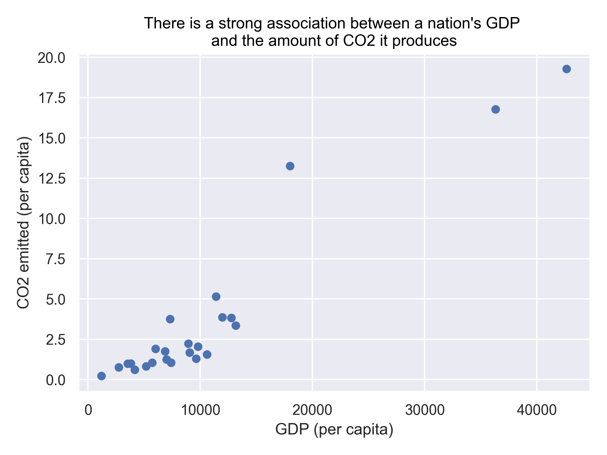
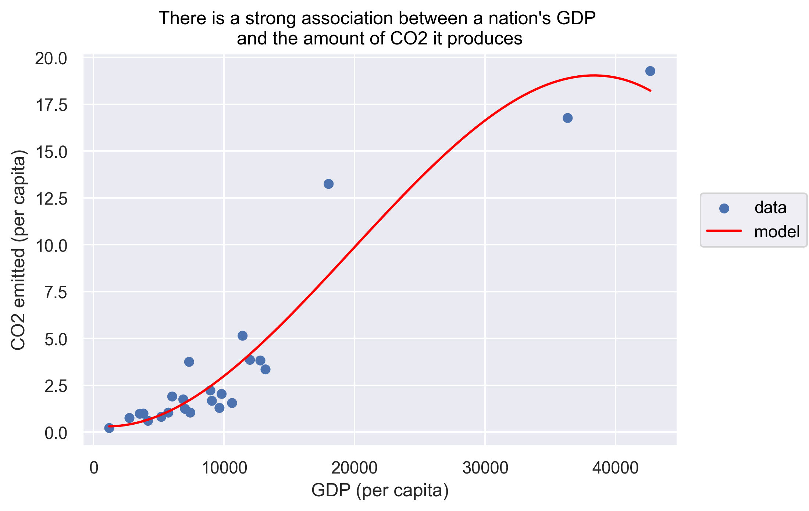
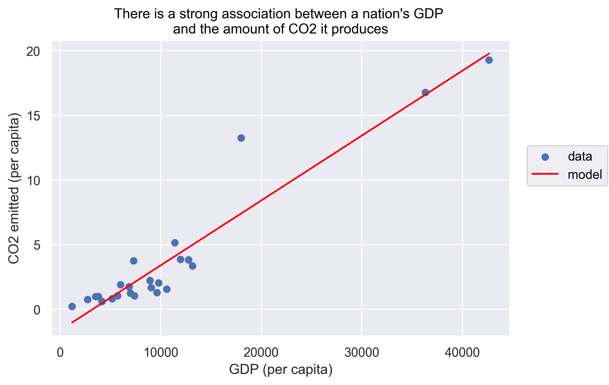
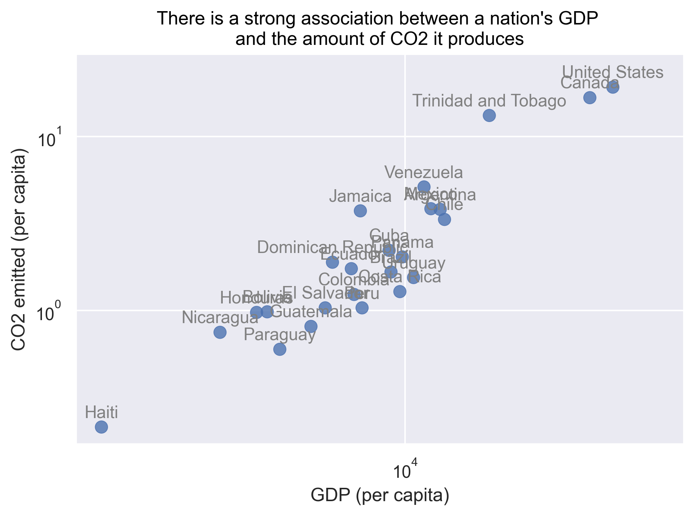
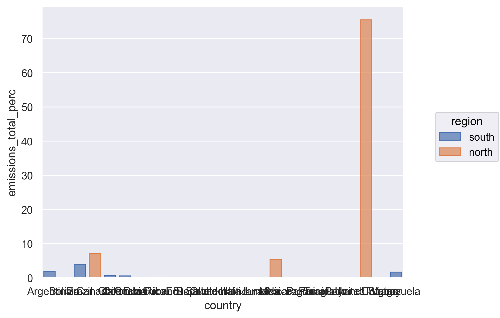
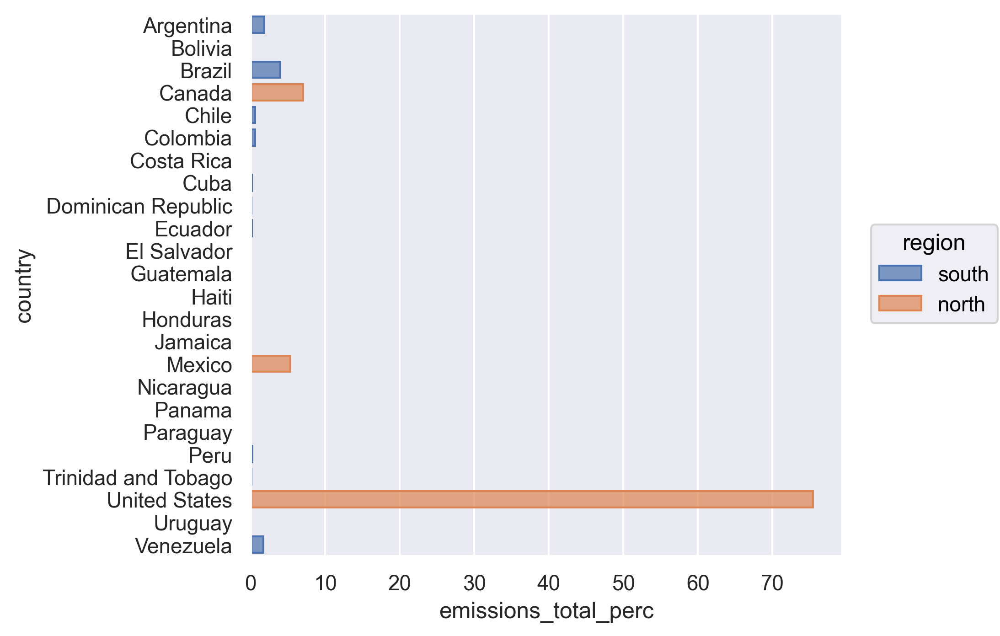
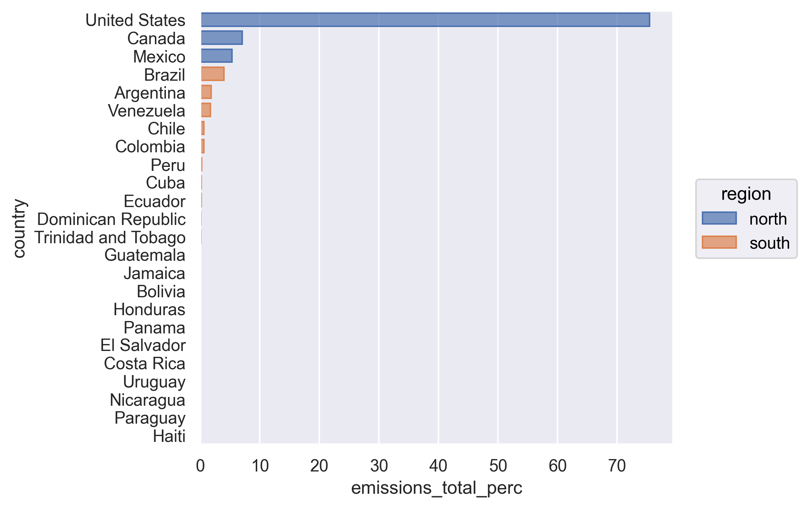
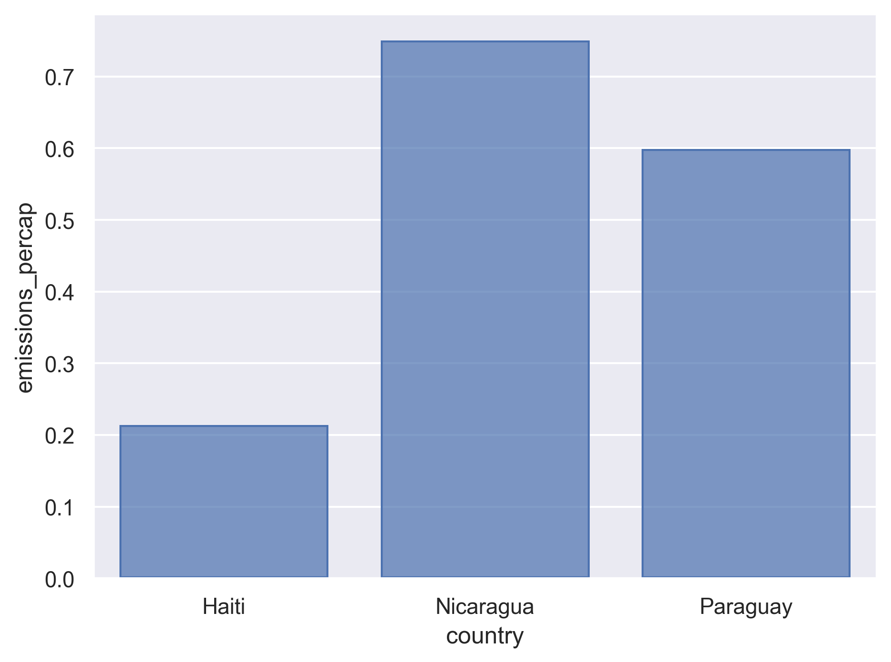
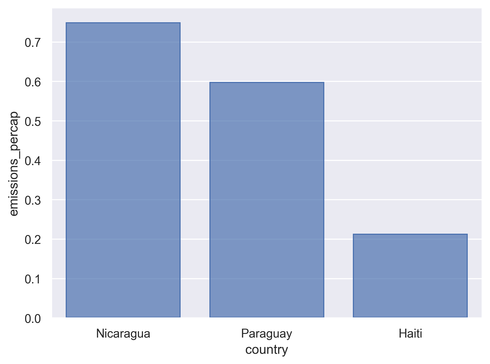

---
# Please do not edit this file directly; it is auto generated.
# Instead, please edit 04-python-data-analysis.md in _episodes_rmd/
title: "Python for Data Analysis"
source: Rmd
teaching: 150
exercises: 15
questions:
- "How can I summarize my data in Python?"
- "How can Python help make my research more reproducible?"
- "How can I combine two datasets from different sources?"
- "How can data tidying facilitate answering analysis questions?"
objectives:
- "To become familiar with the common methods of the Python pandas library."
- "To be able to use pandas to prepare data for analysis."
- "To be able to combine two different data sources using joins."
- "To be able to create plots and summary tables to answer analysis questions."
keypoints:
- "Library importing is an important first step in preparing a Python environment."
- "Data analysis in Python facilitates reproducible research."
- "There are many useful methods in the pandas library that can aid in data analysis."
- "Assessing data source and structure is an important first step in analysis."
- "Preparing data for analysis can take significant effort and planning."
---


### Contents

1.  [Getting started](#getting-started)
    -   [Reading in the data](#reading-in-the-data)
2.  [An introduction to data analysis with pandas](#intro-data-analysis)
    -   [Get stats fast with `describe`](#get-stats-fast-with-describe)
    -   [Narrow down rows with `query`](#narrow-down-rows-with-query)
    -   [Grouping rows using `groupby`](#grouping-rows-using-groupby)
    -   [Make new variables with `assign`](#make-new-variables-with-assign)
    -   [Subset columns](#subset-columns)
    -   [Changing the shape of the data](#changing-the-shape-of-the-data)
3.  [Cleaning up data](#cleaning-up-data)
4.  [Joining data frames](#joining-data-frames)
5.  [Analyzing combined data](#analyzing-combined-data)
6.  [Finishing with Git and GitHub](#finishing-with-git-and-github)

# Getting Started

Yesterday we spent a lot of time making plots in Python using the seaborn library. 
Visualizing data using plots is a very powerful skill in Python, but what if we would like to work with only a subset of our data? 
Or clean up messy data, calculate summary statistics, create a new variable, or join two datasets together? 
There are several different methods for doing this in Python, and we will touch on a few today using the fast and powerful pandas library.

- First, navigate to the `un-reports` directory in your Command Line Interface (i.e., Anaconda Prompt for Windows and Terminal for MacOS and Linux) and launch JupyterLab.
- Once JupyterLab is opened in your web browser, you can check you are at the correct directory by seeing if the JupyterLab File Browser (located on the left side panel) shows the folders and files inside the `un-reports` directory. 
- Create a new Jupyter notebook file for our work. 
    - Make sure you are at the `un-reports` home directory.
    - On the Launcher tab (the main window on the right) click "Python 3" under the Notebook category. 
- Then you should see a new file named `Untitled.ipynb` been created on the File Browser. Left-click the file on the File Browser and rename it to `un_data_analysis.ipynb`.

### Reading in the data

We will start by reading in the complete gapminder dataset that we used yesterday into our fresh new Jupyter notebook. 
Let's type the code into a cell: `gapminder = pd.read_csv("./data/gapminder_data.csv")`

> ## Exercise
>
> If we look in the console now, we'll see we've received an error message saying that "name 'pd' is not defined". *Hint: Libraries...*
>
> > ## Solution
> >
> > What this means is that Python did not recognize the `pd` part of the code and thus cannot find the `read_csv` function we are trying to call. The reason for this usually is that we are trying to run a function from a library that we have not yet imported. This is a very common error message that you will probably see again when using Python. It's important to remember that you will need to import any libraries you want to use into Python each time you start a new notebook. The `read_csv` function comes from the pandas library so we will just import the pandas library and run the code again.
> {: .solution}
{: .challenge}

Now that we know what's wrong, We will use the `read_csv` function from the pandas library. 
Import the pandas library (along with another common library numpy) and read in the gapminder dataset using the code below.


~~~
import numpy as np
import pandas as pd

gapminder = pd.read_csv("./data/gapminder_data.csv")
gapminder     # this line is just to show the data in the Jupyter notebook output
~~~
{: .language-python}

~~~
          country  year         pop continent  lifeExp   gdpPercap
0     Afghanistan  1952   8425333.0      Asia   28.801  779.445314
1     Afghanistan  1957   9240934.0      Asia   30.332  820.853030
2     Afghanistan  1962  10267083.0      Asia   31.997  853.100710
3     Afghanistan  1967  11537966.0      Asia   34.020  836.197138
4     Afghanistan  1972  13079460.0      Asia   36.088  739.981106
...           ...   ...         ...       ...      ...         ...
1699     Zimbabwe  1987   9216418.0    Africa   62.351  706.157306
1700     Zimbabwe  1992  10704340.0    Africa   60.377  693.420786
1701     Zimbabwe  1997  11404948.0    Africa   46.809  792.449960
1702     Zimbabwe  2002  11926563.0    Africa   39.989  672.038623
1703     Zimbabwe  2007  12311143.0    Africa   43.487  469.709298

[1704 rows x 6 columns]
~~~
{: .output}

The output above gives us an overview of the data with its first and last few rows, the names of the columns, and the numbers of rows and columns.


If we want more information, we can apply the `info` method to a DataFrame to print some basic information about the DataFrame.
In Python we use the dot notation to apply a method to an object.

> **Note:** When applying a method, we always need to follow the method name by a pair of parenthesis, even if we are not passing any arguments to the method. 

~~~
gapminder.info()
~~~
{: .language-python}

~~~
<class 'pandas.core.frame.DataFrame'>
RangeIndex: 1704 entries, 0 to 1703
Data columns (total 6 columns):
 #   Column     Non-Null Count  Dtype  
---  ------     --------------  -----  
 0   country    1704 non-null   object 
 1   year       1704 non-null   int64  
 2   pop        1704 non-null   float64
 3   continent  1704 non-null   object 
 4   lifeExp    1704 non-null   float64
 5   gdpPercap  1704 non-null   float64
dtypes: float64(3), int64(1), object(2)
memory usage: 80.0+ KB
~~~
{: .output}

- The first line in the output indicates `gapminder`, the output from the `pd.read_csv()` function that we called earlier, is a pandas DataFrame.
A pandas DataFrame is a two-dimensional rectangular table of data with rows and columns.
It is the main data structure that we will be dealing with when working with pandas.
- The information also shows the data type ("Dtype") of each columns. 
  - Not surprisingly, the `year` column has an integer data type ("int64").
  - A few other columns have the data type of floating number ("float64"). 
  - The `country` column has a data type of "object", indicating the data is a string or mixed type.

<!-- 
We can use the Python built-in function `type()`to see the type of the output of the `pd.read_csv()` function, an object now called `gapminder`, with the code below. 

~~~
type(gapminder)
~~~
{: .language-python}

~~~
pandas.core.frame.DataFrame
~~~
{: .output}

The object is a pandas DataFrame, a two-dimensional tabular data with rows and columns.
It is the main data structure that we will be dealing with when working with pandas. -->

Sometimes (especially when our data has many rows) we just want to take a look at the first few rows of the data. We can apply the `head()` method to select the first few rows of a DataFrame. 


~~~
gapminder.head()
~~~
{: .language-python}

~~~
       country  year         pop continent  lifeExp   gdpPercap
0  Afghanistan  1952   8425333.0      Asia   28.801  779.445314
1  Afghanistan  1957   9240934.0      Asia   30.332  820.853030
2  Afghanistan  1962  10267083.0      Asia   31.997  853.100710
3  Afghanistan  1967  11537966.0      Asia   34.020  836.197138
4  Afghanistan  1972  13079460.0      Asia   36.088  739.981106
~~~
{: .output}

By default, the `head` method selects the first 5 rows of the DataFrame. You can change the number of rows by passing a number as an argument to the method. 
For example, we can use the code below to select the first 3 rows.

~~~
gapminder.head(3)
~~~
{: .language-python}

~~~
       country  year         pop continent  lifeExp   gdpPercap
0  Afghanistan  1952   8425333.0      Asia   28.801  779.445314
1  Afghanistan  1957   9240934.0      Asia   30.332  820.853030
2  Afghanistan  1962  10267083.0      Asia   31.997  853.100710
~~~
{: .output}

Similarly, we can apply the `tail` method to select the *last* few rows of a DataFrame. 

~~~
gapminder.tail()
~~~
{: .language-python}

~~~
       country  year         pop continent  lifeExp   gdpPercap
1699  Zimbabwe  1987   9216418.0    Africa   62.351  706.157306
1700  Zimbabwe  1992  10704340.0    Africa   60.377  693.420786
1701  Zimbabwe  1997  11404948.0    Africa   46.809  792.449960
1702  Zimbabwe  2002  11926563.0    Africa   39.989  672.038623
1703  Zimbabwe  2007  12311143.0    Africa   43.487  469.709298
~~~
{: .output}

<!-- In Python we can also use the dot notation to access an attributes of an object.
Unlike methods, attributes do not take any arguments thus are not followed by a pair of braces.

For example, a pandas DataFrame has an attribute `shape` that stores the information of the dimensionality of the DataFrame (in terms of the number of rows and columns). -->


Now we have the tools necessary to work through this lesson.

# An introduction to data analysis with pandas {#intro-data-analysis}

## Get stats fast with `describe` {#get-stats-fast-with-describe}

[*Back to top*](#contents)


Pandas has a handy method `describe` that will generate the summary statistics of the data.
<!-- We can apply that function to our lifeExp column using the `summarize()` function. Here's what that looks like: -->

~~~
gapminder.describe()
~~~
{: .language-python}

~~~
             year           pop      lifeExp      gdpPercap
count  1704.00000  1.704000e+03  1704.000000    1704.000000
mean   1979.50000  2.960121e+07    59.474439    7215.327081
std      17.26533  1.061579e+08    12.917107    9857.454543
min    1952.00000  6.001100e+04    23.599000     241.165876
25%    1965.75000  2.793664e+06    48.198000    1202.060309
50%    1979.50000  7.023596e+06    60.712500    3531.846988
75%    1993.25000  1.958522e+07    70.845500    9325.462346
max    2007.00000  1.318683e+09    82.603000  113523.132900
~~~
{: .output}

The output above shows the summary (or descriptive) statistics for the four numerical columns in our data.

If we are interested in specific columns with specific statistics, we can also select the columns of interest and apply specific methods for statistics.

Let's say we would like to know what is the mean life expectancy in the dataset. 

~~~
(
    gapminder['lifeExp']
    .mean()
)
~~~
{: .language-python}

~~~
59.474439366197174
~~~
{: .output}

We can also get the 5th and 95% percentile of the life expectancy by applying the `quantile` method. 

~~~
(
    gapminder['lifeExp']
    .quantile([0.05, 0.95])
)
~~~
{: .language-python}

~~~
0.05    38.4924
0.95    77.4370
Name: lifeExp, dtype: float64
~~~
{: .output}

Other methods for common descriptive statistics include `median`, `min`, `max`, `std` (for standard deviation), and `var` (for variance). 


<!-- When we call `summarize()`, we can use any of the column names of our data object as values to pass to other functions. `summarize()` will return a new data object and our value will be returned as a column.

> **Note:** The `summarize()` and `summarise()` perform identical functions.

We name this new column so we can use in a future argument. So the `averageLifeExp=` part tells `summarize()` to use "averageLifeExp" as the name of the new column. Note that you don't have to quotes around this new name as long as it starts with a letter and doesn't include a space.

Instead of including the data as an argument, we can use the *pipe operator* `%>%` to pass the data value into the `summarize` function. 


~~~
gapminder_data %>% summarize(averageLifeExp=mean(lifeExp))
~~~
{: .language-r}


~~~
# A tibble: 1 × 1
  averageLifeExp
           <dbl>
1           59.5
~~~
{: .output}
 
This line of code will do the exact same thing as our first summary command, but the piping function tells R to use the `gapminder_data` dataframe as the first argument in the next function.

This lets us "chain" together multiple functions, which will be helpful later. Note that the pipe (`%>%`) is a bit different from using the ggplot plus (`+`). Pipes take the output from the left side and use it as input to the right side. Plusses layer on additional information (right side) to a preexisting plot (left side). 
 
We can also add an <kdb>Enter</kdb> to make it look nicer:  

~~~
gapminder_data %>%
  summarize(averageLifeExp=mean(lifeExp))
~~~
{: .language-r}


~~~
# A tibble: 1 × 1
  averageLifeExp
           <dbl>
1           59.5
~~~
{: .output}

Using the *pipe operator* `%>%` and enter command makes our code more readable. The  *pipe operator* `%>%` also helps to avoid using nested function and minimizes the need for new variables.

Since we use the pipe operator so often, there is a keyboard shortcut for it in JupyterLab. You can press <kdb>Ctrl</kdb>+<kdb>Shift</kdb>+<kdb>M<kdb> on Windows or <kdb>Cmd<kdb>+<kdb>Shift<kdb>+<kdb>M<kdb> on a Mac.

> ## Pro tip: Saving a new dataframe
> Notice that when we run the following code, we are not actually saving a new variable: 
> 
> ~~~
> gapminder_data %>%
>   summarize(averageLifeExp=mean(lifeExp))
> ~~~
> {: .language-r}
> This simply outputs what we have created, but does not change actually change `gapminder_data` or save a new dataframe. To save a new dataframe, we could run: 
> 
> ~~~
> gapminder_data_summarized <- gapminder_data %>%
>   summarize(averageLifeExp=mean(lifeExp))
> ~~~
> {: .language-r}
> Or if we want to change `gapminder_data` itself: 
> 
> ~~~
> gapminder_data <- gapminder_data %>%
>   summarize(averageLifeExp=mean(lifeExp))
> ~~~
> {: .language-r}
> IMPORTANT: This would overwrite the existing `gapminder_data` object. 
> 
> For now, we will not be saving dataframes, since we are just experimenting with `dyplr` functions, but it will be useful later on in this lesson. 
> 
{: .callout} -->

## Narrow down rows with `query` {#narrow-down-rows-with-query}

[*Back to top*](#contents)

Let's take a look at the value we just calculated, which tells us the mean life expectancy for all rows in the data was 59.47. That seems a bit low, doesn't it? What's going on?

Well, remember the dataset contains rows from many different years and many different countries. It's likely that life expectancy has increased overtime, so it may not make sense to average over all the years at the same time.

Use the `max` method to find the most recent year in the data set.

> ## Practice getting descriptive statistics
>
> Find the most recent year in the dataset. 
>
> > ## Solution:
> >
> > 
> > ~~~
> > (
> >     gapminder['year']
> >     .max()
> > )
> > ~~~
> > {: .language-python}
> > 
> > 
> > 
> > ~~~
> > 2007
> > ~~~
> > {: .output}
> > 
> {: .solution}
{: .challenge}

So we see that the most recent year in the dataset is 2007. 
Let's calculate the life expectancy for all countries for only that year. 
To do that, we will apply the `query` method to only use the rows for that year before calculating the mean life expectancy.


~~~
(
    gapminder
    .query("year == 2007")
    ['lifeExp']
    .mean()
)
~~~
{: .language-python}


~~~
67.00742253521126
~~~
{: .output}

> ## Filtering the dataset
>
> What is the mean GDP per capita for the first year in the dataset? *Hint: the column headers identified by `read_csv()` showed us there was a column called gdpPercap in the dataset*
>
> > ## Solution
> >
> > Identify the earliest year in our dataset using `min()` and `summarize()`
> >
> > 
> > ~~~
> > (
> >     gapminder['year']
> >     .min()
> > )
> > ~~~
> > {: .language-python}
> > 
> > 
> > 
> > ~~~
> > 1952
> > ~~~
> > {: .output}
> >
> > We see here that the first year in the dataset is 1952. Filter to only 1952, and determine the mean GDP per capita.
> >
> > 
> > ~~~
> > (
> >     gapminder
> >     .query("year == 1952")
> >     ['gdpPercap']
> >     .mean()
> > )
> > ~~~
> > {: .language-python}
> > 
> > 
> > 
> > ~~~
> > 3725.2760457992963
> > ~~~
> > {: .output}
> > {: .source}
> > By chaining the two methods `query` and `mean` we were able to calculate the mean GDP per capita in the year 1952.
> {: .solution}
{: .challenge}

Notice how the method chaining allows us to combine these two simple steps into a more complicated data extraction?
We took the data, queried the `year` column, selected the `gdpPercap` columns, then took its mean value. 
The string argument we passed to `query` needs to be an expression that will return TRUE or FALSE for each row. 
We use `==` (double equals) when evaluating if two values are equal, and we use `=` (single equal) when assigning values. 
Try changing the code above to use `query("year = 2007")` and see what happens.

Other common Python comparison operators 
- `>` greater than
- `<` less than
- `>=` greater than or equal to 
- `<=` less than or equal to
- `==` equal
- `!=` not equal

We can also use the operator `==` to evaluate if two strings are the same. 
For example, the code below returns all the rows from the United States.


~~~
(
    gapminder
    .query("country == 'United States'")
)
~~~
{: .language-python}

~~~
            country  year          pop continent  lifeExp    gdpPercap
1608  United States  1952  157553000.0  Americas   68.440  13990.48208
1609  United States  1957  171984000.0  Americas   69.490  14847.12712
1610  United States  1962  186538000.0  Americas   70.210  16173.14586
1611  United States  1967  198712000.0  Americas   70.760  19530.36557
1612  United States  1972  209896000.0  Americas   71.340  21806.03594
1613  United States  1977  220239000.0  Americas   73.380  24072.63213
1614  United States  1982  232187835.0  Americas   74.650  25009.55914
1615  United States  1987  242803533.0  Americas   75.020  29884.35041
1616  United States  1992  256894189.0  Americas   76.090  32003.93224
1617  United States  1997  272911760.0  Americas   76.810  35767.43303
1618  United States  2002  287675526.0  Americas   77.310  39097.09955
1619  United States  2007  301139947.0  Americas   78.242  42951.65309
~~~
{: .output}


> **Note:** In a `query` expression, any string values (e.g., *United States* in the code above) need to be wrapped with quotation marks.

> **Note:** In a `query` expression, any column names that does not include any special characters (e.g., a white space) do not need to be wrapped with anything. However, if a column name does include special characters, the name needs be wrapped with a pair of backticks (the key above the <kdb>Tab</kdb> key on your keyboard).


<!-- Similarly, we can use the operator `not in` to evaluate if a value is *not* in a list.  -->

Often times we may wish to query the data based on more than a single criterion. 
In a `query` expression we can combine multiple criteria with Python logical operators `and` or `or`. 
For example, the code below returns all the rows that from the United States *and* after year 2000.

~~~
(
    gapminder
    .query("country == 'United States' and year > 2000")
)
~~~
{: .language-python}

~~~
            country  year          pop continent  lifeExp    gdpPercap
1618  United States  2002  287675526.0  Americas   77.310  39097.09955
1619  United States  2007  301139947.0  Americas   78.242  42951.65309
~~~
{: .output}

Note the if the logical operators are all `and`, we can also separate them by chaining multiple `query` methods. 
The code below generates the same results as above. 

~~~
(
    gapminder
    .query("country == 'United States'")
    .query("year > 2000")
)
~~~
{: .language-python}

Sometimes we may wish to query the data based on whether a value is from a list or not. 
In a `query` expression we can use the Python membership operator `in` to achieve that. 
For example, the code below returns all the rows from a list of countries (the United States and Canada).

~~~
(
    gapminder
    .query("country in ['United States', 'Canada']")
)
~~~
{: .language-python}

~~~
            country  year          pop continent  lifeExp    gdpPercap
240          Canada  1952   14785584.0  Americas   68.750  11367.16112
241          Canada  1957   17010154.0  Americas   69.960  12489.95006
242          Canada  1962   18985849.0  Americas   71.300  13462.48555
243          Canada  1967   20819767.0  Americas   72.130  16076.58803
244          Canada  1972   22284500.0  Americas   72.880  18970.57086
245          Canada  1977   23796400.0  Americas   74.210  22090.88306
246          Canada  1982   25201900.0  Americas   75.760  22898.79214
247          Canada  1987   26549700.0  Americas   76.860  26626.51503
248          Canada  1992   28523502.0  Americas   77.950  26342.88426
249          Canada  1997   30305843.0  Americas   78.610  28954.92589
250          Canada  2002   31902268.0  Americas   79.770  33328.96507
251          Canada  2007   33390141.0  Americas   80.653  36319.23501
1608  United States  1952  157553000.0  Americas   68.440  13990.48208
1609  United States  1957  171984000.0  Americas   69.490  14847.12712
1610  United States  1962  186538000.0  Americas   70.210  16173.14586
1611  United States  1967  198712000.0  Americas   70.760  19530.36557
1612  United States  1972  209896000.0  Americas   71.340  21806.03594
1613  United States  1977  220239000.0  Americas   73.380  24072.63213
1614  United States  1982  232187835.0  Americas   74.650  25009.55914
1615  United States  1987  242803533.0  Americas   75.020  29884.35041
1616  United States  1992  256894189.0  Americas   76.090  32003.93224
1617  United States  1997  272911760.0  Americas   76.810  35767.43303
1618  United States  2002  287675526.0  Americas   77.310  39097.09955
1619  United States  2007  301139947.0  Americas   78.242  42951.65309
~~~
{: .output}
 
In a `query` expression we can refer to variables in the environment by prefixing them with an ‘@’ character. For example, the code below generates the same results as above.

~~~
country_list = ['United States', 'Canada']

(
    gapminder
    .query("country in @country_list")
)
~~~
{: .language-python}

Lastly, we can use the `not in` operator to evaluate if a value is *not* in a list. 
For example, the code below returns all the rows for 2007 in Americas except for the United States and Canada. 

~~~
(
    gapminder
    .query("year == 2007")
    .query("continent == 'Americas'")
    .query("country not in ['United States', 'Canada']")
)
~~~
{: .language-python}

~~~
                  country  year          pop continent  lifeExp     gdpPercap
59              Argentina  2007   40301927.0  Americas   75.320  12779.379640
143               Bolivia  2007    9119152.0  Americas   65.554   3822.137084
179                Brazil  2007  190010647.0  Americas   72.390   9065.800825
287                 Chile  2007   16284741.0  Americas   78.553  13171.638850
311              Colombia  2007   44227550.0  Americas   72.889   7006.580419
359            Costa Rica  2007    4133884.0  Americas   78.782   9645.061420
395                  Cuba  2007   11416987.0  Americas   78.273   8948.102923
443    Dominican Republic  2007    9319622.0  Americas   72.235   6025.374752
455               Ecuador  2007   13755680.0  Americas   74.994   6873.262326
479           El Salvador  2007    6939688.0  Americas   71.878   5728.353514
611             Guatemala  2007   12572928.0  Americas   70.259   5186.050003
647                 Haiti  2007    8502814.0  Americas   60.916   1201.637154
659              Honduras  2007    7483763.0  Americas   70.198   3548.330846
791               Jamaica  2007    2780132.0  Americas   72.567   7320.880262
995                Mexico  2007  108700891.0  Americas   76.195  11977.574960
1115            Nicaragua  2007    5675356.0  Americas   72.899   2749.320965
1187               Panama  2007    3242173.0  Americas   75.537   9809.185636
1199             Paraguay  2007    6667147.0  Americas   71.752   4172.838464
1211                 Peru  2007   28674757.0  Americas   71.421   7408.905561
1259          Puerto Rico  2007    3942491.0  Americas   78.746  19328.709010
1559  Trinidad and Tobago  2007    1056608.0  Americas   69.819  18008.509240
1631              Uruguay  2007    3447496.0  Americas   76.384  10611.462990
1643            Venezuela  2007   26084662.0  Americas   73.747  11415.805690
~~~
{: .output}


## Grouping rows using `groupby` {#grouping-rows-using-groupby}

[*Back to top*](#contents)

We see that the life expectancy in 2007 is much larger than the value we got using all of the rows. 
It seems life expectancy is increasing which is good news. 
But now we might be interested in calculating the mean for each year. 
Rather than doing a bunch of different `query`'s for each year, we can instead use the `groupby` method. 
This method allows us to tell the code to treat the rows in logical groups, so rather than aggregating over all the rows, we will get one summary value for each group. Here's what that will look like:

~~~
(
    gapminder
    .groupby('year')['lifeExp']
    .mean()
)
~~~
{: .language-python}

~~~
year
1952    49.057620
1957    51.507401
1962    53.609249
1967    55.678290
1972    57.647386
1977    59.570157
1982    61.533197
1987    63.212613
1992    64.160338
1997    65.014676
2002    65.694923
2007    67.007423
Name: lifeExp, dtype: float64
~~~
{: .output}

The `groupby` method expects you to pass in the name of a column (or a list of columns) in your data. 

<!-- Note that you might get a message about the summarize function regrouping the output by 'year'. This simply indicates what the function is grouping by.  -->

> ## Grouping the data
>
> Try calculating the mean life expectancy by continent.
>
> > ## Solution
> >
> > 
> > ~~~
> > (
> >     gapminder
> >     .groupby('continent')['lifeExp']
> >     .mean()
> > )
> > ~~~
> > {: .language-python}
> > 
> > 
> > 
> > ~~~
> > continent
> > Africa      48.865330
> > Americas    64.658737
> > Asia        60.064903
> > Europe      71.903686
> > Oceania     74.326208
> > Name: lifeExp, dtype: float64
> > ~~~
> > {: .output}
> > {: .source}
> >
> > By chaining the two methods `groupby` and `mean` we are able to calculate the mean life expectancy by continent.
> {: .solution}
{: .challenge}

Sometimes we may wish to apply more than one aggregation method. 
For example, we may want to know the mean and minimum life expectancy by continents.
To do so, we can use the aggregation method called `agg` and pass it a list of aggregation methods. 

~~~
(
    gapminder
    .groupby('continent')['lifeExp']
    .agg(['mean', 'min'])
)
~~~
{: .language-python}

~~~
                mean     min
continent                   
Africa     48.865330  23.599
Americas   64.658737  37.579
Asia       60.064903  28.801
Europe     71.903686  43.585
Oceania    74.326208  69.120
~~~
{: .output}


## Make new variables with `assign` {#make-new-variables-with-assign}

[*Back to top*](#contents)

Sometimes we want to create a new column in our data.
We can use the pandas `assign` method to assign new columns to a DataFrame.

We have a column for the population and the GDP per capita. 
If we wanted to get the total GDP, we could multiply the per capita GDP values by the total population. 
Below is what the code would look like:


~~~
(
    gapminder
    .assign(gdp=lambda df: df['pop'] * df['gdpPercap'])
)
~~~
{: .language-python}


~~~
          country  year         pop continent  lifeExp   gdpPercap           gdp
0     Afghanistan  1952   8425333.0      Asia   28.801  779.445314  6.567086e+09
1     Afghanistan  1957   9240934.0      Asia   30.332  820.853030  7.585449e+09
2     Afghanistan  1962  10267083.0      Asia   31.997  853.100710  8.758856e+09
3     Afghanistan  1967  11537966.0      Asia   34.020  836.197138  9.648014e+09
4     Afghanistan  1972  13079460.0      Asia   36.088  739.981106  9.678553e+09
...           ...   ...         ...       ...      ...         ...           ...
1699     Zimbabwe  1987   9216418.0    Africa   62.351  706.157306  6.508241e+09
1700     Zimbabwe  1992  10704340.0    Africa   60.377  693.420786  7.422612e+09
1701     Zimbabwe  1997  11404948.0    Africa   46.809  792.449960  9.037851e+09
1702     Zimbabwe  2002  11926563.0    Africa   39.989  672.038623  8.015111e+09
1703     Zimbabwe  2007  12311143.0    Africa   43.487  469.709298  5.782658e+09

[1704 rows x 7 columns]
~~~
{: .output}

This will add a new column called "gdp" to our data. 
We use the column names as if they were regular values that we want to perform mathematical operations on and provide the name in front of an equals sign.

> ## Assigning multiple columns
> We can also assign multiple columns by separating them with a comma inside `assign()`. Try making a new column for this DataFrame called popInMillions that is the population in million. 
> 
> > ## Solution: 
> > 
> > ~~~
> > (
> >     gapminder
> >     .assign(gdp=lambda df: df['pop'] * df['gdpPercap'],
> >             popInMillions=lambda df: df['pop'] / 1_000_000,
> >            )
)
> > ~~~
> > {: .language-python}
> > 
> > 
> > 
> > ~~~
> >           country  year         pop continent  lifeExp   gdpPercap           gdp  popInMillions
> > 0     Afghanistan  1952   8425333.0      Asia   28.801  779.445314  6.567086e+09       8.425333
> > 1     Afghanistan  1957   9240934.0      Asia   30.332  820.853030  7.585449e+09       9.240934
> > 2     Afghanistan  1962  10267083.0      Asia   31.997  853.100710  8.758856e+09      10.267083
> > 3     Afghanistan  1967  11537966.0      Asia   34.020  836.197138  9.648014e+09      11.537966
> > 4     Afghanistan  1972  13079460.0      Asia   36.088  739.981106  9.678553e+09      13.079460
> > ...           ...   ...         ...       ...      ...         ...           ...            ...
> > 1699     Zimbabwe  1987   9216418.0    Africa   62.351  706.157306  6.508241e+09       9.216418
> > 1700     Zimbabwe  1992  10704340.0    Africa   60.377  693.420786  7.422612e+09      10.704340
> > 1701     Zimbabwe  1997  11404948.0    Africa   46.809  792.449960  9.037851e+09      11.404948
> > 1702     Zimbabwe  2002  11926563.0    Africa   39.989  672.038623  8.015111e+09      11.926563
> > 1703     Zimbabwe  2007  12311143.0    Africa   43.487  469.709298  5.782658e+09      12.311143
> > 
> > [1704 rows x 8 columns]
> > ~~~
> > {: .output}
> {: .solution}
{: .challenge}
 

## Subset columns {#subset-columns}

[*Back to top*](#contents)

We can apply the `query` method to choose a subset of the rows from our data, 
but when we want to choose a subset of columns from our data we can pass a list of column names into (another) pair of square brackets. 
For example, if we only wanted to see the population ("pop") and year values, we can do:


~~~
(
    gapminder
    [['pop', 'year']]
)
~~~
{: .language-python}


~~~
             pop  year
0      8425333.0  1952
1      9240934.0  1957
2     10267083.0  1962
3     11537966.0  1967
4     13079460.0  1972
...          ...   ...
1699   9216418.0  1987
1700  10704340.0  1992
1701  11404948.0  1997
1702  11926563.0  2002
1703  12311143.0  2007

[1704 rows x 2 columns]
~~~
{: .output}

> **Note:** There are two nested pairs of square bracket in the code above. The outer square brackets is the notation for selecting columns from a DataFrame by name. The inner square brackets define a Python list that contains the column names. Try removing one pair of bracket and see what happens. 


We can also apply the `drop` method to drop/remove particular columns. 
For example, if we want everything but the continent and population columns, we can do:


~~~
(
    gapminder
    .drop(columns=['continent', 'pop'])
)
~~~
{: .language-python}


~~~
          country  year  lifeExp   gdpPercap
0     Afghanistan  1952   28.801  779.445314
1     Afghanistan  1957   30.332  820.853030
2     Afghanistan  1962   31.997  853.100710
3     Afghanistan  1967   34.020  836.197138
4     Afghanistan  1972   36.088  739.981106
...           ...   ...      ...         ...
1699     Zimbabwe  1987   62.351  706.157306
1700     Zimbabwe  1992   60.377  693.420786
1701     Zimbabwe  1997   46.809  792.449960
1702     Zimbabwe  2002   39.989  672.038623
1703     Zimbabwe  2007   43.487  469.709298

[1704 rows x 4 columns]
~~~
{: .output}

> ## selecting columns 
> Create a dataframe with only the `country`, `continent`, `year`, and `lifeExp` columns. 
> 
> > ## Solution: 
> > There are multiple ways to do this exercise. Here are two different possibilities. 
> > 
> > 
> > ~~~
> > (
> >     gapminder
> >     [['country', 'continent', 'year', 'lifeExp']]
> > )
> > ~~~
> > {: .language-python}
> > 
> > 
> > 
> > ~~~
> >           country continent  year  lifeExp
> > 0     Afghanistan      Asia  1952   28.801
> > 1     Afghanistan      Asia  1957   30.332
> > 2     Afghanistan      Asia  1962   31.997
> > 3     Afghanistan      Asia  1967   34.020
> > 4     Afghanistan      Asia  1972   36.088
> > ...           ...       ...   ...      ...
> > 1699     Zimbabwe    Africa  1987   62.351
> > 1700     Zimbabwe    Africa  1992   60.377
> > 1701     Zimbabwe    Africa  1997   46.809
> > 1702     Zimbabwe    Africa  2002   39.989
> > 1703     Zimbabwe    Africa  2007   43.487
> > 
> > [1704 rows x 4 columns]
> > ~~~
> > {: .output}
> > 
> > ~~~
> > (
> >     gapminder
> >     .drop(columns=['pop', 'gdpPercap'])
> > )
> > ~~~
> > {: .language-python}
> > 
> > 
> > 
> > ~~~
> >           country  year continent  lifeExp
> > 0     Afghanistan  1952      Asia   28.801
> > 1     Afghanistan  1957      Asia   30.332
> > 2     Afghanistan  1962      Asia   31.997
> > 3     Afghanistan  1967      Asia   34.020
> > 4     Afghanistan  1972      Asia   36.088
> > ...           ...   ...       ...      ...
> > 1699     Zimbabwe  1987    Africa   62.351
> > 1700     Zimbabwe  1992    Africa   60.377
> > 1701     Zimbabwe  1997    Africa   46.809
> > 1702     Zimbabwe  2002    Africa   39.989
> > 1703     Zimbabwe  2007    Africa   43.487
> > 
> > [1704 rows x 4 columns]
> > ~~~
> > {: .output}
> {: .solution}
{: .challenge}


> ## Bonus: Using the `filter` method
>
> The `filter` method can be used to filter columns by their names. It may become handy if you are working with a dataset that has a lot of columns. For example, let's say we wanted to select the year column and all the columns that contain the letter "e". You can do that with:
> 
> 
> ~~~
> (
>     gapminder
>     .filter(like='e')
> )
> ~~~
> {: .language-python}
> 
> 
> 
> ~~~
>       year continent  lifeExp   gdpPercap
> 0     1952      Asia   28.801  779.445314
> 1     1957      Asia   30.332  820.853030
> 2     1962      Asia   31.997  853.100710
> 3     1967      Asia   34.020  836.197138
> 4     1972      Asia   36.088  739.981106
> ...    ...       ...      ...         ...
> 1699  1987    Africa   62.351  706.157306
> 1700  1992    Africa   60.377  693.420786
> 1701  1997    Africa   46.809  792.449960
> 1702  2002    Africa   39.989  672.038623
> 1703  2007    Africa   43.487  469.709298
> 
> [1704 rows x 4 columns]
> ~~~
> {: .output}
> This returns the four columns we are interested in. 
>
> > ## Applying `filter` with regular expression
> >
> > For those of you who know regular expression (pattern matching in text), the `filter` method also supports it. For example, let’s say we want to select all the columns that start with the letter “c”. We can do that with:
> >
> > > ## Solution
> > >
> > >
> > > 
> > > ~~~
> > > (
> > >     gapminder
> > >     .filter(regex='^c')
> > > )
> > > ~~~
> > > {: .language-python}
> > > 
> > > 
> > > 
> > > ~~~
> > >           country continent
> > > 0     Afghanistan      Asia
> > > 1     Afghanistan      Asia
> > > 2     Afghanistan      Asia
> > > 3     Afghanistan      Asia
> > > 4     Afghanistan      Asia
> > > ...           ...       ...
> > > 1699     Zimbabwe    Africa
> > > 1700     Zimbabwe    Africa
> > > 1701     Zimbabwe    Africa
> > > 1702     Zimbabwe    Africa
> > > 1703     Zimbabwe    Africa
> > > 
> > > [1704 rows x 2 columns]
> > > ~~~
> > > {: .output}
> > {: .solution}
> > 
> > Similarly, if we want to select all the columns that end with the letter “p”. We can do that with:
> > > ## Solution
> > >
> > >
> > > 
> > > ~~~
> > > (
> > >     gapminder
> > >     .filter(regex='p$')
> > > )
> > > ~~~
> > > {: .language-python}
> > > 
> > > 
> > > 
> > > ~~~
> > >              pop  lifeExp   gdpPercap
> > > 0      8425333.0   28.801  779.445314
> > > 1      9240934.0   30.332  820.853030
> > > 2     10267083.0   31.997  853.100710
> > > 3     11537966.0   34.020  836.197138
> > > 4     13079460.0   36.088  739.981106
> > > ...          ...      ...         ...
> > > 1699   9216418.0   62.351  706.157306
> > > 1700  10704340.0   60.377  693.420786
> > > 1701  11404948.0   46.809  792.449960
> > > 1702  11926563.0   39.989  672.038623
> > > 1703  12311143.0   43.487  469.709298
> > > 
> > > [1704 rows x 3 columns]
> > > ~~~
> > > {: .output}
> > {: .solution}
> >
> {: .challenge}
> 
{: .solution}


## Changing the shape of the data

[*Back to top*](#contents)

Data comes in many shapes and sizes, and one way we classify data is either "wide" or "long." 
Data that is "long" has one row per observation. 
The gapminder data is in a long format. 
We have one row for each country for each year and each different measurement for that country is in a different column. 
We might describe this data as "tidy" because it makes it easy to work with pandas and seaborn. 
As tidy as it may be, sometimes we may want our data in a "wide" format. 
Typically in "wide" format each row represents a group of observations and each value is placed in a different column rather than a different row. 
For example maybe we want only one row per country and want to spread the life expectancy values into different columns (one for each year).

The pandas methods `pivot` and `melt` make it easy to switch between the two formats.


~~~
(
    gapminder
    [['country', 'continent', 'year', 'lifeExp']]
    .pivot(columns='year', 
           index=['country', 'continent'], 
           values='lifeExp',
          )
)
~~~
{: .language-python}


~~~
year                            1952    1957    1962    1967    1972    1977    1982    1987    1992    1997    2002    2007
country            continent                                                                                                
Afghanistan        Asia       28.801  30.332  31.997  34.020  36.088  38.438  39.854  40.822  41.674  41.763  42.129  43.828
Albania            Europe     55.230  59.280  64.820  66.220  67.690  68.930  70.420  72.000  71.581  72.950  75.651  76.423
Algeria            Africa     43.077  45.685  48.303  51.407  54.518  58.014  61.368  65.799  67.744  69.152  70.994  72.301
Angola             Africa     30.015  31.999  34.000  35.985  37.928  39.483  39.942  39.906  40.647  40.963  41.003  42.731
Argentina          Americas   62.485  64.399  65.142  65.634  67.065  68.481  69.942  70.774  71.868  73.275  74.340  75.320
...                              ...     ...     ...     ...     ...     ...     ...     ...     ...     ...     ...     ...
Vietnam            Asia       40.412  42.887  45.363  47.838  50.254  55.764  58.816  62.820  67.662  70.672  73.017  74.249
West Bank and Gaza Asia       43.160  45.671  48.127  51.631  56.532  60.765  64.406  67.046  69.718  71.096  72.370  73.422
Yemen Rep.         Asia       32.548  33.970  35.180  36.984  39.848  44.175  49.113  52.922  55.599  58.020  60.308  62.698
Zambia             Africa     42.038  44.077  46.023  47.768  50.107  51.386  51.821  50.821  46.100  40.238  39.193  42.384
Zimbabwe           Africa     48.451  50.469  52.358  53.995  55.635  57.674  60.363  62.351  60.377  46.809  39.989  43.487

[142 rows x 12 columns]
~~~
{: .output}

Notice here that we tell `pivot` which columns to pull the names we wish our new columns to be named from the year variable, 
and the values to populate those columns from the lifeExp variable. 
We see that the resulting table has new columns by year, and the values populate it with country and continent dictating the rows.

The pandas `melt` method allows us to "melt" a table from wide format to long format. 
The code below convert our wide table back to the long format. 

~~~
(
    gapminder
    [['country', 'continent', 'year', 'lifeExp']]
    .pivot(columns='year', 
           index=['country', 'continent'], 
           values='lifeExp',
          )
    .reset_index()
    .melt(id_vars=['country', 'continent'],
          value_name='lifeExp',
         )
)
~~~
{: .language-python}


~~~
                 country continent  year  lifeExp
0            Afghanistan      Asia  1952   28.801
1                Albania    Europe  1952   55.230
2                Algeria    Africa  1952   43.077
3                 Angola    Africa  1952   30.015
4              Argentina  Americas  1952   62.485
...                  ...       ...   ...      ...
1699             Vietnam      Asia  2007   74.249
1700  West Bank and Gaza      Asia  2007   73.422
1701          Yemen Rep.      Asia  2007   62.698
1702              Zambia    Africa  2007   42.384
1703            Zimbabwe    Africa  2007   43.487

[1704 rows x 4 columns]
~~~
{: .output}

Before we move on to more data cleaning, let's create the final gapminder dataframe we will be working with for the rest of the lesson! 

> ## Final Americas 2007 gapminder dataset
> Read in the `gapminder_data.csv` file, filter out the year 2007 and the continent "Americas." Then drop the `year` and `continent` columns from the dataframe. Then save the new dataframe into a variable called `gapminder_2007`. 
> 
> > ## Solution: 
> > 
> > ~~~
> > gapminder_2007 = (
> >     gapminder
> >     .query("year == 2007 and continent == 'Americas'")
> >     .drop(columns=['year', 'continent'])
> > )
> > ~~~
> > {: .language-python}
> > 
> > 
> > 
> > ~~~
> >                   country          pop  lifeExp     gdpPercap
> > 59              Argentina   40301927.0   75.320  12779.379640
> > 143               Bolivia    9119152.0   65.554   3822.137084
> > 179                Brazil  190010647.0   72.390   9065.800825
> > 251                Canada   33390141.0   80.653  36319.235010
> > 287                 Chile   16284741.0   78.553  13171.638850
> > 311              Colombia   44227550.0   72.889   7006.580419
> > 359            Costa Rica    4133884.0   78.782   9645.061420
> > 395                  Cuba   11416987.0   78.273   8948.102923
> > 443    Dominican Republic    9319622.0   72.235   6025.374752
> > 455               Ecuador   13755680.0   74.994   6873.262326
> > 479           El Salvador    6939688.0   71.878   5728.353514
> > 611             Guatemala   12572928.0   70.259   5186.050003
> > 647                 Haiti    8502814.0   60.916   1201.637154
> > 659              Honduras    7483763.0   70.198   3548.330846
> > 791               Jamaica    2780132.0   72.567   7320.880262
> > 995                Mexico  108700891.0   76.195  11977.574960
> > 1115            Nicaragua    5675356.0   72.899   2749.320965
> > 1187               Panama    3242173.0   75.537   9809.185636
> > 1199             Paraguay    6667147.0   71.752   4172.838464
> > 1211                 Peru   28674757.0   71.421   7408.905561
> > 1259          Puerto Rico    3942491.0   78.746  19328.709010
> > 1559  Trinidad and Tobago    1056608.0   69.819  18008.509240
> > 1619        United States  301139947.0   78.242  42951.653090
> > 1631              Uruguay    3447496.0   76.384  10611.462990
> > 1643            Venezuela   26084662.0   73.747  11415.805690
> > ~~~
> > {: .output}
> > 
> {: .solution}
{: .challenge}

Awesome! This is the dataframe we will be using later on in this lesson. 


## Reviewing Git and GitHub
Now that we have our gapminder data prepared, let's use what we learned about git and GitHub in the previous lesson to add, commit, and push our changes.  

Open Terminal/Git Bash, if you do not have it open already. First we'll need to navigate to our un-report directory.

Let's start by print our current working directory and listing the items in the directory, to see where we are. 
``` 
pwd
ls
```
{: .language-bash}

Now, we'll navigate to the un-report directory. 
```
cd ~/Desktop/un-report  
ls
```
{: .language-bash}

To start, let's pull to make sure our local repository is up to date. 
```
git status
git pull
```
{: .language-bash}

Not let's add and commit our changes. 
```
git status
git add
git status "un_data_analysis.ipynb"  
git commit -m "Create data analysis file"  
```
{: .language-bash}

Finally, let's check our commits and then push the commits to GitHub. 
```
git status
git log --online  
git push 
git status
``` 
{: .language-bash}

# Cleaning up data

[*Back to top*](#contents)

Researchers are often pulling data from several sources, and the process of making data compatible with one another and prepared for analysis can be a large undertaking. 
Luckily, there are many functions that allow us to do this with pandas. 
We've been working with the gapminder dataset, which contains population and GDP data by year. 
In this section, we practice cleaning and preparing a second dataset containing CO2 emissions data by country and year, sourced from [the UN](https://data.un.org/_Docs/SYB/CSV/SYB63_310_202009_Carbon%20Dioxide%20Emission%20Estimates.csv).

It's always good to go into data cleaning with a clear goal in mind. 
Here, we'd like to prepare the CO2 UN data to be compatible with our gapminder data so we can directly compare GDP to CO2 emissions. 
To make this work, we'd like a data frame that contains a column with the country name, and columns for different ways of measuring CO2 emissions. 
We will also want the data to be collected as close to 2007 as possible (the last year we have data for in gapminder). 
Let's start with reading the data in using pandas's `read_csv` function.


~~~
pd.read_csv("./data/co2-un-data.csv")
~~~
{: .language-python}


~~~
                      T24 CO2 emission estimates Unnamed: 2                                         Unnamed: 3 Unnamed: 4 Unnamed: 5  \
0     Region/Country/Area                    NaN       Year                                             Series      Value  Footnotes   
1                       8                Albania       1975  Emissions (thousand metric tons of carbon diox...  4338.3340        NaN   
2                       8                Albania       1985  Emissions (thousand metric tons of carbon diox...  6929.9260        NaN   
3                       8                Albania       1995  Emissions (thousand metric tons of carbon diox...  1848.5490        NaN   
4                       8                Albania       2005  Emissions (thousand metric tons of carbon diox...  3825.1840        NaN   
...                   ...                    ...        ...                                                ...        ...        ...   
2128                  716               Zimbabwe       2005  Emissions per capita (metric tons of carbon di...     0.7940        NaN   
2129                  716               Zimbabwe       2010  Emissions per capita (metric tons of carbon di...     0.6720        NaN   
2130                  716               Zimbabwe       2015  Emissions per capita (metric tons of carbon di...     0.7490        NaN   
2131                  716               Zimbabwe       2016  Emissions per capita (metric tons of carbon di...     0.6420        NaN   
2132                  716               Zimbabwe       2017  Emissions per capita (metric tons of carbon di...     0.5880        NaN   

                                             Unnamed: 6  
0                                                Source  
1     International Energy Agency, IEA World Energy ...  
2     International Energy Agency, IEA World Energy ...  
3     International Energy Agency, IEA World Energy ...  
4     International Energy Agency, IEA World Energy ...  
...                                                 ...  
2128  International Energy Agency, IEA World Energy ...  
2129  International Energy Agency, IEA World Energy ...  
2130  International Energy Agency, IEA World Energy ...  
2131  International Energy Agency, IEA World Energy ...  
2132  International Energy Agency, IEA World Energy ...  

[2133 rows x 7 columns]
~~~
{: .output}


Looking at the table that is outputted above we can see that there appear to be two rows at the top of the file that contain information about the data in the table. 
The first is a header that tells us the table number and its name. 
Ideally, we'd skip that. We can do this using the `skiprows` argument in `read_csv`` by giving it a number of rows to skip.

~~~
pd.read_csv("./data/co2-un-data.csv", skiprows=1)
~~~
{: .language-python}


~~~
      Region/Country/Area Unnamed: 1  Year                                             Series     Value Footnotes  \
0                       8    Albania  1975  Emissions (thousand metric tons of carbon diox...  4338.334       NaN   
1                       8    Albania  1985  Emissions (thousand metric tons of carbon diox...  6929.926       NaN   
2                       8    Albania  1995  Emissions (thousand metric tons of carbon diox...  1848.549       NaN   
3                       8    Albania  2005  Emissions (thousand metric tons of carbon diox...  3825.184       NaN   
4                       8    Albania  2010  Emissions (thousand metric tons of carbon diox...  3930.295       NaN   
...                   ...        ...   ...                                                ...       ...       ...   
2127                  716   Zimbabwe  2005  Emissions per capita (metric tons of carbon di...     0.794       NaN   
2128                  716   Zimbabwe  2010  Emissions per capita (metric tons of carbon di...     0.672       NaN   
2129                  716   Zimbabwe  2015  Emissions per capita (metric tons of carbon di...     0.749       NaN   
2130                  716   Zimbabwe  2016  Emissions per capita (metric tons of carbon di...     0.642       NaN   
2131                  716   Zimbabwe  2017  Emissions per capita (metric tons of carbon di...     0.588       NaN   

                                                 Source  
0     International Energy Agency, IEA World Energy ...  
1     International Energy Agency, IEA World Energy ...  
2     International Energy Agency, IEA World Energy ...  
3     International Energy Agency, IEA World Energy ...  
4     International Energy Agency, IEA World Energy ...  
...                                                 ...  
2127  International Energy Agency, IEA World Energy ...  
2128  International Energy Agency, IEA World Energy ...  
2129  International Energy Agency, IEA World Energy ...  
2130  International Energy Agency, IEA World Energy ...  
2131  International Energy Agency, IEA World Energy ...  

[2132 rows x 7 columns]
~~~
{: .output}

Now the outputted table looks better.

<!-- > ## Warnings and Errors
> It's important to differentiate between Warnings and Errors in R. A warning tells us, "you might want to know about this issue, but R still did what you asked". An error tells us, "there's something wrong with your code or your data and R didn't do what you asked". You need to fix any errors that arise. Warnings, are probably best to resolve or at least understand why they are coming up.
{.callout} -->

Another thing we can do is to tell the `read_csv` function what the column names should be with the `names` argument where we give it the column names we want as a Python list.
If we do this, then we need to skip 2 rows including the original column headings. 
Let's also save this dataframe to `co2_emissions_dirty` so that we don't have to read it in every time we want to clean it even more.


~~~
co2_emissions_dirty = (
    pd.read_csv("./data/co2-un-data.csv", skiprows=2,
                names=['region', 'country', 'year', 'series', 'value', 'footnotes', 'source'],
               )
)
~~~
{: .language-python}


~~~
co2_emissions_dirty
~~~
{: .language-python}


~~~
      region   country  year                                             series     value footnotes  \
0          8   Albania  1975  Emissions (thousand metric tons of carbon diox...  4338.334       NaN   
1          8   Albania  1985  Emissions (thousand metric tons of carbon diox...  6929.926       NaN   
2          8   Albania  1995  Emissions (thousand metric tons of carbon diox...  1848.549       NaN   
3          8   Albania  2005  Emissions (thousand metric tons of carbon diox...  3825.184       NaN   
4          8   Albania  2010  Emissions (thousand metric tons of carbon diox...  3930.295       NaN   
...      ...       ...   ...                                                ...       ...       ...   
2127     716  Zimbabwe  2005  Emissions per capita (metric tons of carbon di...     0.794       NaN   
2128     716  Zimbabwe  2010  Emissions per capita (metric tons of carbon di...     0.672       NaN   
2129     716  Zimbabwe  2015  Emissions per capita (metric tons of carbon di...     0.749       NaN   
2130     716  Zimbabwe  2016  Emissions per capita (metric tons of carbon di...     0.642       NaN   
2131     716  Zimbabwe  2017  Emissions per capita (metric tons of carbon di...     0.588       NaN   

                                                 source  
0     International Energy Agency, IEA World Energy ...  
1     International Energy Agency, IEA World Energy ...  
2     International Energy Agency, IEA World Energy ...  
3     International Energy Agency, IEA World Energy ...  
4     International Energy Agency, IEA World Energy ...  
...                                                 ...  
2127  International Energy Agency, IEA World Energy ...  
2128  International Energy Agency, IEA World Energy ...  
2129  International Energy Agency, IEA World Energy ...  
2130  International Energy Agency, IEA World Energy ...  
2131  International Energy Agency, IEA World Energy ...  

[2132 rows x 7 columns]
~~~
{: .output}

> ## Bonus: Another way to deal with the column names
> 
> Many data analysts prefer to have their column names be in all lower case. We can apply the `rename` method to set all of the column names to lower case.
> 
> 
> ~~~
> (
>     pd.read_csv("./data/co2-un-data.csv", skiprows=1)
>     .rename(columns=str.lower)
> )
> ~~~
> {: .language-python}
> 
> 
> 
> ~~~
>       region/country/area unnamed: 1  year                                             series     value footnotes  \
> 0                       8    Albania  1975  Emissions (thousand metric tons of carbon diox...  4338.334       NaN   
> 1                       8    Albania  1985  Emissions (thousand metric tons of carbon diox...  6929.926       NaN   
> 2                       8    Albania  1995  Emissions (thousand metric tons of carbon diox...  1848.549       NaN   
> 3                       8    Albania  2005  Emissions (thousand metric tons of carbon diox...  3825.184       NaN   
> 4                       8    Albania  2010  Emissions (thousand metric tons of carbon diox...  3930.295       NaN   
> ...                   ...        ...   ...                                                ...       ...       ...   
> 2127                  716   Zimbabwe  2005  Emissions per capita (metric tons of carbon di...     0.794       NaN   
> 2128                  716   Zimbabwe  2010  Emissions per capita (metric tons of carbon di...     0.672       NaN   
> 2129                  716   Zimbabwe  2015  Emissions per capita (metric tons of carbon di...     0.749       NaN   
> 2130                  716   Zimbabwe  2016  Emissions per capita (metric tons of carbon di...     0.642       NaN   
> 2131                  716   Zimbabwe  2017  Emissions per capita (metric tons of carbon di...     0.588       NaN   
> 
>                                                  source  
> 0     International Energy Agency, IEA World Energy ...  
> 1     International Energy Agency, IEA World Energy ...  
> 2     International Energy Agency, IEA World Energy ...  
> 3     International Energy Agency, IEA World Energy ...  
> 4     International Energy Agency, IEA World Energy ...  
> ...                                                 ...  
> 2127  International Energy Agency, IEA World Energy ...  
> 2128  International Energy Agency, IEA World Energy ...  
> 2129  International Energy Agency, IEA World Energy ...  
> 2130  International Energy Agency, IEA World Energy ...  
> 2131  International Energy Agency, IEA World Energy ...  
> 
> [2132 rows x 7 columns]
> ~~~
> {: .output}
> 
> 
{: .solution}

We previously saw how we can subset columns from a DataFrame using the select function. 
There are a lot of columns with extraneous information in this dataset, let's subset out the columns we are interested in. 

> ## Reviewing selecting columns
> Select the country, year, series, and value columns from our dataset. 
> 
> > ## Solution: 
> > 
> > ~~~
> > (
> >     co2_emissions_dirty
> >     [['country', 'year', 'series', 'value']]
> > )
> > ~~~
> > {: .language-python}
> > 
> > 
> > 
> > ~~~
> >        country  year                                             series     value
> > 0      Albania  1975  Emissions (thousand metric tons of carbon diox...  4338.334
> > 1      Albania  1985  Emissions (thousand metric tons of carbon diox...  6929.926
> > 2      Albania  1995  Emissions (thousand metric tons of carbon diox...  1848.549
> > 3      Albania  2005  Emissions (thousand metric tons of carbon diox...  3825.184
> > 4      Albania  2010  Emissions (thousand metric tons of carbon diox...  3930.295
> > ...        ...   ...                                                ...       ...
> > 2127  Zimbabwe  2005  Emissions per capita (metric tons of carbon di...     0.794
> > 2128  Zimbabwe  2010  Emissions per capita (metric tons of carbon di...     0.672
> > 2129  Zimbabwe  2015  Emissions per capita (metric tons of carbon di...     0.749
> > 2130  Zimbabwe  2016  Emissions per capita (metric tons of carbon di...     0.642
> > 2131  Zimbabwe  2017  Emissions per capita (metric tons of carbon di...     0.588
> > 
> > [2132 rows x 4 columns]
> > ~~~
> > {: .output}
> {: .solution}
{: .challenge}

The series column has two methods of quantifying CO2 emissions - "Emissions (thousand metric tons of carbon dioxide)" and "Emissions per capita (metric tons of carbon dioxide)". 
Those are long titles that we'd like to shorten to make them easier to work with. 
We can shorten them to "emissions_total" and "emissions_percap" using the recode function. 
We can achieve this by applying the pandas `replace` method to replace the values. 
When using the `replace` method we need to tell it which column we want to replace values and then what the old value (e.g. "Emissions (thousand metric tons of carbon dioxide)") and new values (e.g. "emissions_total").


~~~
(
    co2_emissions_dirty[['country', 'year', 'series', 'value']]
    .replace({'series': {"Emissions (thousand metric tons of carbon dioxide)":"emissions_total",
                         "Emissions per capita (metric tons of carbon dioxide)":"emissions_percap"}, 
             })
)
~~~
{: .language-python}


~~~
       country  year            series     value
0      Albania  1975   emissions_total  4338.334
1      Albania  1985   emissions_total  6929.926
2      Albania  1995   emissions_total  1848.549
3      Albania  2005   emissions_total  3825.184
4      Albania  2010   emissions_total  3930.295
...        ...   ...               ...       ...
2127  Zimbabwe  2005  emissions_percap     0.794
2128  Zimbabwe  2010  emissions_percap     0.672
2129  Zimbabwe  2015  emissions_percap     0.749
2130  Zimbabwe  2016  emissions_percap     0.642
2131  Zimbabwe  2017  emissions_percap     0.588

[2132 rows x 4 columns]
~~~
{: .output}

Recall that we'd like to have separate columns for the two ways that we CO2 emissions data. 
To achieve this, we'll apply the `pivot` method that we used previously. 
The columns we want to spread out are "series" (i.e. the `columns` argument) and "value" (i.e. the `value` argument).


~~~
(
    co2_emissions_dirty[['country', 'year', 'series', 'value']]
    .replace({'series': {"Emissions (thousand metric tons of carbon dioxide)":"emissions_total",
                         "Emissions per capita (metric tons of carbon dioxide)":"emissions_percap"}, 
             })
    .pivot(index=['country', 'year'], columns='series', values='value')
    .reset_index()
)
~~~
{: .language-python}


~~~
series   country  year  emissions_percap  emissions_total
0        Albania  1975             1.804         4338.334
1        Albania  1985             2.337         6929.926
2        Albania  1995             0.580         1848.549
3        Albania  2005             1.270         3825.184
4        Albania  2010             1.349         3930.295
...          ...   ...               ...              ...
1061    Zimbabwe  2005             0.794        10272.774
1062    Zimbabwe  2010             0.672         9464.714
1063    Zimbabwe  2015             0.749        11822.362
1064    Zimbabwe  2016             0.642        10368.900
1065    Zimbabwe  2017             0.588         9714.938

[1066 rows x 4 columns]
~~~
{: .output}

Excellent! The last step before we can join this data frame is to get the most data that is for the year closest to 2007 so we can make a more direct comparison to the most recent data we have from gapminder. 
For the sake of time, we'll just tell you that we want data from 2005. 

> ## Bonus: How did we determine that 2005 is the closest year to 2007? 
> 
> We want to make sure we pick a year that is close to 2005, but also a year that has a decent amount of data to work with. One useful tool is the `value_counts` method, which will tell us how many times a value is repeated in a column of a DataFrame. Let's use this function on the year column to see which years we have data for and to tell us whether we have a good number of countries represented in that year.
> 
> 
> ~~~
> (
>     co2_emissions_dirty[['country', 'year', 'series', 'value']]
>     .replace({'series': {"Emissions (thousand metric tons of carbon dioxide)":"emissions_total",
>                          "Emissions per capita (metric tons of carbon dioxide)":"emissions_percap"}, 
>              })
>     .pivot(index=['country', 'year'], columns='series', values='value')
>     .reset_index()
>     ['year']
>     .value_counts()
>     .sort_index()
> )
> ~~~
> {: .language-python}
> 
> 
> 
> ~~~
> year
> 1975    111
> 1985    113
> 1995    136
> 2005    140
> 2010    140
> 2015    142
> 2016    142
> 2017    142
> Name: count, dtype: int64
> ~~~
> {: .output}
> 
> It looks like we have data for 140 countries in 2005 and 2010. We chose 2005 because it is closer to 2007. 
{: .solution}


> ## Filtering rows and removing columns
> Filter out data from 2005 and then drop the year column. (Since we will have only data from one year, it is now irrelevant.)
> 
> > ## Solution: 
> > 
> > ~~~
> > (
> >     co2_emissions_dirty[['country', 'year', 'series', 'value']]
> >     .replace({'series': {"Emissions (thousand metric tons of carbon dioxide)":"emissions_total",
> >                          "Emissions per capita (metric tons of carbon dioxide)":"emissions_percap"}, 
> >              })
> >     .pivot(index=['country', 'year'], columns='series', values='value')
> >     .reset_index()
> >     .query("year == 2005")
> >     .drop(columns='year')
> > )
> > ~~~
> > {: .language-python}
> > 
> > 
> > 
> > ~~~
> > series                     country  emissions_percap  emissions_total
> > 3                          Albania             1.270         3825.184
> > 11                         Algeria             2.327        77474.130
> > 19                          Angola             0.314         6146.691
> > 27                       Argentina             3.819       149476.040
> > 33                         Armenia             1.385         4129.845
> > ...                            ...               ...              ...
> > 1029    Venezuela (Boliv. Rep. of)             5.141       137701.548
> > 1037                      Viet Nam             0.940        79230.185
> > 1045                         Yemen             0.915        18836.222
> > 1053                        Zambia             0.176         2120.692
> > 1061                      Zimbabwe             0.794        10272.774
> > 
> > [140 rows x 3 columns]
> > ~~~
> > {: .output}
> {: .solution}
{: .challenge}

Finally, let's go ahead and assign the output of this code chunk, which is the cleaned dataframe, to a variable name:

~~~
co2_emissions = (
    co2_emissions_dirty[['country', 'year', 'series', 'value']]
    .replace({'series': {'Emissions (thousand metric tons of carbon dioxide)':'emissions_total',
                         'Emissions per capita (metric tons of carbon dioxide)':'emissions_percap'}, 
             })
    .pivot(index=['country', 'year'], columns='series', values='value')
    .reset_index()
    .query("year == 2005")
    .drop(columns='year')
)
~~~
{: .language-python}

<!-- > **Looking at your data:** You can get a look at your data-cleaning hard work by navigating to the **Environment** tab in JupyterLab and clicking the table icon next to the variable name. Notice when we do this, JupyterLab automatically runs the `View()` command. We've made a lot of progress!
{.callout} -->

# Joining data frames

[*Back to top*](#contents)


Now we're ready to join our CO2 emissions data to the gapminder data. 
Previously we saw that we could read in and query the gapminder data like this to get the data from the Americas for 2007 so we can create a new DataFrame with our filtered data:

~~~
gapminder_2007 = (
    gapminder
    .query("year == 2007 and continent == 'Americas'")
    .drop(columns=['year', 'continent'])
)
~~~
{: .language-python}


Look at the data in `co2_emissions` and `gapminder_data_2007`. 
If you had to merge these two data frames together, which column would you use to merge them together? 
If you said "country" - good job!

We'll call country our "key". 
Now, when we join them together, can you think of any problems we might run into when we merge things? 
We might not have CO2 emissions data for all of the countries in the gapminder dataset and vice versa. 
Also, a country might be represented in both data frames but not by the same name in both places. 
As an example, write down the name of the country that the University of Michigan is in - 
we'll come back to your answer shortly!

pandas has a number of tools for joining data frames together depending on what we want to do with the rows of the data of countries that are not represented in both data frames. 
Here we'll be using "inner join" and "outer join". 

In an "inner join", the new data frame only has those rows where the same key is found in both data frames. 
This is a very commonly used join.


> ## Bonus: Other pandas join methods 
>
> There are other types of join too. 
> For a *left* join, if the key is present in the left hand DataFrame, it will appear in the output, even if it is not found in the the right hand DataFrame. 
> For a *right* join, the opposite is true.
> For a *outer* (or full) join, all possible keys are included in the output DataFrame.
> 
> 
{: .solution}

Let's give the `merge` method a try.

~~~
(
    gapminder_2007
    .merge(co2_emissions, how='inner', on='country')
)
~~~
{: .language-python}


~~~
                country          pop  lifeExp     gdpPercap  emissions_percap  emissions_total
0             Argentina   40301927.0   75.320  12779.379640             3.819       149476.040
1                Brazil  190010647.0   72.390   9065.800825             1.667       311623.799
2                Canada   33390141.0   80.653  36319.235010            16.762       540431.495
3                 Chile   16284741.0   78.553  13171.638850             3.343        54434.634
4              Colombia   44227550.0   72.889   7006.580419             1.238        53585.300
5            Costa Rica    4133884.0   78.782   9645.061420             1.286         5463.059
6                  Cuba   11416987.0   78.273   8948.102923             2.220        25051.431
7    Dominican Republic    9319622.0   72.235   6025.374752             1.897        17522.139
8               Ecuador   13755680.0   74.994   6873.262326             1.742        23926.725
9           El Salvador    6939688.0   71.878   5728.353514             1.037         6252.815
10            Guatemala   12572928.0   70.259   5186.050003             0.811        10621.597
11                Haiti    8502814.0   60.916   1201.637154             0.214         1980.992
12             Honduras    7483763.0   70.198   3548.330846             0.976         7192.737
13              Jamaica    2780132.0   72.567   7320.880262             3.746        10281.648
14               Mexico  108700891.0   76.195  11977.574960             3.854       412385.135
15            Nicaragua    5675356.0   72.899   2749.320965             0.750         4032.083
16               Panama    3242173.0   75.537   9809.185636             2.035         6776.118
17             Paraguay    6667147.0   71.752   4172.838464             0.599         3472.665
18                 Peru   28674757.0   71.421   7408.905561             1.037        28632.888
19  Trinidad and Tobago    1056608.0   69.819  18008.509240            13.243        17175.823
20              Uruguay    3447496.0   76.384  10611.462990             1.549         5151.871
~~~
{: .output}

Do you see that we now have data from both DataFrames joined together? 


One thing to notice is that gapminder data had 25 rows, but the output of our join only had 21. 
Let's investigate. 
It appears that there must have been countries in the gapminder data that did not appear in our CO2 emission data. 

Let's do another merge for this, this time with an outer join. 
If we set the `indicator` argument to `True`, it will add a new column called `_merge` to the merged data, and the value indicates whether a particular record appeared at `left_only`, `right_only`, or `both`. 
Then we can do a query to show the data for the keys on the left that are missing from the data frame on the right. 


~~~
(
    gapminder_2007
    .merge(co2_emissions, how='outer', on='country', indicator=True)
    .query("_merge == 'left_only'")
)
~~~
{: .language-python}


~~~
          country          pop  lifeExp     gdpPercap  emissions_percap  emissions_total     _merge
1         Bolivia    9119152.0   65.554   3822.137084               NaN              NaN  left_only
20    Puerto Rico    3942491.0   78.746  19328.709010               NaN              NaN  left_only
22  United States  301139947.0   78.242  42951.653090               NaN              NaN  left_only
24      Venezuela   26084662.0   73.747  11415.805690               NaN              NaN  left_only
~~~
{: .output}

We can see that the CO2 emission data were missing for Bolivia, Puerto Rico, United States, and Venezuela. 


We can query the CO2 emission data to check if there are records contain these names. 

Note we can split a long string by adding a backslash `\` (it's called a line continuation character) at the end of each line.
The string will continue on the next line as if it were a single line.

~~~
(
    co2_emissions
    .query("country.str.contains('Bolivia') or \
            country.str.contains('Puerto Rico') or \
            country.str.contains('United States') or \
            country.str.contains('Venezuela')")
)
~~~
{: .language-python}


~~~
series                     country  emissions_percap  emissions_total
101     Bolivia (Plurin. State of)             0.984         8975.809
1007      United States of America            19.268      5703220.175
1029    Venezuela (Boliv. Rep. of)             5.141       137701.548
~~~
{: .output}

From the outputs above we can see that Bolivia, United States, and Venezuela are called different things in the CO2 emission data. 
Puerto Rico isn't a country; it's part of the United States. 
We can apply the `replace` method to these country names in the CO2 emission data so that the country names for Bolivia, United States, and Venezuela, match those in the gapminder data.

~~~
(
    co2_emissions
    .replace({'country':{'Bolivia (Plurin. State of)':'Bolivia',
                         'United States of America':'United States',
                         'Venezuela (Boliv. Rep. of)':'Venezuela'}
             })
)
~~~
{: .language-python}

~~~
series    country  emissions_percap  emissions_total
3         Albania             1.270         3825.184
11        Algeria             2.327        77474.130
19         Angola             0.314         6146.691
27      Argentina             3.819       149476.040
33        Armenia             1.385         4129.845
...           ...               ...              ...
1029    Venezuela             5.141       137701.548
1037     Viet Nam             0.940        79230.185
1045        Yemen             0.915        18836.222
1053       Zambia             0.176         2120.692
1061     Zimbabwe             0.794        10272.774

[140 rows x 3 columns]
~~~
{: .output}


~~~
(
    gapminder_2007
    .merge(co2_emissions.replace({'country':{'Bolivia (Plurin. State of)':'Bolivia',
                                  'United States of America':'United States',
                                  'Venezuela (Boliv. Rep. of)':'Venezuela'}
                                 }),
           how='outer', on='country', indicator=True)
    .query("_merge == 'left_only'")
)
~~~
{: .language-python}


~~~
        country        pop  lifeExp    gdpPercap  emissions_percap  emissions_total     _merge
20  Puerto Rico  3942491.0   78.746  19328.70901               NaN              NaN  left_only
~~~
{: .output}

Now we see that the replacement of the country names enabled the join for all countries in the gapminder, and we are left with Puerto Rico. 
In the next exercise, let's replace the name Puerto Rico to United States in the gapminder data and then use the `groupby` method to aggregate the data.
We'll use the population data to weight the life expectancy and GDP values.

In the gapminder data, let's first replace the name Puerto Rico to United States. 

~~~
(
    gapminder_2007
    .replace({'country':{'Puerto Rico':'United States'}})
)
~~~
{: .language-python}


~~~
                  country          pop  lifeExp     gdpPercap
59              Argentina   40301927.0   75.320  12779.379640
143               Bolivia    9119152.0   65.554   3822.137084
179                Brazil  190010647.0   72.390   9065.800825
251                Canada   33390141.0   80.653  36319.235010
287                 Chile   16284741.0   78.553  13171.638850
311              Colombia   44227550.0   72.889   7006.580419
359            Costa Rica    4133884.0   78.782   9645.061420
395                  Cuba   11416987.0   78.273   8948.102923
443    Dominican Republic    9319622.0   72.235   6025.374752
455               Ecuador   13755680.0   74.994   6873.262326
479           El Salvador    6939688.0   71.878   5728.353514
611             Guatemala   12572928.0   70.259   5186.050003
647                 Haiti    8502814.0   60.916   1201.637154
659              Honduras    7483763.0   70.198   3548.330846
791               Jamaica    2780132.0   72.567   7320.880262
995                Mexico  108700891.0   76.195  11977.574960
1115            Nicaragua    5675356.0   72.899   2749.320965
1187               Panama    3242173.0   75.537   9809.185636
1199             Paraguay    6667147.0   71.752   4172.838464
1211                 Peru   28674757.0   71.421   7408.905561
1259        United States    3942491.0   78.746  19328.709010
1559  Trinidad and Tobago    1056608.0   69.819  18008.509240
1619        United States  301139947.0   78.242  42951.653090
1631              Uruguay    3447496.0   76.384  10611.462990
1643            Venezuela   26084662.0   73.747  11415.805690
~~~
{: .output}

Now we have to group Puerto Rico and the US together, aggregating and calculating the data for all of the other columns. 
This is a little tricky - we will need a populated-weighted mean of lifeExp and gdpPercap. 

~~~
(
    gapminder_2007
    .replace({'country':{'Puerto Rico':'United States'}})
    .groupby('country')
    .apply(lambda df: pd.Series({'pop': np.sum(df['pop']),
                                 'gdpPercap': np.sum(df['gdpPercap'] * df['pop']) / np.sum(df['pop']),
                                 'lifeExp': np.sum(df['lifeExp'] * df['pop']) / np.sum(df['pop']),
                                }))
)
~~~
{: .language-python}


~~~
                             pop     gdpPercap    lifeExp
country                                                  
Argentina             40301927.0  12779.379640  75.320000
Bolivia                9119152.0   3822.137084  65.554000
Brazil               190010647.0   9065.800825  72.390000
Canada                33390141.0  36319.235010  80.653000
Chile                 16284741.0  13171.638850  78.553000
Colombia              44227550.0   7006.580419  72.889000
Costa Rica             4133884.0   9645.061420  78.782000
Cuba                  11416987.0   8948.102923  78.273000
Dominican Republic     9319622.0   6025.374752  72.235000
Ecuador               13755680.0   6873.262326  74.994000
El Salvador            6939688.0   5728.353514  71.878000
Guatemala             12572928.0   5186.050003  70.259000
Haiti                  8502814.0   1201.637154  60.916000
Honduras               7483763.0   3548.330846  70.198000
Jamaica                2780132.0   7320.880262  72.567000
Mexico               108700891.0  11977.574960  76.195000
Nicaragua              5675356.0   2749.320965  72.899000
Panama                 3242173.0   9809.185636  75.537000
Paraguay               6667147.0   4172.838464  71.752000
Peru                  28674757.0   7408.905561  71.421000
Trinidad and Tobago    1056608.0  18008.509240  69.819000
United States        305082438.0  42646.380702  78.248513
Uruguay                3447496.0  10611.462990  76.384000
Venezuela             26084662.0  11415.805690  73.747000
~~~
{: .output}


Let's check to see if it worked! 

~~~
(
    gapminder_2007
    .replace({'country':{'Puerto Rico': 'United States'}})
    .groupby('country')
    .apply(lambda df: pd.Series({'pop': np.sum(df['pop']),
                                 'gdpPercap': np.sum(df['gdpPercap'] * df['pop']) / np.sum(df['pop']),
                                 'lifeExp': np.sum(df['lifeExp'] * df['pop']) / np.sum(df['pop']),
                                }))
    .merge(co2_emissions.replace({'country': {"Bolivia (Plurin. State of)":"Bolivia",
                                              "United States of America":"United States",
                                              "Venezuela (Boliv. Rep. of)":"Venezuela"}}),
           how='outer', on='country', indicator=True)
    .query("_merge == 'left_only'")
)
~~~
{: .language-python}


~~~
Empty DataFrame
Columns: [country, pop, gdpPercap, lifeExp, emissions_percap, emissions_total, _merge]
Index: []
~~~
{: .output}

Now the output above returns an empty DataFrame, which tells us that we have reconciled all of the keys from the gapminder data with the data in the CO2 emission data.

Finally, let's merge the data with inner join to create a new DataFrame.


~~~
gapminder_co2 = (
    gapminder_2007
    .replace({'country':{'Puerto Rico': 'United States'}})
    .groupby('country')
    .apply(lambda df: pd.Series({'pop': np.sum(df['pop']),
                                 'gdpPercap': np.sum(df['gdpPercap'] * df['pop']) / np.sum(df['pop']),
                                 'lifeExp': np.sum(df['lifeExp'] * df['pop']) / np.sum(df['pop']),
                                }))
    .merge(co2_emissions.replace({'country': {"Bolivia (Plurin. State of)":"Bolivia",
                                              "United States of America":"United States",
                                              "Venezuela (Boliv. Rep. of)":"Venezuela"}}),
           how='inner', on='country')
)
~~~
{: .language-python}

One last thing! What if we're interested in distinguishing between countries in North America and South America? We want to create two groups - Canada, the United States, and Mexico in one and the other countries in another.  

We can apply the `assign` method to add a new column and use the numpy function `np.where` to help us define the region.
 

~~~
(
    gapminder_co2
    .assign(region=lambda df: np.where(df['country'].isin(['Canada', 'United States', 'Mexico']), 'north', 'south'))
)
~~~
{: .language-python}


~~~
                country          pop     gdpPercap    lifeExp  emissions_percap  emissions_total region
0             Argentina   40301927.0  12779.379640  75.320000             3.819       149476.040  south
1               Bolivia    9119152.0   3822.137084  65.554000             0.984         8975.809  south
2                Brazil  190010647.0   9065.800825  72.390000             1.667       311623.799  south
3                Canada   33390141.0  36319.235010  80.653000            16.762       540431.495  north
4                 Chile   16284741.0  13171.638850  78.553000             3.343        54434.634  south
5              Colombia   44227550.0   7006.580419  72.889000             1.238        53585.300  south
6            Costa Rica    4133884.0   9645.061420  78.782000             1.286         5463.059  south
7                  Cuba   11416987.0   8948.102923  78.273000             2.220        25051.431  south
8    Dominican Republic    9319622.0   6025.374752  72.235000             1.897        17522.139  south
9               Ecuador   13755680.0   6873.262326  74.994000             1.742        23926.725  south
10          El Salvador    6939688.0   5728.353514  71.878000             1.037         6252.815  south
11            Guatemala   12572928.0   5186.050003  70.259000             0.811        10621.597  south
12                Haiti    8502814.0   1201.637154  60.916000             0.214         1980.992  south
13             Honduras    7483763.0   3548.330846  70.198000             0.976         7192.737  south
14              Jamaica    2780132.0   7320.880262  72.567000             3.746        10281.648  south
15               Mexico  108700891.0  11977.574960  76.195000             3.854       412385.135  north
16            Nicaragua    5675356.0   2749.320965  72.899000             0.750         4032.083  south
17               Panama    3242173.0   9809.185636  75.537000             2.035         6776.118  south
18             Paraguay    6667147.0   4172.838464  71.752000             0.599         3472.665  south
19                 Peru   28674757.0   7408.905561  71.421000             1.037        28632.888  south
20  Trinidad and Tobago    1056608.0  18008.509240  69.819000            13.243        17175.823  south
21        United States  305082438.0  42646.380702  78.248513            19.268      5703220.175  north
22              Uruguay    3447496.0  10611.462990  76.384000             1.549         5151.871  south
23            Venezuela   26084662.0  11415.805690  73.747000             5.141       137701.548  south
~~~
{: .output}

Let's look at the output - see how the Canada, US, and Mexico rows are all labeled as "north" and everything else is labeled as "south". 

We have reached our data cleaning goals! 
One of the best aspects of doing all of these steps coded in Python is that our efforts are reproducible, and the raw data is maintained. 
With good documentation of data cleaning and analysis steps, we could easily share our work with another researcher who would be able to repeat what we've done. 
However, it's also nice to have a saved `csv` copy of our clean data. 
That way we can access it later without needing to redo our data cleaning, 
and we can also share the cleaned data with collaborators. 
We can apply the `to_csv` method to a DataFrame to save it to a CSV file. 


~~~
(
    gapminder_co2
    .assign(region=lambda df: np.where(df['country'].isin(['Canada', 'United States', 'Mexico']), 'north', 'south'))
    .to_csv("./data/gapminder_co2.csv")
)
~~~
{: .language-python}

Great - Now we can move on to the analysis! 

# Analyzing combined data

[*Back to top*](#contents)

For our analysis, we have two questions we'd like to answer. 
First, is there a relationship between the GDP of a country and the amount of CO2 emitted (per capita)?
Second, Canada, the United States, and Mexico account for nearly half of the population of the Americas. 
What percent of the total CO2 production do they account for?

To answer the first question, we'll plot the CO2 emitted (on a per capita basis) against the GDP (on a per capita basis) using a scatter plot:

~~~
import seaborn.objects as so

(
    so.Plot(gapminder_co2, x='gdpPercap', y='emissions_percap')
    .add(so.Dot())
    .label(x="GDP (per capita)",
           y="CO2 emitted (per capita)",
           title="There is a strong association between a nation's GDP \nand the amount of CO2 it produces")
)
~~~
{: .language-python}



*Tip:* Notice we used the `\n` in our title to get a new line to prevent it from getting cut off.

To help clarify the association, we can add a fitted line representing a 3rd order polynomial regression model.


~~~
(
    so.Plot(gapminder_co2, x='gdpPercap', y='emissions_percap')
    .add(so.Dot(), label='data')
    .add(so.Line(color='red'), so.PolyFit(order=3), label='model')
    .label(x="GDP (per capita)",
           y="CO2 emitted (per capita)",
           title="There is a strong association between a nation's GDP \nand the amount of CO2 it produces")
)
~~~
{: .language-python}



We can force the line to be straight using `order=1` as an argument to `so.PolyFit`.


~~~
(
    so.Plot(gapminder_co2, x='gdpPercap', y='emissions_percap')
    .add(so.Dot(), label='data')
    .add(so.Line(color='red'), so.PolyFit(order=1), label='model')
    .label(x="GDP (per capita)",
           y="CO2 emitted (per capita)",
           title="There is a strong association between a nation's GDP \nand the amount of CO2 it produces")
)
~~~
{: .language-python}




In addition, we see that only two or three countries have very high GDP/emissions, while the rest of the countries are cluttered in the lower ranges of the axes. 
To make it easier to see the relationship we can set the x and y axis to a logarithmic scale.
Lastly, we can also add a text layer that displays the country names next to the markers. 

~~~
(
    so.Plot(gapminder_co2, x='gdpPercap', y='emissions_percap', text='country')
    .add(so.Dot(alpha=.8, pointsize=8))
    .add(so.Text(color='gray', valign='bottom', fontsize=11))
    .scale(x='log', y='log')
    .label(x="GDP (per capita)",
           y="CO2 emitted (per capita)",
           title="There is a strong association between a nation's GDP \nand the amount of CO2 it produces")
    .limit(x=(None, 70_000), y=(None, 30))
)
~~~
{: .language-python}




To answer our first question, as the title of our plot indicates there is indeed a strong association between a nation's GDP and the amount of CO2 it produces.

For the second question, we want to create two groups - Canada, the United States, and Mexico in one and the other countries in another.


~~~
(
    gapminder_co2
    .assign(region=lambda df: np.where(df['country'].isin(['Canada', 'United States', 'Mexico']), 'north', 'south'))
)
~~~
{: .language-python}


~~~
                country          pop     gdpPercap    lifeExp  emissions_percap  emissions_total region
0             Argentina   40301927.0  12779.379640  75.320000             3.819       149476.040  south
1               Bolivia    9119152.0   3822.137084  65.554000             0.984         8975.809  south
2                Brazil  190010647.0   9065.800825  72.390000             1.667       311623.799  south
3                Canada   33390141.0  36319.235010  80.653000            16.762       540431.495  north
4                 Chile   16284741.0  13171.638850  78.553000             3.343        54434.634  south
5              Colombia   44227550.0   7006.580419  72.889000             1.238        53585.300  south
6            Costa Rica    4133884.0   9645.061420  78.782000             1.286         5463.059  south
7                  Cuba   11416987.0   8948.102923  78.273000             2.220        25051.431  south
8    Dominican Republic    9319622.0   6025.374752  72.235000             1.897        17522.139  south
9               Ecuador   13755680.0   6873.262326  74.994000             1.742        23926.725  south
10          El Salvador    6939688.0   5728.353514  71.878000             1.037         6252.815  south
11            Guatemala   12572928.0   5186.050003  70.259000             0.811        10621.597  south
12                Haiti    8502814.0   1201.637154  60.916000             0.214         1980.992  south
13             Honduras    7483763.0   3548.330846  70.198000             0.976         7192.737  south
14              Jamaica    2780132.0   7320.880262  72.567000             3.746        10281.648  south
15               Mexico  108700891.0  11977.574960  76.195000             3.854       412385.135  north
16            Nicaragua    5675356.0   2749.320965  72.899000             0.750         4032.083  south
17               Panama    3242173.0   9809.185636  75.537000             2.035         6776.118  south
18             Paraguay    6667147.0   4172.838464  71.752000             0.599         3472.665  south
19                 Peru   28674757.0   7408.905561  71.421000             1.037        28632.888  south
20  Trinidad and Tobago    1056608.0  18008.509240  69.819000            13.243        17175.823  south
21        United States  305082438.0  42646.380702  78.248513            19.268      5703220.175  north
22              Uruguay    3447496.0  10611.462990  76.384000             1.549         5151.871  south
23            Venezuela   26084662.0  11415.805690  73.747000             5.141       137701.548  south
~~~
{: .output}

Now we can use this column to repeat our `groupby` method.


~~~
(
    gapminder_co2
    .assign(region=lambda df: np.where(df['country'].isin(['Canada', 'United States', 'Mexico']), 'north', 'south'))
    .groupby('region')[["emissions_total", "pop"]]
    .sum()
)
~~~
{: .language-python}


~~~
        emissions_total          pop
region                              
north       6656036.805  447173470.0
south        889331.721  451697714.0
~~~
{: .output}

We see that although Canada, the United States, and Mexico account for close to half the population of the Americas, they account for 88% of the CO2 emitted. We just did this math quickly by plugging the numbers from our table into the console to get the percentages. Can we make that a little more reproducible by calculating percentages for population and total emissions into our data before summarizing?


## Finishing with Git and GitHub {#finishing-with-git-and-github}

Awesome work! Let's make sure it doesn't go to waste. Time to add, commit, and push our changes to GitHub again - do you remember how?

> ## changing directories
> Print your current working directory and list the items in the directory to check where you are. If you are not in the un-report directory, navigate there. 
> > ## Solution: 
> > ```
> > pwd  
> > ls 
> > cd ~/Desktop/un-report  
> > ls
> > ```
> > {: .language-bash}
> {: .solution}
{: .challenge}

> ## reviewing git and GitHub
> 
> Pull to make sure our local repository is up to date. Then add, commit, and push your commits to GitHub. Don't forget to check your git status periodically to make sure everything is going as expected! 
> 
> > ## Solution: 
> > ```
> > git status 
> > git pull
> > git status 
> > git add "data-analysis.ipynb"  
> > git status 
> > git commit -m "Create data analysis file"  
> > git status 
> > git log --online  
> > git push
> > git status 
> > ```
> > {: .language-bash}
> {: .solution}
{: .challenge}


# Bonus 

## Bonus content

### Sort data with `sort_values`

The `sort_values` method allows us to sort our data by some value. 
Let's use the full gapminder data. 
We will take the mean value for each continent in 2007 and then sort it so the continents with the longest life expectancy are on top. 
Which continent might you guess has be highest life expectancy before running the code?

The helper function `ends_with()` can help us here.

~~~
(
    gapminder
    .query("year == 2007")
    .groupby('continent')['lifeExp']
    .mean()
    .sort_values(ascending=False)
)
~~~
{: .language-python}


~~~
continent
Oceania     80.719500
Europe      77.648600
Americas    73.608120
Asia        70.728485
Africa      54.806038
Name: lifeExp, dtype: float64
~~~
{: .output}

Notice we passed the argument `ascending=False` to the `sort_values` method to sort the values in a descending order so the largest values are on top. 
The default is to put the smallest values on top.

## Bonus exercises

> ## Calculating percent
>
> What percentage of the population and CO2 emissions in the Americas does the United States make up? What percentage of the population and CO2 emission does North America make up? 
>
> > ## Solution
> >
> > Create a new variable using `assign` that calculates percentages for the pop and total variables.
> >
> > 
> > ~~~
> > (
> >     gapminder_co2
> >     .assign(region=lambda df: np.where(df['country'].isin(['Canada', 'United States', 'Mexico']), 'north', 'south'), 
> >             emissions_total_perc=lambda df: df['emissions_total']/df['emissions_total'].sum()*100,
> >             pop_perc=lambda df: df['pop']/df['pop'].sum()*100)
> > )
> > ~~~
> > {: .language-python}
> > 
> > 
> > 
> > ~~~
> >                 country          pop     gdpPercap    lifeExp  emissions_percap  emissions_total region  emissions_total_perc   pop_perc
> > 0             Argentina   40301927.0  12779.379640  75.320000             3.819       149476.040  south              1.981030   4.483615
> > 1               Bolivia    9119152.0   3822.137084  65.554000             0.984         8975.809  south              0.118958   1.014512
> > 2                Brazil  190010647.0   9065.800825  72.390000             1.667       311623.799  south              4.130001  21.138807
> > 3                Canada   33390141.0  36319.235010  80.653000            16.762       540431.495  north              7.162427   3.714675
> > 4                 Chile   16284741.0  13171.638850  78.553000             3.343        54434.634  south              0.721431   1.811688
> > 5              Colombia   44227550.0   7006.580419  72.889000             1.238        53585.300  south              0.710175   4.920344
> > 6            Costa Rica    4133884.0   9645.061420  78.782000             1.286         5463.059  south              0.072403   0.459897
> > 7                  Cuba   11416987.0   8948.102923  78.273000             2.220        25051.431  south              0.332011   1.270147
> > 8    Dominican Republic    9319622.0   6025.374752  72.235000             1.897        17522.139  south              0.232224   1.036814
> > 9               Ecuador   13755680.0   6873.262326  74.994000             1.742        23926.725  south              0.317105   1.530328
> > 10          El Salvador    6939688.0   5728.353514  71.878000             1.037         6252.815  south              0.082870   0.772045
> > 11            Guatemala   12572928.0   5186.050003  70.259000             0.811        10621.597  south              0.140770   1.398746
> > 12                Haiti    8502814.0   1201.637154  60.916000             0.214         1980.992  south              0.026254   0.945944
> > 13             Honduras    7483763.0   3548.330846  70.198000             0.976         7192.737  south              0.095327   0.832573
> > 14              Jamaica    2780132.0   7320.880262  72.567000             3.746        10281.648  south              0.136264   0.309291
> > 15               Mexico  108700891.0  11977.574960  76.195000             3.854       412385.135  north              5.465407  12.093044
> > 16            Nicaragua    5675356.0   2749.320965  72.899000             0.750         4032.083  south              0.053438   0.631387
> > 17               Panama    3242173.0   9809.185636  75.537000             2.035         6776.118  south              0.089805   0.360694
> > 18             Paraguay    6667147.0   4172.838464  71.752000             0.599         3472.665  south              0.046024   0.741724
> > 19                 Peru   28674757.0   7408.905561  71.421000             1.037        28632.888  south              0.379476   3.190085
> > 20  Trinidad and Tobago    1056608.0  18008.509240  69.819000            13.243        17175.823  south              0.227634   0.117548
> > 21        United States  305082438.0  42646.380702  78.248513            19.268      5703220.175  north             75.585707  33.940618
> > 22              Uruguay    3447496.0  10611.462990  76.384000             1.549         5151.871  south              0.068279   0.383536
> > 23            Venezuela   26084662.0  11415.805690  73.747000             5.141       137701.548  south              1.824981   2.901936
> > ~~~
> > {: .output}
> >
> > This table shows that the United states makes up 33% of the population of the Americas, but accounts for 76% of total emissions. Now let's take a look at population and emission for the two different continents: 
> >
> > 
> > ~~~
> > (
> >     gapminder_co2
> >     .assign(region=lambda df: np.where(df['country'].isin(['Canada', 'United States', 'Mexico']), 'north', 'south'), 
> >             emissions_total_perc=lambda df: df['emissions_total']/df['emissions_total'].sum()*100,
> >             pop_perc=lambda df: df['pop']/df['pop'].sum()*100,
> >            )
> >     .groupby('region')[['emissions_total_perc', 'pop_perc']]
> >     .sum()
> > )
> > ~~~
> > {: .language-python}
> > 
> > 
> > 
> > ~~~
> >         emissions_total_perc   pop_perc
> > region                                 
> > north              88.213542  49.748337
> > south              11.786458  50.251663
> > ~~~
> > {: .output}
> > 
> {: .solution}
{: .challenge}


> ## CO2 bar plot
> Create a bar plot of the percent of emissions for each country, colored by north and south America.
> > ## Solution 
> > 
> > ~~~
> > (
> >     so.Plot(gapminder_co2
> >             .assign(region=lambda df: np.where(df['country'].isin(['Canada', 'United States', 'Mexico']), 'north', 'south'), 
> >                     emissions_total_perc=lambda df: df['emissions_total']/df['emissions_total'].sum()*100,
> >                     pop_perc=lambda df: df['pop']/df['pop'].sum()*100,),
> >             x='country', y='emissions_total_perc', color='region')
> >     .add(so.Bar())
> > )
> > ~~~
> > {: .language-python}
> > 
> > 
> > 
> > 
> > 
> {: .solution}
> 
> Now switch the x and y axis to make the country names more readable.   
> 
> > ## Solution 
> > 
> > ~~~
> > (
> >     so.Plot(gapminder_co2
> >             .assign(region=lambda df: np.where(df['country'].isin(['Canada', 'United States', 'Mexico']), 'north', 'south'), 
> >                     emissions_total_perc=lambda df: df['emissions_total']/df['emissions_total'].sum()*100,
> >                     pop_perc=lambda df: df['pop']/df['pop'].sum()*100,),
> >             x='emissions_total_perc', y='country', color='region')
> >     .add(so.Bar())
> > )
> > ~~~
> > {: .language-python}
> > 
> > 
> > 
> > 
> > 
> {: .solution}
> 
> Reorder the bars in descending order. **Hint:** what method we used earlier to sort data values?
> > ## Solution 
> > 
> > ~~~
> > (
> >     so.Plot(gapminder_co2
> >             .assign(region=lambda df: np.where(df['country'].isin(['Canada', 'United States', 'Mexico']), 'north', 'south'), 
> >                     emissions_total_perc=lambda df: df['emissions_total']/df['emissions_total'].sum()*100,
> >                     pop_perc=lambda df: df['pop']/df['pop'].sum()*100,)
> >             .sort_values('emissions_total_perc', ascending=False),
> >             x='emissions_total_perc', y='country', color='region')
> >     .add(so.Bar())
> > )
> > ~~~
> > {: .language-python}
> > 
> > 
> > 
> > 
> > 
> {: .solution}
> 
> Practice making it look pretty! 
{: .challenge}


> ## low emissions
> Find the 3 countries with lowest per capita emissions.
> 
> > ## Solution 
> > 
> > ~~~
> > (
> >     gapminder_co2
> >     .assign(region=lambda df: np.where(df['country'].isin(['Canada', 'United States', 'Mexico']), 'north', 'south'), 
> >             emissions_total_perc=lambda df: df['emissions_total']/df['emissions_total'].sum()*100,
> >             pop_perc=lambda df: df['pop']/df['pop'].sum()*100,)
> >     .sort_values('emissions_percap', ascending=True)[['country', 'emissions_percap']]
> >     .head(3)
> > )
> > ~~~
> > {: .language-python}
> > 
> > 
> > 
> > ~~~
> >       country  emissions_percap
> > 12      Haiti             0.214
> > 18   Paraguay             0.599
> > 16  Nicaragua             0.750
> > ~~~
> > {: .output}
> {: .solution}
> 
> Create a bar chart for the per capita emissions for just those three countries. 
> > ## Solution 
> > 
> > ~~~
> > (
> >     so.Plot(gapminder_co2
> >             .assign(region=lambda df: np.where(df['country'].isin(['Canada', 'United States', 'Mexico']), 'north', 'south'), 
> >                     emissions_total_perc=lambda df: df['emissions_total']/df['emissions_total'].sum()*100,
> >                     pop_perc=lambda df: df['pop']/df['pop'].sum()*100,)
> >             .query("country in ['Haiti', 'Paraguay', 'Nicaragua']"),
> >             x='country', y='emissions_percap')
> >     .add(so.Bar())
> > )
> > ~~~
> > {: .language-python}
> > 
> > 
> > 
> > 
> > 
> {: .solution}
> 
> Reorder them in descending order.
> > ## Solution 
> > 
> > ~~~
> > (
> >     so.Plot(gapminder_co2
> >             .assign(region=lambda df: np.where(df['country'].isin(['Canada', 'United States', 'Mexico']), 'north', 'south'), 
> >                     emissions_total_perc=lambda df: df['emissions_total']/df['emissions_total'].sum()*100,
> >                     pop_perc=lambda df: df['pop']/df['pop'].sum()*100,)
> >             .query("country in ['Haiti', 'Paraguay', 'Nicaragua']")
> >             .sort_values('emissions_percap', ascending=False),
> >             x='country', y='emissions_percap')
> >     .add(so.Bar())
> > )
> > ~~~
> > {: .language-python}
> > 
> > 
> > 
> > 
> > 
> {: .solution}
{: .challenge}
