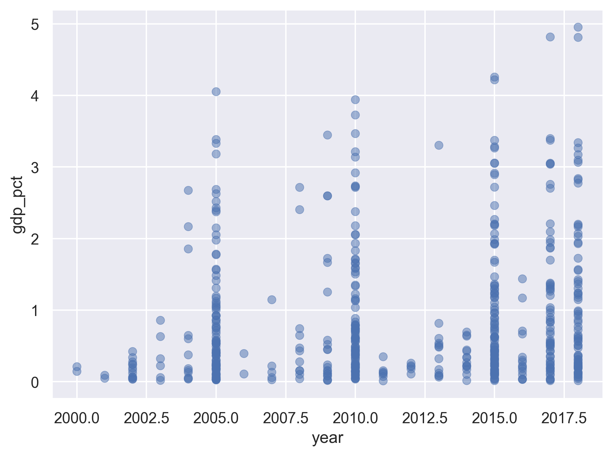

---
# Please do not edit this file directly; it is auto generated.
# Instead, please edit 05-markdown.md in _episodes_rmd/
source: Rmd
title: "Jupyter Notebook and Markdown"
teaching: 45
exercises: 30
questions:
- "How can I make reproducible reports using Jupyter notebook?"
- "How do I format the notebook using Markdown?"
objectives:
- "To create a Jupyter Notebook that combines text, code, and figures."
- "To use Markdown to format our notebook."
# - "To understand how to use R code chunks to include or hide code, figures, and messages."
- "To be aware of the various report formats that can be rendered from Jupyter Notebook."
- "To practice using the Unix Shell, GitHub, and Python through paired programming exercises."
keypoints:
  - "Jupyter Notebook is an easy way to create a report that integrates text, code, and figures."
  # - "Options such as `include` and `echo` determine what parts of an R code chunk are included in the Markdown report. "
  - "A Jupyter Notebook can be exported to HTML, PDF, and other formats."
---


### Contents
1. [Why use Jupyter Notebook?](#why-use-jupyter-notebook)
1. [Creating a notebook directory](#creating-a-notebook-directory)
1. [Basic components of a Jupyter Notebook](#basic-components-of-a-jupyter-notebook)
1. [Exporting Jupyter notebook](#exporting-jupyter-notebook)
1. [Beyond JupyterLab and Jupyter notebook](#beyond-jupyterlab-and-jupyter-notebook)
1. [Integrating it all together: Paired exercise](#integrating-it-all-together-paired-exercise)

Recall that our  goal is to generate a report to the United Nations on how a country's life expectancy is related to GDP.

> ## Discussion
> How do you usually share data analyses with your collaborators? Many people share them through a Word or PDF document, a spreadsheet, slides, a  graphic, etc.
{: .discussion}

## Why use Jupyter Notebook?
_[Back to top](#contents)_

In Jupyter Notebook, you can incorporate ordinary text (ex. experimental methods, analysis and discussion of results) alongside code and figures!
This is useful for writing reproducible reports and publications and sharing work with collaborators. 
Because the code is embedded in the notebook, the tables and figures are *reproducible*. 
Anyone can run the code and get the same results. 
If you find an error or want to add more to the report, you can just re-run the document and you'll have updated tables and figures! 
This concept of combining text and code is called [literate programming](https://en.wikipedia.org/wiki/Literate_programming). 
To do this we use Jupyter Notebook, which combines Markdown (renders plain text) with Python. 
A Jupyter Notebook can be exported as an HTML, PDF, or other document formats that we can share with others.

## Creating a notebook directory
_[Back to top](#contents)_

To get started, let's use the Unix Shell to create a directory within `un-report` called `notebooks` where we will write our notebooks to the UN.
First, open the Unix Shell and `cd` to `un-report`:

~~~
pwd
mkdir notebooks
~~~
{: .language-bash}

~~~
/home/USERNAME/Desktop/un-report/notebooks/
~~~
{: .output}


## Basic components of a Jupyter notebook
_[Back to top](#contents)_


### Creating a Jupyter Notebook

Now that we have a better understanding of what we can use jupyter notebooks for, let's start writing a notebook!

We can create a Jupyter notebook in the same way that we did in the previous lessons. 
To create a Jupyter notebook file:
- Launch JupyterLab in your browser
- In the Launcher tab, click the “Python 3” button (under the “Notebook” category)

A Jupyter notebook is composed of cells. 
So far we have only used "code" cells, which is the default cell type for us to write and execute codes. 
In addition to code cells, Jupyter notebook also supports "Markdown" cells for us to include texts, images, tables, and other things as part of a notebook. 

### Introduction to Markdown

[Markdown](https://en.wikipedia.org/wiki/Markdown) is a simple way for creating formatted text.

Let's convert the first cell in the notebook from a code cell to a markdown cell using the dropdown menu located at the tool bar near the top of the notebook. 

We can create headers and subheaders using one or more pound signs `#` followed by a whitespace. 
For example we can add the following headers.
We can run the Markdown cell the same way as running a code cell to see a rendered (formatted) version of the Markdown text we just typed in. 


~~~
# UM Carpentries Workshop - Python
## Day 2: Jupyter Notebook and Markdown
### 2023-12-12
~~~
{: .language-markdown}


OK, now that we know how to make headers, let's practice some more Markdown syntax.

In JupyterLab click the **Help** menu, then click **Markdown Reference**, read through the Markdown syntax. 
Go through the "10 minute Markdown tutorial". 

## Exporting Jupyter notebook
_[Back to top](#contents)_

We can export a notebook to other formats by clicking the **File** menu, then **Save and Export Notebook As...**. 

We can save a notebook as an HTML file if we want to publish it on a web. 
We can even export it as presentation slides. 
When doing so, we can first click the right sidebar (the button icon with two gears). 
Then assign a "Slide Type" for each cell, which allow us to control whether and how a cell should be included in the slides. 

## Beyond JupyterLab and Jupyter notebook
_[Back to top](#contents)_

Jupyter Notebook is a great and popular tool for learning programming, exploratory data analysis, among other things. 
However, there are some drawbacks of Jupyter Notebooks that may or may not be important to you. 

### Google Colab

[Google Colaboratory](https://colab.google/), or Colab for short, is an online Jupyter Notebook service that requires no setup to use on your own computer, and it allows co-editing by multiple people on the same notebook. 
Think of it as a Google Docs but for Jupyter notebooks. 
Note it does require you to sign in to your Google account to use it. 

### Python's `.py` file
Currently it is not easy to do version control with Jupyter Notebooks, as a notebook raw file is in JSON with many details that is not easy for humans to read (e.g., when checking the differences of two versions.)

The good news that is we can also directly write and run Python files which have a file extension `.py`.
The Python file is a plain text file that is straight forward to do version control. 

For example, we can create a Python file from the Launcher tab by clicking the button **Python File**. 
Then we can copy and paste our code to the Python file. 
We can run a Python file by going to our terminals (also available inside JupyterLab from the Launcher tab), and then type `python` followed by the name of the Python file that we wish to run, for example, `python abc.py`.

ProTip: In JupyterLab we can drag the terminal to the bottom of the main work area, so that we can see both our python file and the terminal. 


## Integrating it all together: Paired exercise
_[Back to top](#contents)_

You've learned so much in the past two days - 
how to use the Unix Shell to move around your computer, 
how to use git for version control and GitHub for collaborating with others on code, 
how to make pretty plots and do data analysis in Python, and how to incorporate it all into a Jupyter Notebook.
Now, you're going to work in pairs to practice everything you learned. 
Ideally, you'll have the same pair as for the git/GitHub lesson.
Don't worry - if you have questions, the instructor and helpers are here to help you out!

Only one of the people in your pair is going to create the Jupyter Notebook file. 
The other person is going to collaborate with that person using GitHub. 
So the first step is to choose one person in your pair to create/host the Jupyter Notebook file.

**For the person who is going to host the new Jupyter Notebook file:**
1. Make a new Jupyter Notebook file in the `notebooks` directory
1. Give it an informative title.

**For the person who is going to collaborate with the host of the Jupyter Notebook file:**

If you don't already have your partner's GitHub repo cloned from the git/GitHub lesson, clone their repo to your Desktop under the name `USERNAME-un-report`. 
If you don't remember how to do this, you can review the [git lesson]({{ page.root }}/03-intro-git-github).

The way you will collaborate with each other is as follows:
1. For each exercise, both people will be thinking about how to answer the question, but only one person will be writing the code.
This is called _paired programming_.
1. Once you have completed 3 exercises, the person working on the exercises will add, commit, and push the changes to GitHub.
1. Then the other person will pull the changes from GitHub.
1. The person who pulled changes will code for the next exercise.
1. Repeat the process for as many exercises as you can finish in the remaining time.

Don't worry if you don't finish all of the exercises, and it's not a race between groups!
This is just a way for you to practice what you've learned.
Also, you can switch off more or less frequently depending on how much you want to practice pushing and pulling to/from GitHub.

**One note:** It may be helpful to copy and paste the questions into the Jupyter Notebook file as you go.

### Exercises using the gapminder data
_[Back to top](#contents)_

First we're going to start out with a few questions about the gapminder dataset.

[1] The very first step is to read in the gapminder dataset, so do that first!

> ## Solution
> 
> ~~~
> import numpy as np
> import pandas as pd
> 
> gapminder = pd.read_csv("./data/gapminder_data.csv")
> print(gapminder.head())
> ~~~
> {: .language-python}
> 
> 
> 
> ~~~
>        country  year         pop continent  lifeExp   gdpPercap
> 0  Afghanistan  1952   8425333.0      Asia   28.801  779.445314
> 1  Afghanistan  1957   9240934.0      Asia   30.332  820.853030
> 2  Afghanistan  1962  10267083.0      Asia   31.997  853.100710
> 3  Afghanistan  1967  11537966.0      Asia   34.020  836.197138
> 4  Afghanistan  1972  13079460.0      Asia   36.088  739.981106
> ~~~
> {: .output}
> 
{: .solution}

#### Investigating population over time.
_[Back to top](#contents)_

[2] Make a scatter plot of year vs. population, separated into a plot for each continent. 
**Hint:** you can apply the `facet()` method to the plot to separate it into multiple plots.

> ## Solution
> 
> ~~~
> import seaborn.objects as so
> 
> (
>     so.Plot(gapminder, x='year', y='pop')
>     .add(so.Dot())
>     .facet('continent', wrap=3)
> )
> ~~~
> {: .language-python}
> 
> 
{: .solution}

[3] It seems like there are 2 outliers - which countries are those?

> ## Solution
> 
> ~~~
> (
>     gapminder
>     .query("pop > 1e9")
>     ['country']
>     .unique()
> )
> ~~~
> {: .language-python}
> 
> 
> 
> ~~~
> array(['China', 'India'], dtype=object)
> ~~~
> {: .output}
{: .solution}

[4] Plot year vs. population separated into a plot for each continent but excluding the 2 outlier countries.

> ## Solution
> 
> ~~~
> (
>     gapminder
>     .query("country not in ['China', 'India']")
>     .pipe(so.Plot, x='year', y='pop')
>     .add(so.Dot())
>     .facet('continent', wrap=3)
> )
> ~~~
> {: .language-python}
> 
> 
{: .solution}


#### Bonus questions: come back to these if you have time at the end
_[Back to top](#contents)_


[5] It's hard to see which country is which here. Can you change the scatter plot to a line plot so we can get a better sense of trends over time? 
**Hint:**  This website has more information: https://www.r-graph-gallery.com/line-chart-several-groups-ggplot2.html

> ## Solution
> 
> ~~~
> (
>     gapminder
>     .query("country not in ['China', 'India']")
>     .pipe(so.Plot, x='year', y='pop', group='country')
>     .add(so.Line())
>     .facet('continent', wrap=3)
>     .save("../fig/python-markdown/06-unnamed-3.png", bbox_inches='tight', dpi=300)
> )
> ~~~
> {: .language-python}
> 
> 
{: .solution}

#### Looking into life expectancy a bit more.
_[Back to top](#contents)_

[6] What country had the highest life expectancy in 1982? **Hint:** You can apply the `max()` method to a column when setting up your query. 

> ## Solution
> 
> ~~~
> (
>     gapminder
>     .query("year == 1982")
>     .query("lifeExp == lifeExp.max()")
> )
> ~~~
> {: .language-python}
> 
> ~~~
>     country  year          pop continent  lifeExp    gdpPercap
> 798   Japan  1982  118454974.0      Asia    77.11  19384.10571
> ~~~
> {: .output}
{: .solution}

[7] Now, do the same thing but for all years! 
**Hint:** You can use the `groupby()` method and then apply a custom function using the `apply()` method. 
You can apply the `idxmax()` method to a column to find the index that has the maximum value.

> ## Solution
> 
> ~~~
> (
>     gapminder
>     .groupby('year')
>     .apply(lambda x: x.loc[x['lifeExp'].idxmax()])
> )
> ~~~
> {: .language-python}
> 
> 
> 
> ~~~
>       country  year          pop continent  lifeExp     gdpPercap
> year                                                             
> 1952   Norway  1952    3327728.0    Europe   72.670  10095.421720
> 1957  Iceland  1957     165110.0    Europe   73.470   9244.001412
> 1962  Iceland  1962     182053.0    Europe   73.680  10350.159060
> 1967   Sweden  1967    7867931.0    Europe   74.160  15258.296970
> 1972   Sweden  1972    8122293.0    Europe   74.720  17832.024640
> 1977  Iceland  1977     221823.0    Europe   76.110  19654.962470
> 1982    Japan  1982  118454974.0      Asia   77.110  19384.105710
> 1987    Japan  1987  122091325.0      Asia   78.670  22375.941890
> 1992    Japan  1992  124329269.0      Asia   79.360  26824.895110
> 1997    Japan  1997  125956499.0      Asia   80.690  28816.584990
> 2002    Japan  2002  127065841.0      Asia   82.000  28604.591900
> 2007    Japan  2007  127467972.0      Asia   82.603  31656.068060
> ~~~
> {: .output}
{: .solution}

[8] Make a jitter plot for the life expectancies of the countries in Asia for each year (year is the x axis, life expectancy is the y axis). Also fix the x and y axis labels.

> ## Solution
> ~~~
> (
>     gapminder
>     .query("continent == 'Asia'")
>     .pipe(so.Plot, x='year', y='lifeExp')
>     .add(so.Dot(alpha=.7), so.Jitter(.5))
> )
> ~~~
> {: .language-python}
> 
{: .solution}

##### Bonus questions: come back to these if you have time at the end
_[Back to top](#contents)_

[9] What are the outliers in life expectancy in Asia for each year (lower life expectancy)?

> ## Solution
> 
> ~~~
> (
>     gapminder
>     .query("continent == 'Asia'")
>     .groupby('year')
>     .apply(lambda x: x.loc[x['lifeExp'].idxmin()])
> )
> ~~~
> {: .language-python}
> 
> 
> 
> ~~~
>           country  year         pop continent  lifeExp   gdpPercap
> year                                                              
> 1952  Afghanistan  1952   8425333.0      Asia   28.801  779.445314
> 1957  Afghanistan  1957   9240934.0      Asia   30.332  820.853030
> 1962  Afghanistan  1962  10267083.0      Asia   31.997  853.100710
> 1967  Afghanistan  1967  11537966.0      Asia   34.020  836.197138
> 1972  Afghanistan  1972  13079460.0      Asia   36.088  739.981106
> 1977     Cambodia  1977   6978607.0      Asia   31.220  524.972183
> 1982  Afghanistan  1982  12881816.0      Asia   39.854  978.011439
> 1987  Afghanistan  1987  13867957.0      Asia   40.822  852.395945
> 1992  Afghanistan  1992  16317921.0      Asia   41.674  649.341395
> 1997  Afghanistan  1997  22227415.0      Asia   41.763  635.341351
> 2002  Afghanistan  2002  25268405.0      Asia   42.129  726.734055
> 2007  Afghanistan  2007  31889923.0      Asia   43.828  974.580338
> ~~~
> {: .output}
{: .solution}

[10] Make a plot that shows the range (i.e., mean plus/minus standard deviation) for the life expectancies of the countries over time for each continent. Try to fix the x and y axis labels and text, too. Feel free to change the theme if you'd like.

> ## Solution
> 
> ~~~
> (
>     gapminder
>     .pipe(so.Plot, x='year', y='lifeExp')
>     .add(so.Range(), so.Est(func='mean', errorbar='sd'))
>     .add(so.Dot(), so.Agg())
>     .facet('continent', wrap=3)
> )
> ~~~
> {: .language-python}
> 
{: .solution}

[11] Which country has had the greatest increase in life expectancy from 1952 to 2007? **Hint:** You might want to use the `pivot()` method to get your data in a format with columns for: country, 1952 life expectancy, 2007 life expectancy, and the difference between 2007 and 1992 life expectancy.

> ## Solution
> ~~~
> (
>     gapminder
>     .query("year in [1952, 2007]")
>     .pivot(index='country', columns='year', values='lifeExp')
>     .assign(diff=lambda x: x[2007] - x[1952])
>     .query("diff == diff.max()")
> )
> ~~~
> {: .language-python}
> ~~~
> year       1952   2007    diff
> country                       
> Oman     37.578  75.64  38.062
> ~~~
> {: .output}
{: .solution}

[12] What countries had a decrease in life expectancy from 1952 to 2007?

> ## Solution
> ~~~
> (
>     gapminder
>     .query("year in [1952, 2007]")
>     .pivot(index='country', columns='year', values='lifeExp')
>     .assign(diff=lambda x: x[2007] - x[1952])
>     .query("diff < 0")
> )
> ~~~
> {: .language-python}
> ~~~
> year         1952    2007   diff
> country                         
> Swaziland  41.407  39.613 -1.794
> Zimbabwe   48.451  43.487 -4.964
> ~~~
> {: .output}
{: .solution}

### Exercises integrating a new dataset
_[Back to top](#contents)_

**If you finished the questions involving the gapminder dataset (bonus questions are optional), move on to these questions next. Note that we don't expect you to finish all of these! You can also use them as practice after the workshop if you'd like.**

Now that you've practiced what you've learned with the gapminder data, you're going to try using what we've learned to explore a new dataset.

#### Preview of the data
_[Back to top](#contents)_

This dataset has information on the gross domestic expenditure on research and development (R&D) for different countries. We're going to use it to practice the data analysis workflow that you learned over the course of the workshop.

_Data:_ Gross domestic expenditure on research and development (R & D)

_Data source:_ [UN data](http://data.un.org), under "Science and technology"

_Data path:_ `data/rnd-un-data.csv`

Raw CSV file:

```
T27,Gross domestic expenditure on research and development (R&D),,,,,
Region/Country/Area,,Year,Series,Value,Footnotes,Source
8,Albania,2008,Gross domestic expenditure on R & D: as a percentage of GDP (%),0.1541,Partial data.,"United Nations Educational, Scientific and Cultural Organization (UNESCO), Montreal, the UNESCO Institute for Statistics (UIS) statistics database, last accessed June 2020."
8,Albania,2008,Gross domestic expenditure on R & D: Business enterprises (%),3.2603,Partial data.,"United Nations Educational, Scientific and Cultural Organization (UNESCO), Montreal, the UNESCO Institute for Statistics (UIS) statistics database, last accessed June 2020."
...
```

#### Reading in and cleaning the data
_[Back to top](#contents)_

[1] First, read in the data. Note that you need to skip the first line of the file because that's just a title for the whole dataset (see above). Also rename the columns to something more informative (as you learned, there are lots of ways to do this, and different preferences - feel free to use whichever method you want!).

> ## Solution
> 
> ~~~
> (
>     pd.read_csv("./data/rnd-un-data.csv", skiprows=1)
>     .rename(columns={'Unnamed: 1' : 'country'})
>     .rename(columns=str.lower)
> )
> ~~~
> {: .language-python}
> 
> 
> 
> ~~~
>       region/country/area  country  year                                             series    value                  footnotes  \
> 0                       8  Albania  2008  Gross domestic expenditure on R & D: as a perc...   0.1541              Partial data.   
> 1                       8  Albania  2008  Gross domestic expenditure on R & D: Business ...   3.2603              Partial data.   
> 2                       8  Albania  2008  Gross domestic expenditure on R & D: Governmen...  80.8046              Partial data.   
> 3                       8  Albania  2008  Gross domestic expenditure on R & D: Higher ed...   8.5680              Partial data.   
> 4                       8  Albania  2008  Gross domestic expenditure on R & D: Funds fro...   7.3672              Partial data.   
> ...                   ...      ...   ...                                                ...      ...                        ...   
> 2415                  894   Zambia  2008  Gross domestic expenditure on R & D: as a perc...   0.2782  Break in the time series.   
> 2416                  894   Zambia  2008  Gross domestic expenditure on R & D: Business ...   3.2277  Break in the time series.   
> 2417                  894   Zambia  2008  Gross domestic expenditure on R & D: Governmen...  94.8311  Break in the time series.   
> 2418                  894   Zambia  2008  Gross domestic expenditure on R & D: Private n...   0.3226  Break in the time series.   
> 2419                  894   Zambia  2008  Gross domestic expenditure on R & D: Funds fro...   1.6187  Break in the time series.   
> 
>                                                  source  
> 0     United Nations Educational, Scientific and Cul...  
> 1     United Nations Educational, Scientific and Cul...  
> 2     United Nations Educational, Scientific and Cul...  
> 3     United Nations Educational, Scientific and Cul...  
> 4     United Nations Educational, Scientific and Cul...  
> ...                                                 ...  
> 2415  United Nations Educational, Scientific and Cul...  
> 2416  United Nations Educational, Scientific and Cul...  
> 2417  United Nations Educational, Scientific and Cul...  
> 2418  United Nations Educational, Scientific and Cul...  
> 2419  United Nations Educational, Scientific and Cul...  
> 
> [2420 rows x 7 columns]
> ~~~
> {: .output}
{: .solution}

[2] Next, take a look at the "series" column (or whatever you renamed it to), and make the titles shorter and with no spaces to make them easier to work with.

> ## Solution
> First let's take a look at what unique values this column contains. 
> ~~~
> (
>     pd.read_csv("./data/rnd-un-data.csv", skiprows=1)
>     .rename(columns={'Unnamed: 1' : 'country'})
>     .rename(columns=str.lower)
>     ['series'].unique()
> )
> ~~~
> {: .language-python}
> ~~~
> ['Gross domestic expenditure on R & D: as a percentage of GDP (%)'
>  'Gross domestic expenditure on R & D: Business enterprises (%)'
>  'Gross domestic expenditure on R & D: Government (%)'
>  'Gross domestic expenditure on R & D: Higher education (%)'
>  'Gross domestic expenditure on R & D: Funds from abroad (%)'
>  'Gross domestic expenditure on R & D: Not distributed (%)'
>  'Gross domestic expenditure on R & D: Private non-profit (%)']
> ~~~
> {: .output}
> Now let's replace them with shorter values, and assign the result to a data frame called `rnd`. 
> ~~~
rnd = (
    pd.read_csv("./data/rnd-un-data.csv", skiprows=1)
    .rename(columns={'Unnamed: 1' : 'country'})
    .rename(columns=str.lower)
    .replace({'series' : {'Gross domestic expenditure on R & D: as a percentage of GDP (%)' : 'gdp_pct',
                          'Gross domestic expenditure on R & D: Business enterprises (%)' : 'business',
                          'Gross domestic expenditure on R & D: Government (%)' : 'government',
                          'Gross domestic expenditure on R & D: Higher education (%)' : 'higher_ed',
                          'Gross domestic expenditure on R & D: Funds from abroad (%)' : 'abroad',
                          'Gross domestic expenditure on R & D: Not distributed (%)' : 'not_distributed',
                          'Gross domestic expenditure on R & D: Private non-profit (%)' : 'non_profit',}})
)
print(rnd)
> ~~~
> {: .language-python}
> ~~~
>       region/country/area  country  year      series    value                  footnotes                                             source
> 0                       8  Albania  2008     gdp_pct   0.1541              Partial data.  United Nations Educational, Scientific and Cul...
> 1                       8  Albania  2008    business   3.2603              Partial data.  United Nations Educational, Scientific and Cul...
> 2                       8  Albania  2008  government  80.8046              Partial data.  United Nations Educational, Scientific and Cul...
> 3                       8  Albania  2008   higher_ed   8.5680              Partial data.  United Nations Educational, Scientific and Cul...
> 4                       8  Albania  2008      abroad   7.3672              Partial data.  United Nations Educational, Scientific and Cul...
> ...                   ...      ...   ...         ...      ...                        ...                                                ...
> 2415                  894   Zambia  2008     gdp_pct   0.2782  Break in the time series.  United Nations Educational, Scientific and Cul...
> 2416                  894   Zambia  2008    business   3.2277  Break in the time series.  United Nations Educational, Scientific and Cul...
> 2417                  894   Zambia  2008  government  94.8311  Break in the time series.  United Nations Educational, Scientific and Cul...
> 2418                  894   Zambia  2008  non_profit   0.3226  Break in the time series.  United Nations Educational, Scientific and Cul...
> 2419                  894   Zambia  2008      abroad   1.6187  Break in the time series.  United Nations Educational, Scientific and Cul...
> 
> [2420 rows x 7 columns]
> ~~~
> {: .output}
{: .solution}

[3] Next, make a column for each of the data types in the "series" column (or whatever you renamed it to). 
This should give you the following columns: country name, year, expenditure in general, % of funds from business, % of funds from government, % of funds from higher ed, % of funds from non-profit, % of funds from abroad, % of funds from non-specified sources.

> ## Solution
> 
> ~~~
> (
>     rnd
>     .pivot(columns='series', values='value', index=['country', 'year'])
>     .reset_index()
> )
> ~~~
> {: .language-python}
> ~~~
> series         country  year  abroad  business  gdp_pct  government  higher_ed  non_profit  not_distributed
> 0              Albania  2008  7.3672    3.2603   0.1541     80.8046      8.568         NaN              NaN
> 1              Algeria  2005     NaN       NaN   0.0660         NaN        NaN         NaN              NaN
> 2              Algeria  2017  0.0246    6.7441   0.5424     93.1311        NaN         NaN           0.0312
> 3       American Samoa  2005     NaN       NaN   0.3647         NaN        NaN         NaN              NaN
> 4       American Samoa  2006     NaN       NaN   0.3931         NaN        NaN         NaN              NaN
> ..                 ...   ...     ...       ...      ...         ...        ...         ...              ...
> 543           Viet Nam  2002  6.3300   18.0600   0.1927     74.1100        NaN         NaN           0.8400
> 544           Viet Nam  2015  2.8893   58.0950   0.4411     33.0259        NaN         NaN           5.0416
> 545           Viet Nam  2017  4.4946   64.1201   0.5267     26.9304        NaN         NaN           3.0523
> 546             Zambia  2005     NaN       NaN   0.0249         NaN        NaN         NaN              NaN
> 547             Zambia  2008  1.6187    3.2277   0.2782     94.8311        NaN      0.3226              NaN
> 
> [548 rows x 9 columns]
> ~~~
> {: .output}
{: .solution}

Note that there is a lot of missing data.  

Now we have our data set up in a way that makes it easier to work with. 
Feel free to clean up the data more before moving on to the next step if you'd like.

#### Plotting with the R & D dataset
_[Back to top](#contents)_

[4] Plot the distribution of percent expenditure using a histogram. 

> ## Solution
> 
> ~~~
> import seaborn.objects as so
> 
> (
>     rnd
>     .pivot(columns='series', values='value', index=['country', 'year'])
>     .reset_index()
>     .pipe(so.Plot, x='gdp_pct')
>     .add(so.Bars(), so.Hist(bins=30))
> )
> ~~~
> {: .language-python}
> 
> 
{: .solution}

[5] Plot the R&D expenditure by year (discrete x vs continuous y) using a scatter plot. Feel free to try to make the plot more legible if you want.

> ## Solution
> 
> ~~~
> (
>     rnd
>     .pivot(columns='series', values='value', index=['country', 'year'])
>     .reset_index()
>     .pipe(so.Plot, x='year', y='gdp_pct')
>     .add(so.Dot(alpha=.5))
> )
> ~~~
> {: .language-python}
> 
> 
{: .solution}

[6] Plot the R&D expenditure by year (discrete x vs continuous y) using a jitter plot.

> ## Solution
> 
> ~~~
> (
>     rnd
>     .pivot(columns='series', values='value', index=['country', 'year'])
>     .reset_index()
>     .pipe(so.Plot, x='year', y='gdp_pct')
>     .add(so.Dot(alpha=.5), so.Jitter(.5))
> )
> ~~~
> {: .language-python}
> 
> 
{: .solution}

### Combining the CO2 and R&D datasets
_[Back to top](#contents)_

Now we're going to work with the CO2 and R&D datasets together.

Unfortunately, we don't have the exact same dates for all of them.

[7] First, read in the CO2 dataset. You can use the code from the [Python for data analysis]({{ page.root }}/04-python-data-analysis) lesson to clean the CO2 data.

> ## Solution
> 
> ~~~
> # read in and clean CO2 data
> 
> co2 = (
>     pd.read_csv("./data/co2-un-data.csv", skiprows=2,
>                 names=['region', 'country', 'year', 'series', 'value', 'footnotes', 'source'])
>     .filter(['country', 'year', 'series', 'value'])
>     .replace({'series': {"Emissions (thousand metric tons of carbon dioxide)":"emissions_total",
>                          "Emissions per capita (metric tons of carbon dioxide)":"emissions_percap"}, 
>              })
>     .pivot(index=['country', 'year'], columns='series', values='value')
>     .reset_index()
> )
> 
> print(co2)
> ~~~
> {: .language-python}
> 
> 
> 
> ~~~
> series   country  year  emissions_percap  emissions_total
> 0        Albania  1975             1.804         4338.334
> 1        Albania  1985             2.337         6929.926
> 2        Albania  1995             0.580         1848.549
> 3        Albania  2005             1.270         3825.184
> 4        Albania  2010             1.349         3930.295
> ...          ...   ...               ...              ...
> 1061    Zimbabwe  2005             0.794        10272.774
> 1062    Zimbabwe  2010             0.672         9464.714
> 1063    Zimbabwe  2015             0.749        11822.362
> 1064    Zimbabwe  2016             0.642        10368.900
> 1065    Zimbabwe  2017             0.588         9714.938
> 
> [1066 rows x 4 columns]
> ~~~
> {: .output}
> 
{: .solution}

[8] Merge the CO2 dataset and the R&D dataset together. 
Keep only the following columns: country, year, total CO2 emissions, CO2 emissions per capita, and percent of GDP used for R&D.

> ## Solution
> 
> ~~~
> (
>     co2
>     .merge(rnd, how='outer', on=['country', 'year'])
>     .filter(['country', 'year', 'emissions_total', 'emissions_percap', 'gdp_pct'])
> )
> ~~~
> {: .language-python}
> 
> 
> 
> ~~~
>                          country  year  emissions_total  emissions_percap  gdp_pct
> 0                        Albania  1975         4338.334             1.804      NaN
> 1                        Albania  1985         6929.926             2.337      NaN
> 2                        Albania  1995         1848.549             0.580      NaN
> 3                        Albania  2005         3825.184             1.270      NaN
> 4                        Albania  2010         3930.295             1.349      NaN
> ...                          ...   ...              ...               ...      ...
> 1276                     Uruguay  2011              NaN               NaN   0.3487
> 1277                  Uzbekistan  2018              NaN               NaN   0.1298
> 1278  Venezuela (Boliv. Rep. of)  2014              NaN               NaN   0.3371
> 1279                    Viet Nam  2002              NaN               NaN   0.1927
> 1280                      Zambia  2008              NaN               NaN   0.2782
> 
> [1281 rows x 5 columns]
> ~~~
> {: .output}
{: .solution}

[9] **BONUS:** After merging the data sets, there is some missing data. 
How many [`NAN`](https://pandas.pydata.org/docs/user_guide/missing_data.html)s are present in each data column for the R&D data set? 
<!-- How may these missing data affect our intuitive observation in a plot and/or summary statistic? (e.g.,  `ggplot` removes `NA`s but stat functions (e.g., `median()`) often ask for specific input regarding how to deal with `NA`s). -->

> ## Solution
> 
> ~~~
> (
>     co2
>     .merge(rnd, how='outer', on=['country', 'year'])
>     .filter(['country', 'year', 'emissions_total', 'emissions_percap', 'gdp_pct'])
>     .isnull().sum()
> )
> ~~~
> {: .language-python}
> 
> 
> ~~~
> country               0
> year                  0
> emissions_total     215
> emissions_percap    215
> gdp_pct             737
> dtype: int64
> ~~~
> {: .output}
{: .solution}

[10] You might have noticed that we don't have both CO2 data _and_ R&D data for all years. 
Drop the rows in the merged dataset for which the CO2 or R&D values are missing.
Save the result to a data frame called `co2rnd`. 
**HINT:** Search the internet for the use of the pandas method `dropna()` to help you here.

> ## Solution
> 
> ~~~
> co2_rnd = (
>     co2
>     .merge(rnd, how='outer', on=['country', 'year'])
>     .filter(['country', 'year', 'emissions_total', 'emissions_percap', 'gdp_pct'])
>     .dropna()
> )
> 
> print(co2_rnd)
> ~~~
> {: .language-python}
>
> ~~~
>                          country  year  emissions_total  emissions_percap  gdp_pct
> 11                       Algeria  2005        77474.130             2.327   0.0660
> 15                       Algeria  2017       130493.653             3.158   0.5424
> 22                        Angola  2016        21458.342             0.745   0.0323
> 27                     Argentina  2005       149476.040             3.819   0.4207
> 28                     Argentina  2010       173768.538             4.215   0.5610
> ...                          ...   ...              ...               ...      ...
> 1029  Venezuela (Boliv. Rep. of)  2005       137701.548             5.141   0.1891
> 1030  Venezuela (Boliv. Rep. of)  2010       171468.892             5.907   0.1882
> 1039                    Viet Nam  2015       182588.799             1.951   0.4411
> 1041                    Viet Nam  2017       191243.601             2.002   0.5267
> 1053                      Zambia  2005         2120.692             0.176   0.0249
> 
> [331 rows x 5 columns]
> ~~~
> {: .output}
{: .solution}

[11] How many countries by year do you have after dropping the rows with missing values? 
**HINT:** You can use the `groupby()` method to help you out.

> ## Solution
> 
> ~~~
> (
>     co2_rnd
>     .groupby('year')
>     .agg({'country' : 'count'})
> )
> ~~~
> {: .language-python}
> 
> 
> 
> ~~~
>       country
> year         
> 2005       83
> 2010       86
> 2015       94
> 2016       11
> 2017       57
> ~~~
> {: .output}
{: .solution}

#### Plotting with the CO2 and R&D datasets together
_[Back to top](#contents)_

[12] Plot R&D expenditure vs. CO2 emission per capita for each country using a scatter plot. 

> ## Solution
> 
> ~~~
> (
>     so.Plot(co2_rnd, x='gdp_pct', y='emissions_percap')
>     .add(so.Dots())
> )
> ~~~
> {: .language-python}
> 
> 
{: .solution}


[13] Next, facet the above plot by year.

> ## Solution
> 
> ~~~
> (
>     so.Plot(co2_rnd, x='gdp_pct', y='emissions_percap')
>     .add(so.Dots())
>     .facet('year', wrap=3)
> )
> ~~~
> {: .language-python}
> 
> 
{: .solution}

[14] Identify the countries that have five years of records for both C02 emissions and R&D.

> ## Solution
> 
> ~~~
> print(
>     co2_rnd
>     .groupby('country')
>     .agg({'year' : 'count'})
>     .query('year == 5')
> )
> ~~~
> {: .language-python}
> 
> 
> 
> ~~~
>             year
> country         
> Azerbaijan     5
> Cuba           5
> Panama         5
> ~~~
> {: .output}
{: .solution}

**BONUS**

[14] For the countries you identified, plot the Percent of GDP spent on R&D and the per-capita CO2 emissions over time on the same plot. 
Color the two different values differently. 

> ## Solution
> 
> ~~~
> (
>     co2_rnd
>     .query("country in ['Azerbaijan','Cuba','Panama']")
>     .pipe(so.Plot, x='year')
>     .add(so.Line(color='red', marker='o'), y='emissions_percap', label='CO2 per capita')
>     .add(so.Line(marker='o'), y='gdp_pct', label='GDP %')
>     .facet('country')
>     .label(x="", y="Value")
> )
> ~~~
> {: .language-python}
> 
> 
{: .solution}


#### Bonus questions
_[Back to top](#contents)_

[15] For the R&D dataset, each country can have data for one or multiple years. 
What is the range of the numbers of yearly records for each country?

> ## Solution
> 
> ~~~
> (
>     rnd
>     .groupby('country')
>     .agg(year_count=('year', 'count'))
>     .agg(['min', 'max'])
> )
> ~~~
> {: .language-python}
> 
> 
> 
> ~~~
>      year_count
> min           1
> max           8
> ~~~
> {: .output}
{: .solution}

[16] Continue with the previous question, how many countries are there for each value within the range? (e.g., 10 countries have two different years and 20 have five different years)

> ## Solution
> 
> ~~~
> (
>     rnd
>     .groupby('country')
>     .agg(year_count=('year', 'count'))
>     .groupby('year_count')
>     .agg(country_count=('year_count', 'count'))
> )
> ~~~
> {: .language-python}
> 
> 
> 
> ~~~
>             country_count
> year_count               
> 1                      22
> 2                      16
> 3                      19
> 4                      39
> 5                      37
> 6                      10
> 7                       4
> 8                       1
> ~~~
> {: .output}
{: .solution}

[17] Create a Jupyter Notebook with some of the information from these exercises. 
Decide exactly what you want to focus your notebook on, 
and then also perform additional analyses to include in your notebook. 
Also make sure your plots are legible and understandable!

> ## Solution
> Use the info from the Jupyter Notebook lesson to create a pretty notebook. 
{: .solution}
